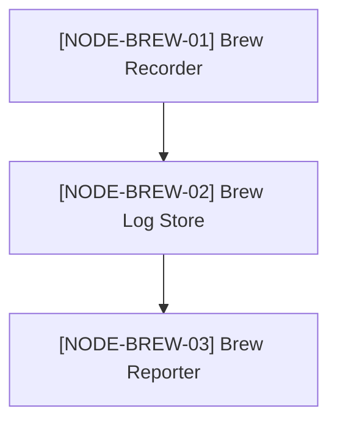
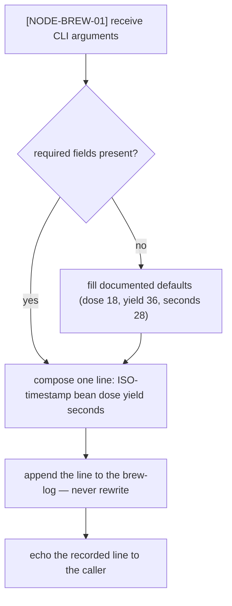

# Brew Log Format — Specification

## Macro node graph

## Flowcharts

## [NODE-BREW-01] Brew Recorder

Records exactly one brew per invocation. Implemented by `recordBrew` in
`src/tracker.mjs` (the unit carries the `@spec-node` marker back to this
node). It composes one [brew-log](../_global/dictionary.md#brew-log) line —
`ISO-timestamp bean doseGrams yieldGrams seconds`, space-separated, newline
terminated — and appends it, respecting
[INV-BREW-001](../_global/invariants.md#inv-brew-001): the log is
append-only.

## [NODE-BREW-02] Brew Log Store

The [brew-log](../_global/dictionary.md#brew-log) file itself (`brews.log`
in the working directory, git-ignored by the target). This node has **no
implementing code unit** — it is data at rest; its format contract is
enforced by the writer ([NODE-BREW-01](#node-brew-01-brew-recorder)) and the
parser ([NODE-BREW-03](#node-brew-03-brew-reporter)). Stated here so
"unmapped" is never mistaken for "unimplemented". Fields per line, in order:
ISO-8601 timestamp, bean name (no spaces), dose in grams, yield in grams,
extraction seconds.

## [NODE-BREW-03] Brew Reporter

Parses every line of the store and prints the brew count and the average
extraction ratio (yield divided by dose). Implemented by `readBrews` and
`averageRatio` in `src/report.mjs` (both under one `@spec-node` comment
block). A malformed line yields `NaN` fields rather than aborting the
report; tightening this is an open follow-up in the deciding session's card.

## Version History

No pivots yet — version 1 is the live content. Each future pivot appends an
entry in
[the frozen shape](https://github.com/seongjaeryu/human-native-knowledge-skills/blob/03ccacf/skill/06-lifecycle-and-versioning.md#23-version-history-section):
`### vN → vN+1 — <date>` with **reason**, **decided-by** (session card link),
**before**/**after** (NODE-ID edge syntax), and **frozen-as** (the outgoing
version's commit hash).
