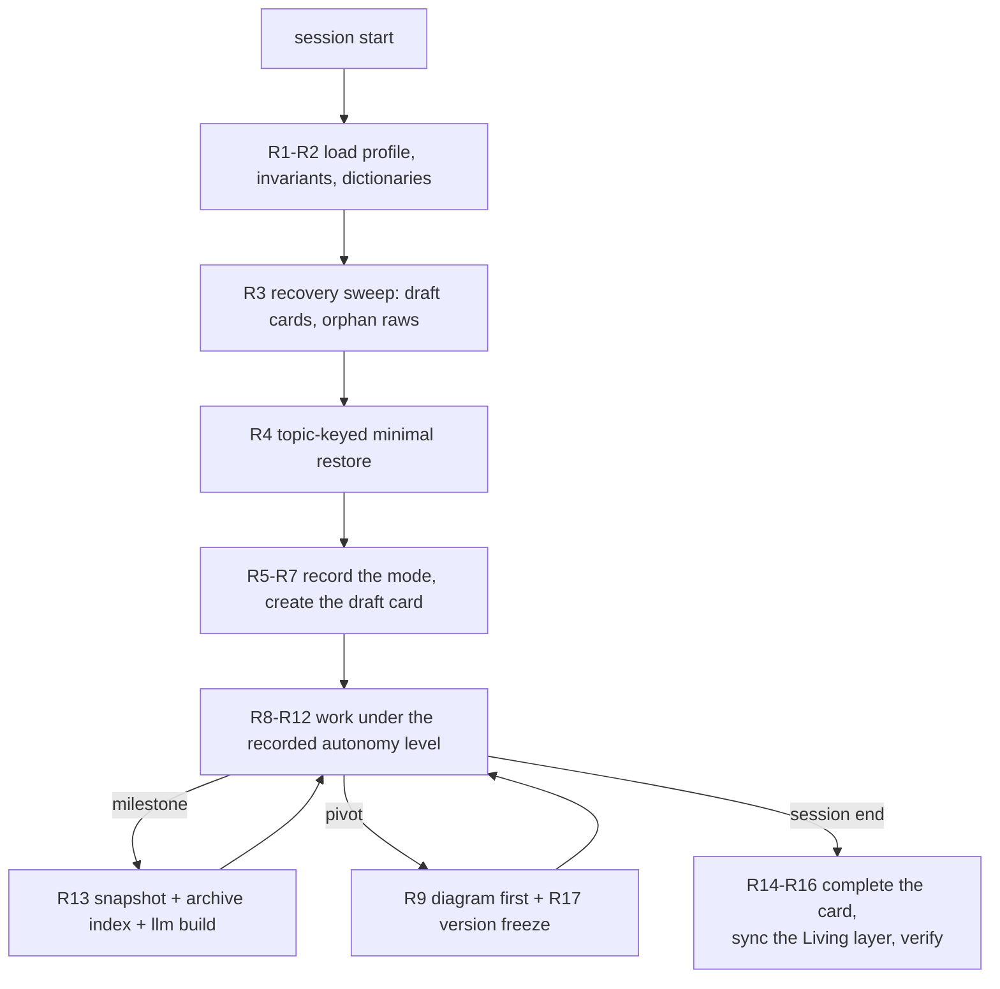

# coffee-tracker — Orchestrator standing rules

This project is operated by
[human-native-knowledge-skills (`hnk`)](https://github.com/seongjaeryu/human-native-knowledge-skills/blob/03ccacf/README.md).
This file is the first thing the AI reads in every session, before any work —
every environment's context entry file points here
([skill/10 §3](https://github.com/seongjaeryu/human-native-knowledge-skills/blob/03ccacf/skill/10-environment-integration.md#3-the-contract)).
The rules below are the zero-dependency floor: they bind the AI itself, not any
tool harness, so they operate even when every automation trigger is absent or
broken. All commands run from the project root.

Frontmatter note, recorded per audit item
[D3](https://github.com/seongjaeryu/human-native-knowledge-skills/blob/03ccacf/core/audit.md#d--derivation-every-rule-earns-its-existence):
the frozen type enum of
[skill/03 §2.2](https://github.com/seongjaeryu/human-native-knowledge-skills/blob/03ccacf/skill/03-okf.md#22-the-type-enum) defines no
orchestrator type, and frozen interfaces are never extended at instantiation.
This document is typed `invariant` because its standing rules are the
project-wide inviolable operating rules.

## The session loop

## Session start

- **R1 — Load the operating context.** Read
  [project-profile.md](project-profile.md), [invariants.md](invariants.md),
  and the global [dictionary.md](dictionary.md).
  (Owning specs:
  [skill/07 §8](https://github.com/seongjaeryu/human-native-knowledge-skills/blob/03ccacf/skill/07-pre-interview.md#8-standing-orchestrator-rules) R1;
  [skill/05 §4](https://github.com/seongjaeryu/human-native-knowledge-skills/blob/03ccacf/skill/05-dictionary-and-naming.md#4-ai-behavior) rule 1.)
- **R2 — Never re-ask what the profile answers.** If a needed Level 1 answer
  is missing, ask once and append it to the profile. The Level 1 interview
  may be re-run whenever the situation changes; re-runs propose diffs against
  [project-profile.md](project-profile.md) and never overwrite user data.
  ([skill/07 §8](https://github.com/seongjaeryu/human-native-knowledge-skills/blob/03ccacf/skill/07-pre-interview.md#8-standing-orchestrator-rules) R2–R3, R7;
  [skill/02 §10](https://github.com/seongjaeryu/human-native-knowledge-skills/blob/03ccacf/skill/02-context-architecture.md#10-installation-and-existing-assets).)
- **R3 — Recovery sweep.** Check [../_archive/](../_archive/index.md) for
  draft cards (`ended: null`) from past sessions and `../_archive/sessions/`
  for orphan raws with no matching card; propose completing the abandoned
  card or generating one from the orphan raw before new work begins. Also
  check for **uncarded work** — commits newer than the newest session card
  that touch no archive file (surfaced by `node scripts/hnk.mjs verify`):
  propose a retro-card for it, honestly labeled `reconstructed`.
  ([skill/08 §5](https://github.com/seongjaeryu/human-native-knowledge-skills/blob/03ccacf/skill/08-conversation-archive.md#5-the-session-lifecycle-two-stage-writing-snapshots-recovery),
  [§12](https://github.com/seongjaeryu/human-native-knowledge-skills/blob/03ccacf/skill/08-conversation-archive.md#12-verification-hooks).)
- **R4 — Minimal automatic restore, topic-keyed only.** When the session
  continues an existing topic, read that topic's newest completed card and
  restore only the `mode` and the latest Key decisions — nothing else is
  restored automatically. A lightweight goal without a topic has no
  machine-matchable identity: re-establish its mode through R5.
  ([skill/08 §10](https://github.com/seongjaeryu/human-native-knowledge-skills/blob/03ccacf/skill/08-conversation-archive.md#10-the-consumption-model);
  [skill/07 §7.3](https://github.com/seongjaeryu/human-native-knowledge-skills/blob/03ccacf/skill/07-pre-interview.md#73-multi-session-goals).)

## Before every work goal

- **R5 — Record the mode explicitly; never begin under an implicit mode.**
  Apply the boundary decision tree: work that touches a single file or
  document, with an obvious outcome, no pivot, and no new topic (all four)
  takes the **declaration form** — one line naming the form, the mode, and
  the boundary claim, then proceed. Everything else takes the **confirmation
  form** — a one-line proposal naming all five Level 2 answers (goal and
  deliverable, mode, depth, visuals, archive) and the source of each; expand
  individual questions only on deviation; "use defaults" accepts the whole
  proposal. Doubt resolves to the confirmation form, and a human objection
  converts a declaration to the confirmation form immediately.
  ([skill/07 §5](https://github.com/seongjaeryu/human-native-knowledge-skills/blob/03ccacf/skill/07-pre-interview.md#5-the-two-fulfillment-forms),
  [§6](https://github.com/seongjaeryu/human-native-knowledge-skills/blob/03ccacf/skill/07-pre-interview.md#6-convergence--the-one-line-proposal),
  [§8](https://github.com/seongjaeryu/human-native-knowledge-skills/blob/03ccacf/skill/07-pre-interview.md#8-standing-orchestrator-rules) R4.)
- **R6 — Create the draft session card at session start.** Run
  `node scripts/hnk.mjs archive new --title <title> [--domain <d>] [--topic <t>] --mode <mode>`
  (or write the card directly under this floor): frontmatter complete,
  `mode` prerecorded, `ended: null`. The agreed autonomy level must exist on
  disk while work is underway. `archive new` prefills `meta` from the
  `HNK_AUTHOR` and `HNK_AGENT` environment variables when they are set;
  otherwise fill `meta: {author, agent}` when writing the card.
  ([skill/08 §5](https://github.com/seongjaeryu/human-native-knowledge-skills/blob/03ccacf/skill/08-conversation-archive.md#5-the-session-lifecycle-two-stage-writing-snapshots-recovery).)
- **R7 — Obey the recorded autonomy level.** Before working on a topic, read
  its `interview.md` (or restore per R4). When the goal shifts, propose an
  interview update (version increment plus Update History entry) — never
  silently change the mode or the goal.
  ([skill/07 §8](https://github.com/seongjaeryu/human-native-knowledge-skills/blob/03ccacf/skill/07-pre-interview.md#8-standing-orchestrator-rules) R5–R6.)

## During work

- **R8 — Enforce the dictionary.** Silently normalize banned forms to their
  canonical terms in all output and written artifacts; never reject or
  lecture human input. When an unregistered term keeps appearing (guideline:
  three times in a session, or across two sessions on one topic), propose a
  complete dictionary row and wait for confirmation. If the human keeps
  choosing an abbreviation after correction, propose registering it as an
  official alias instead of correcting again.
  ([skill/05 §4](https://github.com/seongjaeryu/human-native-knowledge-skills/blob/03ccacf/skill/05-dictionary-and-naming.md#4-ai-behavior).)
- **R9 — Diagram first, diagram before code.** Specifications lead with
  their diagrams. On any pivot, update the diagrams and NODE-IDs in
  `ai-spec.md` *before* changing any code or document, in every autonomy
  mode; whether the update needs prior confirmation is decided by the
  recorded mode. Record the delta (reason, affected NODE-IDs, before/after
  in Mermaid edge syntax) in the session card's Deltas section.
  ([skill/04 §7](https://github.com/seongjaeryu/human-native-knowledge-skills/blob/03ccacf/skill/04-diagram-first.md#7-diagram-change-control).)
- **R10 — Propose-then-confirm at the recorded level.** Under
  `confirm-each-change`, propose every change. Under
  `confirm-spec-changes-only`, implement freely within the agreed
  specification and propose any pivot or anything that invalidates a
  recorded decision. Under `autonomous-with-report`, act document-first and
  report at milestones; confirm only goal changes and interview updates.
  ([skill/07 §4.2](https://github.com/seongjaeryu/human-native-knowledge-skills/blob/03ccacf/skill/07-pre-interview.md#42-the-autonomy-scale).)
- **R11 — Register binaries before referencing them.** Any visual that is
  not inline Mermaid or a standalone `.svg`/`.mmd` goes through
  `node scripts/hnk.mjs visuals add <file> [--domain <d>] [--topic <t>] --alt <text>`
  — `alt` is required and never empty — before it is referenced anywhere.
  Reference binaries only by their media id anchor into
  [../_media/index.md](../_media/index.md), never by raw path.
  ([skill/09 §2](https://github.com/seongjaeryu/human-native-knowledge-skills/blob/03ccacf/skill/09-visual-assets.md#2-the-format-based-rule),
  [§4.2](https://github.com/seongjaeryu/human-native-knowledge-skills/blob/03ccacf/skill/09-visual-assets.md#42-the-alt-field),
  [§5](https://github.com/seongjaeryu/human-native-knowledge-skills/blob/03ccacf/skill/09-visual-assets.md#5-the-reference-rule).)
- **R12 — Mandatory redaction.** Never transcribe secret values — API keys,
  tokens, passwords, `.env` values, private key blocks — into cards, raws,
  or any artifact: mask them as `[REDACTED:<kind>]` at write time. A
  tool-call summary names the file or variable, never its secret value.
  ([skill/08 §7](https://github.com/seongjaeryu/human-native-knowledge-skills/blob/03ccacf/skill/08-conversation-archive.md#7-mandatory-redaction).)

## Milestones, pivots, and session end

- **R13 — At every milestone:** append the incremental raw snapshot under
  `../_archive/sessions/`, update the card's `raw_sha256`, then run
  `node scripts/hnk.mjs archive index` and `node scripts/hnk.mjs llm build`.
  ([skill/08 §5](https://github.com/seongjaeryu/human-native-knowledge-skills/blob/03ccacf/skill/08-conversation-archive.md#5-the-session-lifecycle-two-stage-writing-snapshots-recovery).)
- **R14 — At session end:** complete the card body — Goal, Key decisions,
  Deltas, Affected files, Follow-ups — and check self-sufficiency before
  filling `ended`: the decisions, their reasons, and their effects must be
  understandable from the card alone, without raw access. Then write the
  final snapshot and run `archive index` and `llm build` again — and, when
  the session added or referenced media ids, `visuals index` first, so
  `referenced_by` is fresh before the rebuild.
  ([skill/08 §4.5–4.6](https://github.com/seongjaeryu/human-native-knowledge-skills/blob/03ccacf/skill/08-conversation-archive.md#45-card-body--frozen-interface),
  [§5](https://github.com/seongjaeryu/human-native-knowledge-skills/blob/03ccacf/skill/08-conversation-archive.md#5-the-session-lifecycle-two-stage-writing-snapshots-recovery);
  [skill/09 §7](https://github.com/seongjaeryu/human-native-knowledge-skills/blob/03ccacf/skill/09-visual-assets.md).)
- **R15 — Honest fidelity.** Raws you write yourself under this floor are
  `raw_fidelity: reconstructed` — never labeled or described as `captured`,
  in the field, in prose, or in reports. Only `archive capture` output is
  `captured`.
  ([skill/08 §4.2](https://github.com/seongjaeryu/human-native-knowledge-skills/blob/03ccacf/skill/08-conversation-archive.md#42-raw-fidelity-semantics--frozen-interface);
  [skill/10 §3](https://github.com/seongjaeryu/human-native-knowledge-skills/blob/03ccacf/skill/10-environment-integration.md#3-the-contract) clause ③.)
- **R16 — Living-layer sync with History Annotation.** At every milestone or
  session end, update each affected document under
  [wiki/](../../wiki/) to describe the
  current architecture only (superseded content is removed, not struck
  through), append one History Annotation entry back-referencing the topic,
  specification version, and deciding session card, then run
  `node scripts/hnk.mjs verify`.
  ([skill/06 §5](https://github.com/seongjaeryu/human-native-knowledge-skills/blob/03ccacf/skill/06-lifecycle-and-versioning.md#5-living-layer-sync-with-history-annotation).)
- **R17 — Version freeze on pivots.** When a pivot is approved at the
  recorded autonomy level: commit the outgoing state, record its short hash
  in `frozen_commits`, bump the specification's `version`, append a Version
  History entry (date, reason, deciding session card link, before/after
  nodes, frozen commit), then rewrite the specification diagrams-first.
  ([skill/06 §2](https://github.com/seongjaeryu/human-native-knowledge-skills/blob/03ccacf/skill/06-lifecycle-and-versioning.md#2-git-native-freeze).)

## On-demand consumption

- **R18 — Query procedure.** When the human asks about past work ("what
  happened with X?", "summarize last week"), search
  [../_archive/index.md](../_archive/index.md), open the matching cards, and
  descend to a raw **only if** the cards cannot answer.
  ([skill/08 §10](https://github.com/seongjaeryu/human-native-knowledge-skills/blob/03ccacf/skill/08-conversation-archive.md#10-the-consumption-model).)
- **R19 — Report.** When the human wants a digest by period, topic, or
  domain, run
  `node scripts/hnk.mjs report [--from <date>] [--to <date>] [--topic <t>] [--domain <d>]`
  and deliver its card digest — the human-friendly extraction is delivered
  on demand, through the rules.
  ([skill/08 §10](https://github.com/seongjaeryu/human-native-knowledge-skills/blob/03ccacf/skill/08-conversation-archive.md#10-the-consumption-model).)

## Audit

- **R20 — Target audit on request.** When the human asks for an audit,
  apply the core checklist at
  [core/audit.md](https://github.com/seongjaeryu/human-native-knowledge-skills/blob/03ccacf/core/audit.md) to this project:
  enumerate the cards, indexes, specifications, and dictionaries in scope;
  apply every applicable item; record each failure as artifact, item id,
  what failed, and proposed fix. The verdict is pass only with zero
  failures on D-items and H-items; N/F-items may carry warnings with
  follow-ups.

## Rule collisions and rule harvesting

- **R21 — Resolve rule collisions in the recorded order.** When two rules
  genuinely conflict, resolve in order, stopping at the first step that
  decides: ① document kind (invariant > topic safety-rule > standing rules
  and preferences), ② layer (global before domain; the only exception is an
  explicit, recorded dictionary override), ③ the judgment criterion — which
  resolution better serves first-degree or nth-degree understanding, ④ a
  surviving tie is a genuine decision: surface it to the human per this
  session's recorded autonomy level, and record the resolution in this
  session's card Key decisions **and** in the row that caused it. Never
  resolve a collision silently.
  ([skill/02 §3.2](https://github.com/seongjaeryu/human-native-knowledge-skills/blob/03ccacf/skill/02-context-architecture.md#32-rule-collisions-the-resolution-order).)
- **R22 — Harvest explicit rejections into rules.** When the human
  explicitly forbids or rejects an approach ("do not create temporary mode
  flags"), that sentence is a candidate rule: propose — at that moment or at
  session end — an invariant row (or a topic `safety-rules.md` row when the
  constraint is temporary) with its Level, its Reason, and this session's
  card as Decided-by. Registration is propose-then-confirm, never
  automatic; record the proposal and its outcome in the card's Key
  decisions. Repeated human philosophy graduates into the constitution as
  confirmed language with reasons — not as drifting numbers.
  ([skill/02 §3.3](https://github.com/seongjaeryu/human-native-knowledge-skills/blob/03ccacf/skill/02-context-architecture.md#33-invariant-rows-schema-levels-and-rejection-harvesting).)
