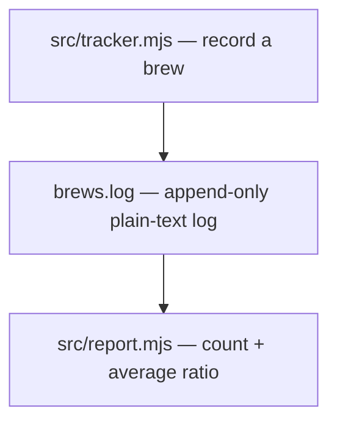

# coffee-tracker — current state

## Architecture now

coffee-tracker is a zero-dependency Node.js CLI with two entry points:
`src/tracker.mjs` appends one brew record per invocation to a plain-text log,
and `src/report.mjs` reads the log and prints count and average extraction
ratio. The log line format is specified in the brew-log-format topic
(one space-separated line per brew: ISO-timestamp, bean, dose, yield,
seconds; the log is append-only).

## Active topics

| Topic | Live version | Specification | State (one line) |
| --- | --- | --- | --- |
| 0001-brew-log-format | 1 | [ai-spec.md](../.context/0001-brew-log-format/ai-spec.md) | Line format specified and mapped to both CLI entry points. |

## History Annotation

- 2026-07-28 — [0001-brew-log-format](../.context/0001-brew-log-format/ai-spec.md) v1
  — decided in [session-20260728-202806-brew-log-format-specification](../.context/_archive/session-20260728-202806-brew-log-format-specification.md)
