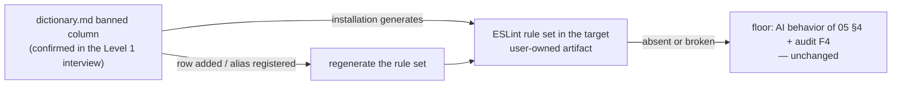

# Enforcement Guide — ESLint (TypeScript / JavaScript)

This guide is the TypeScript/JavaScript row of the enforcement table in
[`05-dictionary-and-naming.md` §5](../../skill/05-dictionary-and-naming.md#5-enforcement-is-guidance-not-core):
lint rules **generated from the banned column** of the dictionary, so a
banned term in code fails lint. It applies to `code` and `mixed` projects
(L1-1 activates the code module,
[`02-context-architecture.md` §9](../../skill/02-context-architecture.md#9-project-types));
the stack answer of L1-3 selects this guide
([`07-pre-interview.md` §2.1](../../skill/07-pre-interview.md#21-frozen-interface--the-level-1-question-bank)).

**The floor rule comes first.** Per
[`05-dictionary-and-naming.md` §5](../../skill/05-dictionary-and-naming.md#5-enforcement-is-guidance-not-core),
tooling is an amplifier: if ESLint is absent, broken, or skipped, the AI
behavior rules of [`05` §4](../../skill/05-dictionary-and-naming.md#4-ai-behavior)
and audit item
[F4](../../core/audit.md#f--first-degree-devices-production-time-mutual-understanding)
still hold in full. **The absence of tooling never suspends the rule.**

## 1. Source of truth: the banned column

The dictionary's **Banned synonyms / abbreviations** column
([`05` §3.2](../../skill/05-dictionary-and-naming.md#32-columns)) is the only
input. Registered aliases are legal by registration
([`05` §2](../../skill/05-dictionary-and-naming.md#2-the-full-naming-principle-refined))
and must never appear in a generated rule; canonical terms are never enforced
positively — enforcement bans wrong forms, it does not mandate usage. In
domain-layer projects the input is the merged scope: global rows plus the
domain dictionary of the code being linted, with conflicts already resolved
in the dictionary itself
([`05` §3.1](../../skill/05-dictionary-and-naming.md#31-files-and-scope-inheritance)).

## 2. Mapping the column onto ESLint mechanisms

| Dictionary content | ESLint mechanism | Behavior |
| --- | --- | --- |
| banned forms that are plausible identifiers (`dev`, `ctx`, `authn`) | `id-denylist` | any variable, parameter, property, or function of that exact name fails lint |
| banned forms needing finer targeting (a specific property key, a pattern family like `isPending`/`loadingState`) | `no-restricted-syntax` with an AST selector | the message cites the canonical term and its dictionary anchor, so the fix is one click away |
| registered aliases (`hnk`, an interview-approved `auth`) | excluded from both | legality is registration, not brevity |
| comments, strings, prose, markdown | not covered by lint | the works-anywhere scan of [`generic-grep.md`](generic-grep.md) covers text |

## 3. Illustrative rule snippet

The snippet below is an **example of what installation generates — not a
maintained configuration**. Guides ship no configuration files
([`10-environment-integration.md` §7](../../skill/10-environment-integration.md#7-example-not-dependency));
the installing AI produces the real rule set from the *confirmed* dictionary
and the *current* ESLint documentation (flat config or legacy format,
whichever the target uses). Do not copy it verbatim into a project.

```jsonc
// EXAMPLE OUTPUT — generated at installation from dictionary.md's banned column.
// Regenerate whenever dictionary rows change; never hand-maintain this list.
{
  "rules": {
    "id-denylist": ["error", "dev", "dvc", "ctx", "cntxt", "authn", "deviceInfo"],
    "no-restricted-syntax": [
      "error",
      {
        "selector": "Identifier[name=/^(isPending|loadingState)$/]",
        "message": "Banned synonym of 'isLoading' — see .context/_global/dictionary.md#isloading"
      }
    ]
  }
}
```

The example names come from the default seed rows
([`05` §3.3](../../skill/05-dictionary-and-naming.md#33-default-seed-rows-proposals-not-law));
a real project's list mirrors its own confirmed banned column — for a team
whose interview registered `auth` as an alias, `auth` appears in **no** rule.

## 4. Generation and regeneration



- The dictionary is the single source of truth; the lint rule set is a
  derived, user-owned artifact in the target project — same ownership model
  as generated integrations
  ([`10-environment-integration.md` §5](../../skill/10-environment-integration.md#5-regeneration-not-maintenance)):
  when it drifts or the linter's config format changes, the fix is
  regeneration, never a patch to this repository.
- Dictionary changes go through propose-then-confirm and land in a session
  card ([`05` §4](../../skill/05-dictionary-and-naming.md#4-ai-behavior));
  regenerating the rule set is part of applying the confirmed change.
- Scope the rules to project source. A banned name imposed from outside (a
  third-party API field the code must spell) is not a suppression comment —
  it is a candidate for alias registration with the justification recorded
  ("register instead of fight",
  [`05` §4](../../skill/05-dictionary-and-naming.md#4-ai-behavior) rule 4).

## 5. Continuous-integration wiring

Run the project's normal lint command in continuous integration so a banned
term fails the build before review. No `hnk`-specific step exists: the rule
set rides the linter the project already runs, and the specific pipeline
syntax is owned by the project, not by this guide. The same command runs
locally, so the check works with no pipeline at all — and when the pipeline
is down, the floor of [`05` §5](../../skill/05-dictionary-and-naming.md#5-enforcement-is-guidance-not-core)
still holds.
