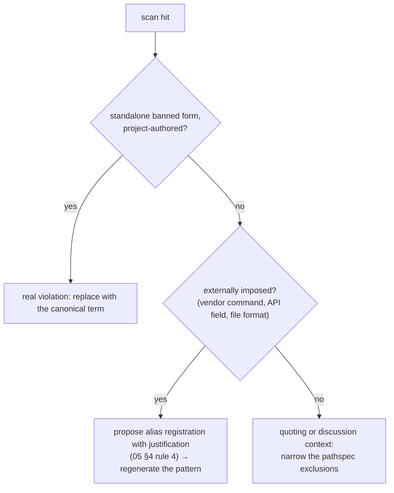

# Enforcement Guide — Generic grep (any stack)

This guide is the works-anywhere row of the enforcement table in
[`05-dictionary-and-naming.md` §5](../../skill/05-dictionary-and-naming.md#5-enforcement-is-guidance-not-core):
one pattern, built from the dictionary's banned column, scanned over the
project's tracked text files. It needs git and grep — nothing else — so it is
the lowest-dependency *tooling* tier. The true floor sits below even this:
the AI behavior of [`05` §4](../../skill/05-dictionary-and-naming.md#4-ai-behavior)
and audit item
[F4](../../core/audit.md#f--first-degree-devices-production-time-mutual-understanding)
operate with no tooling at all, and **the absence or breakage of this scan
never suspends the rule**.

## 1. The pattern

The pattern is the banned column of the dictionary in scope
([`05` §3.2](../../skill/05-dictionary-and-naming.md#32-columns)), joined
with `|`. Two construction rules:

- **Banned forms only.** Registered aliases are the allowlist — they are
  legal by registration and must never enter the pattern. When the interview
  moves a form (say `auth`) from banned to alias
  ([`05` §3.3](../../skill/05-dictionary-and-naming.md#33-default-seed-rows-proposals-not-law)),
  the pattern is regenerated without it.
- **Whole words.** Match with word boundaries (`grep -w`), so `dev` does not
  fire inside `device` or `developer` — the ban is on the *standalone form*,
  which is what creates ambiguity.

## 2. The command

One example, scanning tracked text files, excluding the two git-ignored
payload directories and the dictionary files themselves (the banned column
legitimately spells every banned form). The banned list shown is the default
seed ([`05` §3.3](../../skill/05-dictionary-and-naming.md#33-default-seed-rows-proposals-not-law));
generate the real list from the project's confirmed dictionary:

```bash
! git grep -nIwE 'dev|dvc|ctx|cntxt|auth|authn|isPending|waiting|loadingState' \
    -- ':!.context/_archive/sessions' ':!.context/_media/files' ':!*dictionary.md'
```

| Element | Why |
| --- | --- |
| `git grep` | scans **tracked** files only — untracked and ignored content is out of scope by construction |
| `!` prefix | inverts the exit code: hits found → nonzero → a failing check |
| `-n -I -w -E` | line numbers; skip binaries; whole words; alternation pattern |
| `:!.context/_archive/sessions` `:!.context/_media/files` | the two payload directories are already git-ignored ([`02-context-architecture.md` §8](../../skill/02-context-architecture.md#8-the-gitignore-contract)), so `git grep` skips them anyway — the explicit excludes keep the command correct even if a payload is ever force-added |
| `:!*dictionary.md` | global and domain dictionaries are the pattern's source, not its target |

## 3. Knowledge-project usage

Knowledge-type projects have no mandatory enforcement tooling
([`05` §5](../../skill/05-dictionary-and-naming.md#5-enforcement-is-guidance-not-core));
this scan is their optional document check. Narrow the pathspec to documents:

```bash
! git grep -nIwE '<banned-pattern>' -- '*.md' \
    ':!.context/_archive/sessions' ':!.context/_media/files' ':!*dictionary.md'
```

Because the AI auto-corrects banned forms in all written output
([`05` §4](../../skill/05-dictionary-and-naming.md#4-ai-behavior) rule 2),
hits in committed documents usually mean hand-edited text or pre-`hnk`
content — exactly what a floor-level net should catch.

## 4. Continuous-integration wiring

Add the §2 command as a pipeline step; the inverted exit code fails the build
when a banned form lands. The same line runs in any shell, so the check
exists with or without a pipeline — continuous integration amplifies it, and
a down pipeline changes nothing about the rule
([`05` §5](../../skill/05-dictionary-and-naming.md#5-enforcement-is-guidance-not-core)).
The pattern is regenerated whenever a dictionary row changes; row changes
themselves go through propose-then-confirm and are recorded in the session
card ([`05` §4](../../skill/05-dictionary-and-naming.md#4-ai-behavior)).

## 5. False positives



- **Word boundaries handle substrings** — that is what `-w` is for. If a
  pattern still over-fires, check that no alternation branch contains
  regex metacharacters unescaped.
- **The allowlist is the registered-aliases column.** Recurring legitimate
  hits are a signal the dictionary should adapt, not that the scan should be
  quietly weakened: register the alias with its justification recorded
  ([`05` §4](../../skill/05-dictionary-and-naming.md#4-ai-behavior) rule 4),
  then regenerate.
- **Quoting contexts** — documents that *discuss* banned terms (style guides,
  retrospectives) — are handled by pathspec exclusion, mirroring the
  `dictionary.md` exclusion above. Keep the exclusion list short and visible
  in the command itself; a long hidden exclusion list is how a floor rots.
- **Case sensitivity** stays on by default: banned forms match as written in
  the column. Add `-i` only as a deliberate, recorded choice — it multiplies
  false positives.
