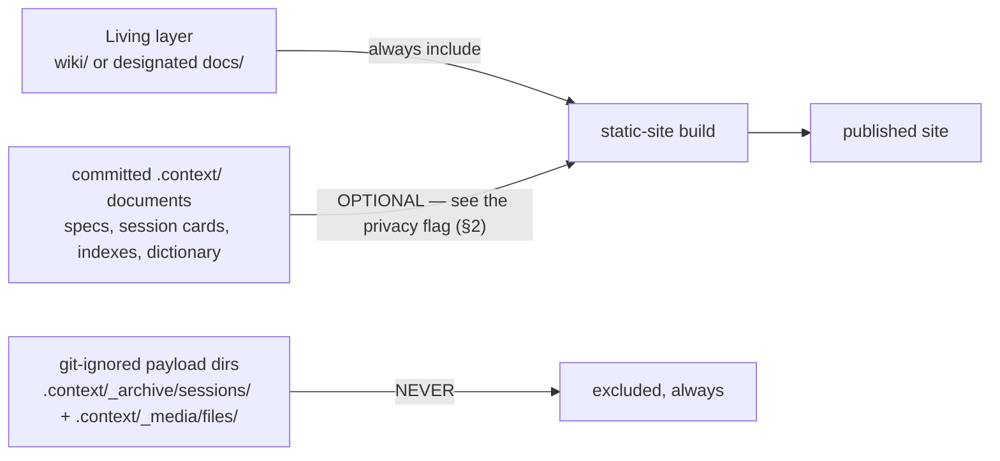

# Viewer Guide — Quartz and static-site publishing

A static site is the read path of
[`02-context-architecture.md` §7](../../skill/02-context-architecture.md#7-storageconsumption-separation-and-the-integrity-net)
taken one step further: the Living layer, already the human-facing
current-state surface
([`02-context-architecture.md` §6](../../skill/02-context-architecture.md#6-the-living-layer)),
is rendered for readers who never open the repository. Quartz is one suitable
generator; any static-site generator that reads markdown with YAML
frontmatter works the same way. Publishing is a **consumption-side choice**:
`hnk` never depends on it, records nothing about it beyond the L1-4 viewer
answer, and ships no site configuration — a guide that needed to embed one
would be violating the boundary of
[`10-environment-integration.md` §7](../../skill/10-environment-integration.md#7-example-not-dependency).

## 1. What to publish

| Content | Publish | Why |
| --- | --- | --- |
| Living layer (`wiki/` or designated `docs/`) | yes — the intended surface | current state for humans; History Annotation as its only memory ([`06-lifecycle-and-versioning.md` §5](../../skill/06-lifecycle-and-versioning.md#5-living-layer-sync-with-history-annotation)) |
| topic `visuals/` (`.svg`, `.mmd`) | optional | committed text-format assets referenced by specs |
| committed `.context/` documents | optional — read §2 first | they are committed, so they are publishable; whether they *should* be public is a separate decision |
| `.context/_archive/sessions/` and `.context/_media/files/` | **never** | the two git-ignored payload directories of [`02-context-architecture.md` §8](../../skill/02-context-architecture.md#8-the-gitignore-contract); raws are private by default and leave the machine only through the gated upload of [`08-conversation-archive.md` §9](../../skill/08-conversation-archive.md#9-upload--frozen-behavior) |

A clean CI checkout contains no ignored payloads, so a CI-built site cannot
leak them — but builds also run on working machines that *do* hold the
payloads. Write the two exclusion patterns into the site configuration
explicitly; do not rely on the checkout being clean.

## 2. The privacy consideration on committed `.context/`

**`visibility` gates raw upload only — it does not gate the card.** Session
cards are always committed
([`08-conversation-archive.md` §4.3](../../skill/08-conversation-archive.md#43-visibility-behavior--frozen-interface)):
a site that includes `.context/_archive/` therefore publishes every card,
including cards whose raws are `private`. That is spec-consistent — the card
is the shareable result document, and mandatory redaction keeps secret values
out of cards and raws alike
([`08-conversation-archive.md` §7](../../skill/08-conversation-archive.md#7-mandatory-redaction))
— but redaction masks *credentials*, not business-sensitive prose. Publishing
moves the audience from "people with repository access" to "everyone".
Decide deliberately:

| Site scope | Gets | Accepts |
| --- | --- | --- |
| Living layer only | current state, clean surface | History Annotation back-references into `.context/` dangle on the site (§4) |
| Living layer + committed `.context/` | resolvable back-references, full decision trail | every card, spec, interview record, and dictionary row becomes world-readable |

When in doubt, publish the Living layer only. Widening the site later is
cheap; unpublishing is not.

## 3. Mermaid and frontmatter support

- **Mermaid is not optional.** Diagrams are the primary verification surface
  ([`04-diagram-first.md` §1](../../skill/04-diagram-first.md#1-why-diagrams-come-first)),
  and Living pages carry a current-architecture diagram. Quartz renders
  Mermaid code fences; when choosing another generator, verify it does too —
  a site that drops Mermaid blocks publishes the documents minus the part
  humans verify first.
- **Frontmatter parses everywhere.** The machine-readable subset of
  [`03-okf.md` §3](../../skill/03-okf.md#3-the-machine-readable-subset-grammar)
  is strict, valid YAML, so any generator's frontmatter handling accepts it.
  The one-line `summary` maps naturally onto page-description metadata, and
  `status`/`version` can drive badges or ordering — extraction working as
  designed ([core §7](../../core/philosophy.md#7-the-ai-native-storage-process)).

## 4. Link integrity across the publish boundary

Semantic pointers are relative links
([`03-okf.md` §4](../../skill/03-okf.md#4-semantic-pointers)), so they survive
any generator that preserves relative structure — *within* the published set.
Links that cross the boundary from published to unpublished content dangle:

- Living-only sites dangle the History Annotation links into `.context/`.
  The entries remain honest readable text (date, id, version), so nothing is
  lost — only click-through.
- Sites that include committed `.context/` resolve those links, but links to
  git-ignored payloads (`raw_local` paths, `path_local` values) can never
  resolve on any site. Cards and media entries are designed to stand without
  them ([`08-conversation-archive.md` §4.6](../../skill/08-conversation-archive.md#46-the-self-sufficiency-acceptance-criterion),
  [`09-visual-assets.md` §4.2](../../skill/09-visual-assets.md#42-the-alt-field)).

Never "fix" dangling links by rewriting the committed documents for the
site's benefit — the repository is the source of truth; any link rewriting
belongs in the generator's build step.

## 5. Deployment-agnostic notes

- Any static host works: a pages-style host, object storage behind a CDN, a
  self-hosted web server. `hnk` records nothing about the deployment and no
  command touches it.
- The site is a **derived artifact**: regenerate it from the repository (on
  push, on a schedule, or by hand); never edit published output in place. A
  stale site misleads exactly the consumer it exists to orient — the same
  reasoning as `llm.txt` staleness
  ([`03-okf.md` §5](../../skill/03-okf.md#5-llmtxt)).
- Site configuration is user-owned and tracks the generator's current
  documentation, exactly like the generated integrations of
  [`10-environment-integration.md` §5](../../skill/10-environment-integration.md#5-regeneration-not-maintenance):
  when the generator's harness changes, regenerate the configuration — do not
  expect this guide to track it.
- Access control (private sites, authenticated readers) is a host concern.
  If the audience is limited, enforcing that limit is the host's job; `hnk`'s
  only contribution is that nothing which must not leave the machine is in
  the publishable set in the first place (§1).
