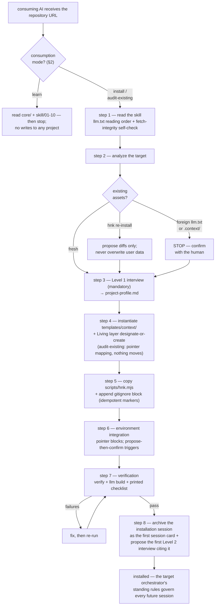

# Orchestrator — the root installation state machine

This document is what a consuming AI **follows** after reading
[`llm.txt`](llm.txt) and the curriculum. It defines *how* installation
proceeds; [`skill/02-context-architecture.md`](skill/02-context-architecture.md)
defines *what must exist when it is done*. Do not confuse this file with the
target project's `.context/_global/orchestrator.md` — that file is
instantiated from [`templates/context/`](templates/context/) and holds the
**standing rules** that govern every session after installation. This file
governs exactly one session: the installation itself. Throughout that
session, every decision is propose-then-confirm
([`core/philosophy.md` §8](core/philosophy.md#8-storageconsumption-separation)).

## 1. The state machine

## 2. Consumption modes

| Mode | Trigger | Steps executed | Writes to the target |
| --- | --- | --- | --- |
| install | "apply this to my project" | 1–8 | yes |
| audit-existing | "map/audit my existing docs into this system" | 1–8, with the step 4 variant: non-destructive pointer mapping ([`skill/02` §10](skill/02-context-architecture.md#10-installation-and-existing-assets)) | yes — new files and pointer documents only; existing documents are never moved, rewritten, or deleted |
| learn | "explain this system" | reading only: `core/` + `skill/01`–`10` | none |

## 3. The eight steps

### Step 1 — Read the skill

- Read [`llm.txt`](llm.txt) first, then follow its reading order:
  [`core/philosophy.md`](core/philosophy.md), [`core/audit.md`](core/audit.md),
  then [`skill/01`](skill/01-principles.md) through
  [`skill/10`](skill/10-environment-integration.md).
- **Fetch-integrity self-check:** after fetching each file, confirm it is
  complete — it ends with an intact final section (most skill documents end
  with a Version History or freeze section) and contains no truncation.
  Refetch any file that fails the check before acting on it. Fetch raw file
  contents, never rendered HTML pages (per `llm.txt`).
- Governed by: `llm.txt`, [`core/philosophy.md`](core/philosophy.md).
- **Done when:** every document in the reading order has been read in full,
  with zero unresolved truncations.

### Step 2 — Analyze the target

- Inspect the target project: stack and repository shape, git availability,
  an existing `docs/` (or equivalent), detectable AI environments (existing
  context entry files, tool directories), and recurring terms — this
  analysis pre-fills the Level 1 proposal of step 3
  ([`skill/07` §2.2](skill/07-pre-interview.md#22-conduct-rules), "analyze
  before asking").
- **Existing-asset detection — three branches**
  ([`skill/02` §10](skill/02-context-architecture.md#10-installation-and-existing-assets)):

| Branch | Signal | Action |
| --- | --- | --- |
| fresh | no `llm.txt`, no `.context/` | proceed normally |
| `hnk` re-install | `.context/` with an `hnk` `project-profile.md`, or `hnk:begin` markers present | re-installation: propose template updates as diffs; re-run of Level 1 proposes diffs against the existing profile; **never overwrite user data files** |
| foreign | an `llm.txt` or `.context/` not produced by `hnk` | **stop and confirm with the human** before writing anything |

- User data files — the dictionary, session cards, topic `interview.md`
  files, `project-profile.md`, and hand-maintained index fields such as
  media `alt` text — are never overwritten in any branch.
- **Done when:** the analysis summary is presented and the branch is
  established (confirmed by the human where the branch requires it).

### Step 3 — Level 1 interview (mandatory)

- Run the Level 1 installation interview — **mandatory, never skipped** —
  per [`skill/07` §2](skill/07-pre-interview.md#2-level-1--the-installation-interview):
  the eight questions L1-1..L1-8, proposed pre-filled from step 2's
  analysis, confirmed in bulk; only genuinely ambiguous questions are asked
  individually. When storage is `none`, state the frozen disclosure of
  [`skill/07` §2.2](skill/07-pre-interview.md#22-conduct-rules) before
  confirmation.
- Write `.context/_global/project-profile.md` (`type: profile`) with the
  frozen frontmatter fields and body sections of
  [`skill/07` §3](skill/07-pre-interview.md#3-the-project-profile) —
  including `hnk_version` and `hnk_commit` taken from the fetched
  repository's release tag and commit. (If `.context/_global/` does not
  exist yet, create the directory now; step 4 fills in the rest.)
- Seed the global dictionary rows confirmed in L1-8 (default rows and the
  `hnk` registration row of
  [`skill/05` §3.3–3.4](skill/05-dictionary-and-naming.md#33-default-seed-rows-proposals-not-law)).
- **Done when:** the profile exists with all eight answers recorded and
  valid machine-subset frontmatter
  ([`skill/03` §3](skill/03-okf.md#3-the-machine-readable-subset-grammar)),
  and `dictionary_seeded: true`.

### Step 4 — Instantiate templates + Living layer

- Instantiate [`templates/context/`](templates/context/) into `.context/`
  per the layout of
  [`skill/02` §2](skill/02-context-architecture.md#2-the-installed-layout):
  resolve every `{{PLACEHOLDER}}`, **resolve and remove every
  `<!-- ai-instruction: ... -->` comment**, and skip interview-gated
  optional files (`design-system.md` unless `design_system: true`; the
  domain layer unless `domain_layer: true`). Instantiated documents must
  pass verification: frozen frontmatter fields, machine-subset grammar,
  required sections.
- **Not instantiated at install:** `_archive/session-card.md` (once per
  session — the first use is step 8) and `templates/context/topic/*`
  (instantiated at topic creation, after a `full-topic` Level 2 interview —
  no topic exists at install time). Only `_archive/index.md` and
  `_media/index.md` are seeded empty now.
- **Living layer — designate or create**
  ([`skill/02` §6](skill/02-context-architecture.md#6-the-living-layer)):
  if the profile designates an existing `docs/`, move nothing — bind its
  documents in with pointer mapping, add the History Annotation rule
  ([`skill/06` §5](skill/06-lifecycle-and-versioning.md#5-living-layer-sync-with-history-annotation)),
  and propose (never silently apply) frontmatter additions per
  [`skill/03` §5.1](skill/03-okf.md#51-target-projects-generated).
  Otherwise create `wiki/` from [`templates/living/`](templates/living/).
- **audit-existing variant:** step 4 is entirely non-destructive — existing
  documents stay where they are; pointer documents map them into the
  structure; the existing `docs/` becomes the Living layer.
- Template instantiation may create missing files but never replaces
  existing ones; conflicts become proposed diffs.
- **Done when:** `.context/` matches the
  [`skill/02`](skill/02-context-architecture.md) layout for the chosen
  options, no placeholder or ai-instruction comment survives anywhere, and
  the Living layer exists at the profile's `living_layer` path.

### Step 5 — Copy the script + gitignore block

- Copy `scripts/hnk.mjs` from this repository to the target's
  `scripts/hnk.mjs`, verbatim — never edited, never renamed.
- Append the managed gitignore block from
  [`templates/context/gitignore-block.txt`](templates/context/gitignore-block.txt)
  to the target's `.gitignore`, idempotently via the `# hnk:begin` /
  `# hnk:end` markers
  ([`skill/02` §8](skill/02-context-architecture.md#8-the-gitignore-contract)):
  if the markers exist, replace the content between them; never append a
  second block.
- **Done when:** `node scripts/hnk.mjs` runs in the target, and the
  gitignore block is present exactly once with intact markers.
- *Pre-release consumption note:* if `scripts/hnk.mjs` is absent in the
  fetched repository (a pre-v1 state), apply the rule-based core of
  [`skill/08` §5](skill/08-conversation-archive.md#5-the-session-lifecycle-two-stage-writing-snapshots-recovery)
  and [`skill/09`](skill/09-visual-assets.md) by hand, and treat the
  script-based "Done when" gates here and in step 7 as manual checklists.

### Step 6 — Environment integration

- Follow the generation procedure of
  [`skill/10` §4](skill/10-environment-integration.md#4-generation-at-installation):
  enumerate environments (Level 1 answers plus detection — detection adds
  candidates, never overrides the human); for each, read the tool's
  **current** documentation; generate the pointer block to
  `.context/_global/orchestrator.md` (marker-wrapped, idempotent,
  [`skill/10` §3.2](skill/10-environment-integration.md#3-the-contract));
  and **propose-then-confirm** any trigger wiring before generating it
  ([`skill/10` §4.1–4.2](skill/10-environment-integration.md#41-procedure)).
- Record one integration-table row per environment in
  `project-profile.md`, with the frozen columns and `trigger` values of
  [`skill/10` §4.3](skill/10-environment-integration.md#43-the-integration-record--frozen-interface).
  Never copy the `examples/` integration — it is a stale instance by design.
- **Done when:** every environment has a pointer block and a recorded row
  (`generated` | `unsupported` | `declined`); the floor of clause ③ needs
  no artifact and is always in force.

### Step 7 — Verification

- Run `node scripts/hnk.mjs verify`, then `node scripts/hnk.mjs llm build`,
  then re-run `verify` (it checks `llm.txt` staleness). Fix failures and
  repeat until clean.
- Print the installation checklist to the human: structural conformance to
  [`skill/02`](skill/02-context-architecture.md); machine-subset
  frontmatter and resolving pointers
  ([`skill/03` §6](skill/03-okf.md#6-what-verification-enforces-from-this-document));
  gitignore block; Living layer at the recorded location; profile validity;
  **and the environment-contract items EC-1..EC-6 of
  [`skill/10` §8](skill/10-environment-integration.md#8-contract-conformance-checklist--frozen-interface)**.
- **Done when:** `verify` passes, `llm.txt` is fresh, and the printed
  checklist shows every item green (or a failure explicitly accepted by the
  human, recorded in the step 8 card).

### Step 8 — Archive the installation session + first Level 2 proposal

- Archive **this installation session itself** as the target's first
  session card, per the two-stage rule of
  [`skill/08` §5](skill/08-conversation-archive.md#5-the-session-lifecycle-two-stage-writing-snapshots-recovery):
  create the draft (full frontmatter; `started` = when this session began,
  UTC; `mode` as actually run — installation is propose-then-confirm
  throughout, i.e. `confirm-each-change`; `raw_fidelity` per path, normally
  `reconstructed`), then complete it — Goal, Key decisions (the confirmed
  interview answers with reasons), Deltas, Affected files (everything this
  installation created), Follow-ups — check self-sufficiency
  ([`skill/08` §4.6](skill/08-conversation-archive.md#46-the-self-sufficiency-acceptance-criterion)),
  and fill `ended`. The two stages collapse into one pass here only because
  the archive store did not exist at session start; every later session
  drafts at start. Write the normalized raw under `_archive/sessions/`,
  then run `node scripts/hnk.mjs archive index` and
  `node scripts/hnk.mjs llm build`.
- **Immediately propose the first Level 2 work interview**
  ([`skill/07` §4–6](skill/07-pre-interview.md#4-level-2--the-work-interview)),
  citing the installation card by id in the proposal — the first
  demonstration of on-demand retrieval
  ([`skill/08` §10](skill/08-conversation-archive.md#10-the-consumption-model)).
- **Done when:** the card is completed and indexed, `llm.txt` is
  regenerated, and the Level 2 proposal has been presented.

## 4. After step 8 — handover

Installation ends here. From this point the **target's**
`.context/_global/orchestrator.md` standing rules govern every future
session: profile reading and the Level 2 interview before every new work
goal ([`skill/07` §8](skill/07-pre-interview.md#8-standing-orchestrator-rules)),
archiving and regeneration ([`skill/08` §5](skill/08-conversation-archive.md#5-the-session-lifecycle-two-stage-writing-snapshots-recovery)),
and Living-layer sync ([`skill/06` §5](skill/06-lifecycle-and-versioning.md#5-living-layer-sync-with-history-annotation)).
This root file is consulted again only for re-installation, upgrade, or a
target audit ([`core/audit.md`](core/audit.md)).

## 5. Boundary rules

- **`examples/` is an instance demo, not spec.** It is the output of one
  real installation run. Never parse it as rules, and never copy its
  generated integration into a target
  ([`skill/10` §7](skill/10-environment-integration.md#7-example-not-dependency)).
- **Templates are instantiated, not parsed as rules.** Files under
  `templates/` carry placeholders and ai-instruction comments; they state
  no rule of their own — the rules live in `core/` and `skill/`. No
  placeholder or ai-instruction comment may ever survive into a target.
- **Two orchestrators.** This root file is the installer's state machine;
  the instantiated `.context/_global/orchestrator.md` holds the target's
  standing rules. Neither substitutes for the other.

## Version History

- **version 1** — initial root installation state machine, written against
  [`core/philosophy.md`](core/philosophy.md) version 1 and the frozen
  milestone-M2 interfaces of `skill/02`, `03`, `07`, `08`, and `10`.
