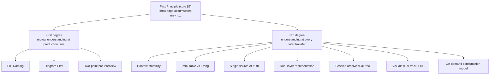
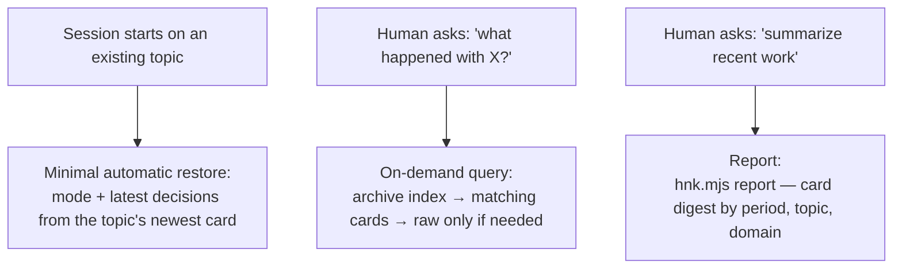

# 01 — Principles: Deriving Everything from the Core

This document is the **derivation layer** between the constitution
([`core/philosophy.md`](../core/philosophy.md)) and every other skill
document. It does not restate the core (that would violate audit item D2 in
[`core/audit.md`](../core/audit.md)); it shows *why* each rule of the system
exists, by deriving it from the first principle — the
[two-stage condition of accumulation](../core/philosophy.md#2-first-principle--the-two-stage-condition-of-accumulation)
— through the
[judgment criterion of core §10](../core/philosophy.md#10-the-judgment-criterion).

Every principle below answers that criterion's question explicitly. If a
future rule cannot, it does not belong in the system.

## 1. Derivation map

The diagram shows the *primary* degree each device serves; several serve
both (Full Naming also lets an nth-degree reader resolve every term; a
session card also forces first-degree verification at the moment it is
written). Two structural consequences of the two stages, stated here because
the whole architecture follows from them:

- **The interview has two points because the first degree has two moments** —
  agreeing how the *project* works (install time, Level 1) and agreeing how
  *this piece of work* works (per work goal, Level 2). Defined in
  [07-pre-interview.md](07-pre-interview.md).
- **The archive has two tracks because the nth degree has two readers** —
  the card for the human and the AI who need the result, the raw for the
  rare consumer who needs the full trail. Defined in
  [08-conversation-archive.md](08-conversation-archive.md).

## 2. The six philosophies, derived

The source playbook stated six philosophies as a flat list. Here each is
derived from the first principle, with the refinement `hnk` applies.

| # | Philosophy | Core question it answers | Primary degree | Specified in |
| --- | --- | --- | --- | --- |
| P1 | Context atomicity | To verify, context must gather at one entry point | nth | [02-context-architecture.md](02-context-architecture.md) |
| P2 | Immutable vs Living | To verify, "the decision then" must be distinguishable from "the state now" | nth | [06-lifecycle-and-versioning.md](06-lifecycle-and-versioning.md) |
| P3 | Full Naming | To understand, there must be no ambiguity | first | [05-dictionary-and-naming.md](05-dictionary-and-naming.md) |
| P4 | Single source of truth | The verification standard must be one | nth | [02-context-architecture.md](02-context-architecture.md), [05-dictionary-and-naming.md](05-dictionary-and-naming.md) |
| P5 | Dual-layer representation | Machine and human must read the same original | nth | [03-okf.md](03-okf.md) |
| P6 | Diagram-First | Human understanding is faster through vision than through text | first | [04-diagram-first.md](04-diagram-first.md) |

### P1 — Context atomicity, reinterpreted as "retrievable from one entry point"

**Derivation.** Verification — first-degree at production, nth-degree at
transfer — is only possible if everything relevant to a topic can be reached
from one entry point. Scattered context is unpayable debt: the reader cannot
even enumerate what they do not know.

**Refinement and its justification.** The playbook implemented atomicity as
*physical co-location*: sources, specification, threads, safety rules, and
visuals all inside one topic folder. `hnk` keeps the requirement but changes
the means: raw transcripts centralize in `_archive/` and binaries in
`_media/`, while each one **binds back to its topic** through frontmatter
fields (`domain`, `topic`) and semantic pointers. This is still atomicity
because the atom is the *retrieval graph rooted at the topic's entry point*,
not the folder: from a topic's `ai-spec.md` and its session cards, every
raw and every binary remains reachable in one hop. Physical co-location of
these files would force either committing heavy machine-scale artifacts into
topic folders (nth-degree noise) or maintaining per-topic ignore rules and
per-topic upload tooling (many standards where
[the core demands one](#p4--single-source-of-truth)). Centralizing keeps one
ignore rule, one index, one upload path — and pointers keep one entry point.
Structure: [02-context-architecture.md](02-context-architecture.md).

### P2 — Immutable vs Living, with a corrected boundary

**Derivation.** An nth-degree consumer must be able to ask two different
questions and get two different answers: *what was decided then* (immutable,
citable, with its reasons) and *what is true now* (living, current). Merging
them destroys both answers.

**Refinement.** The playbook drew the boundary at the directory level
(`.context/` immutable, `wiki/` living). That boundary is wrong in practice:
dictionaries, invariants, the orchestrator, and the project profile live in
`.context/` and *must* evolve. The fixed boundary is by **state, not
location**: the global and domain layers are living; **only frozen
specification versions are immutable** — a version entry sealed under the
git-native freeze of
[06-lifecycle-and-versioning.md](06-lifecycle-and-versioning.md). The Living
layer (`wiki/` or an existing `docs/`) remains the human-facing "state now"
view, synchronized per the same document.

### P3 — Full Naming, refined to "no unregistered abbreviations"

**Derivation.** First-degree mutual understanding requires a shared
vocabulary with zero ambiguity while the work happens; nth-degree
understanding requires that a future reader can resolve every term without
asking anyone.

**Refinement.** The playbook banned all abbreviations. `hnk` refines this:
**abbreviations are banned unless registered in the dictionary.** A
registered alias is unambiguous precisely because the dictionary resolves
it — banning it would add friction without adding understanding, failing the
judgment criterion. `hnk` itself is the demonstration: it is the registered
official short name of human-native-knowledge-skills — the registration row
lives in the naming specification
([05-dictionary-and-naming.md §3.4](05-dictionary-and-naming.md)), which
also seeds it into every target project's dictionary. Format and
enforcement: [05-dictionary-and-naming.md](05-dictionary-and-naming.md).

### P4 — Single source of truth

**Derivation.** If two documents can answer the same question differently,
verification is impossible at both degrees — the reader must first
adjudicate the sources, which is exactly the interest payment knowledge debt
extracts. Therefore: one dictionary and one invariants document per scope
([02-context-architecture.md](02-context-architecture.md)), one `ai-spec.md`
per topic with versions inside it rather than beside it
([06-lifecycle-and-versioning.md](06-lifecycle-and-versioning.md)), and one
index per archive. This principle is why the playbook's `v1/`–`v2/` folder
copies were replaced (see [§6](#6-what-changed-from-the-source-playbook-and-why)).

### P5 — Dual-layer representation, refined by the AI-native storage process

**Derivation.** Machine and human must read the *same original* — a
human-only format cannot be verified by the AI, an opaque machine format
cannot be verified by the human, and two divergent copies violate P4.

**Refinement.** The core's
[AI-native storage process](../core/philosophy.md#7-the-ai-native-storage-process)
makes the layer roles concrete: data is created AI-native under the rules,
prepared for human extraction at creation time, and delivered to humans by
the AI on demand — the real worker is the AI. Consequences: frontmatter uses
a strict machine-readable subset (humans never hand-write it, so its rigidity
costs nothing — grammar in [03-okf.md](03-okf.md)); card and specification
bodies double as the human extraction; and the report command of
`scripts/hnk.mjs` is the delivery step made executable.

### P6 — Diagram-First

**Derivation.** The first-degree bottleneck is the human: they must verify
AI output *at production speed*. Vision-first review — a node graph for
macro structure, a flowchart for logic — lets a human catch a structural
error in seconds that a prose wall would hide for pages. Diagrams lead,
prose follows (audit item F3). Node identity, specification-to-code mapping,
and diagrams for non-code projects: [04-diagram-first.md](04-diagram-first.md).

## 3. The three improvements, derived the same way

These are not features bolted onto the playbook; each falls out of the same
first principle.

### I1 — Session archive dual-track (card + raw)

The core metaphor
([document collaboration](../core/philosophy.md#5-core-metaphor--the-restoration-of-document-collaboration))
already contains the design: flowing documents are the raw transcript, and
**the result document is the session card**. The card is the unit of
verification (first degree: writing it forces the producer to check what was
decided) and the unit of transfer (nth degree: audit item H3 requires the
card to be understandable without raw access). The raw is preserved for the
rare deep audit, honestly labeled per
[core §9](../core/philosophy.md#9-honesty-of-the-record). Card fields,
identifiers, and fidelity rules are frozen in
[08-conversation-archive.md](08-conversation-archive.md).

### I2 — Visuals dual-track (text-native committed, binary indexed with mandatory alt)

Diagrams-as-text (Mermaid, `.svg`, `.mmd`) commit alongside the documents;
binaries centralize in `_media/` and are git-ignored. The derivation is
nth-degree honesty: a clone without the binaries must still be
understandable, so **every binary entry requires an `alt` description**
(audit item H2) — the text record must never depend on a file that may be
gone. Formats, index entries, and registration rules:
[09-visual-assets.md](09-visual-assets.md).

### I3 — Two-point pre-interview (install time + per work goal)

The first degree demands that not only the output but **the way of working
itself is agreed and recorded** — an unverified process produces unverifiable
output. Agreement is needed at two points because two different things are
being agreed: how the project operates (Level 1, at install) and how this
specific work goal will run — autonomy level, documentation depth (Level 2,
at every work goal; audit items F1–F2). Recorded interviews also serve the
nth degree: a later reader can see under which mode a decision was made.
Question sets, the declaration/confirmation split for small tasks, and
orchestrator wiring: [07-pre-interview.md](07-pre-interview.md).

## 4. The on-demand consumption model, derived

An archive that is only written is itself knowledge debt: the writing cost
is principal that no reader ever redeems. Accumulation
([core §1](../core/philosophy.md#1-goal)) therefore includes *retrieval* —
and since humans do not read the data layer as a whole
([core §7](../core/philosophy.md#7-the-ai-native-storage-process)),
retrieval is an nth-degree device executed by the AI, on demand:

Three layers, no more: automatic restore covers only work continuity;
everything else is pulled when a human (or a later AI) actually needs it,
which is the delivery step of the AI-native storage process made concrete.
Audit item N3 checks that this path can reconstruct past decisions from
cards alone. Query procedure and report command:
[08-conversation-archive.md](08-conversation-archive.md).

## 5. Protocols

### 5.1 Human protocol

The human role is fixed by
[core §7](../core/philosophy.md#7-the-ai-native-storage-process) and
[core §8](../core/philosophy.md#8-storageconsumption-separation); the four
rules below operationalize it:

| Rule | Derivation |
| --- | --- |
| Use Full Naming in communication with the AI; the AI corrects unregistered abbreviations, but clean input transfers intent faster | first degree — shared vocabulary (P3, audit F4) |
| When reviewing any specification, read the diagrams before the prose — verify macro structure first | first degree — vision-first verification (P6, audit F3) |
| Confirm at decision points; never accept a silent change of mode or specification | first degree — propose-then-confirm (I3, audit F1–F2) |
| Write through the AI and scripts, read through viewers and reports; leave integrity to the verification tooling | storage/consumption separation ([core §8](../core/philosophy.md#8-storageconsumption-separation)) |

### 5.2 AI protocol — where each rule lives

The AI-side rules are operational, so they live in the documents that
specify them, and are installed into the target project's
`orchestrator.md` as standing rules. This table is the map, not the rules:

| AI rule (summary) | Owning document |
| --- | --- |
| Maintain the `.context/` layer structure and the Living layer's role | [02-context-architecture.md](02-context-architecture.md) |
| Write frontmatter in the machine-readable subset; link with semantic pointers; regenerate `llm.txt` | [03-okf.md](03-okf.md) |
| Lead every specification with a node graph and flowchart; assign node identifiers; keep specification-to-code mapping | [04-diagram-first.md](04-diagram-first.md) |
| Enforce the dictionary: correct unregistered abbreviations, register new terms | [05-dictionary-and-naming.md](05-dictionary-and-naming.md) |
| Freeze specification versions git-natively; synchronize the Living layer with History Annotations at milestones | [06-lifecycle-and-versioning.md](06-lifecycle-and-versioning.md) |
| Run the Level 2 interview (or one-line declaration) before every work goal; record the mode; propose interview updates when the goal shifts | [07-pre-interview.md](07-pre-interview.md) |
| Archive every session: draft card at start, normalized raw snapshot, completed card and index at end; serve on-demand queries and reports | [08-conversation-archive.md](08-conversation-archive.md) |
| Register binaries before referencing them; require `alt`; reference by media identifier, not path | [09-visual-assets.md](09-visual-assets.md) |
| Satisfy the environment integration contract; fall back to the rule-based core in any environment | [10-environment-integration.md](10-environment-integration.md) |
| On audit, apply the core checklist to the target project | [../core/audit.md](../core/audit.md) |

## 6. What changed from the source playbook, and why

Every departure from the source playbook is a derivation decision, not a
taste decision. Audit item D3 requires the resolution to be written where
the conflict arose — this table is that record.

| Change | Playbook had | `hnk` has | Core-derived reason |
| --- | --- | --- | --- |
| Flattened topic folders | `vN/{original, artifact, safety-rules, thread}/` — four subfolders per version | flat files: `sources.md`, `ai-spec.md`, `safety-rules.md` per topic | Atomicity means one entry point, not folder ceremony; each extra layer is nth-degree reading cost with no understanding gained (judgment criterion: serves neither degree) |
| Git-native freeze | copy the topic into a new `v2/` folder on pivot | one `ai-spec.md` per topic; version number, Version History section, and prior-version commit hash on pivot ([06-lifecycle-and-versioning.md](06-lifecycle-and-versioning.md)) | Duplicate trees create two candidate truths, violating P4; git already preserves the immutable "decision then" (P2) without copies. Folder freeze survives only as the no-git appendix |
| Change ledger absorbed into cards | `thread/change-ledger.json` as a separate machine delta log | the Deltas section of the session card carries reason, node identifier, and before/after | The result document is the card ([core §5](../core/philosophy.md#5-core-metaphor--the-restoration-of-document-collaboration)); a second record of the same decisions is a competing source of truth (P4). The ledger survives only in the no-git appendix of [06-lifecycle-and-versioning.md](06-lifecycle-and-versioning.md) |
| Interviews replace Interactive/Auto modes | two hardcoded execution modes chosen ad hoc | two-point pre-interview with a three-level autonomy scale, recorded per work goal ([07-pre-interview.md](07-pre-interview.md)) | The first degree requires the mode itself to be agreed and *recorded* (audit F1–F2), not assumed; Auto mode's document-first-then-report behavior survives as the highest autonomy level rather than as an unrecorded default |

## Version History

- **version 1** — initial derivation layer, written against
  [`core/philosophy.md`](../core/philosophy.md) version 1.
