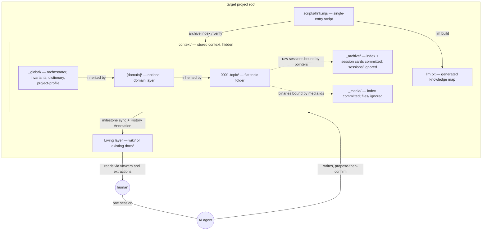
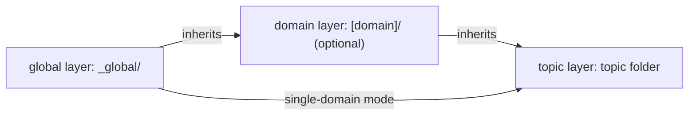

# Skill 02 — Context Architecture

This document specifies the structure of a target project after `hnk` is
installed. [`orchestrator.md`](../orchestrator.md) defines *how* installation
proceeds; this document defines *what must exist when it is done* — the target
state that `node scripts/hnk.mjs verify` checks against.

## 1. Derivation

Per [`core/philosophy.md`](../core/philosophy.md) §10, every structural rule
below exists to serve one of the two degrees of understanding
([§2](../core/philosophy.md#2-first-principle--the-two-stage-condition-of-accumulation)):

| Structural rule | Serves | Derives from |
| --- | --- | --- |
| One entry point per topic (flat folder + pointers) | nth degree | atomicity, derived in [`01-principles.md`](01-principles.md) |
| Central `_archive/` and `_media/` stores | nth degree | session model, [core §6](../core/philosophy.md#6-the-actor-model--the-session) |
| Mandatory Living layer | nth degree | delivery step of [core §7](../core/philosophy.md#7-the-ai-native-storage-process) |
| Hidden `.context/` with write/read paths | first degree | [core §8](../core/philosophy.md#8-storageconsumption-separation) |
| Exactly two git-ignored directories | nth degree | honesty of the record, [core §9](../core/philosophy.md#9-honesty-of-the-record) |
| Compat views and the optional topic `plan.md` — external tool paths bound by stubs (§4.1, §11) | nth degree | mapping principle of §10; [core §2](../core/philosophy.md#2-first-principle--the-two-stage-condition-of-accumulation) |

## 2. The installed layout

### 2.1 Node graph



### 2.2 Layout tree

```text
target/
├── llm.txt                          # committed; generated by `hnk.mjs llm build`
│                                    #   input scope: .context/ + Living layer (spec: 03)
├── .context/
│   ├── _global/
│   │   ├── orchestrator.md          # standing rules the AI reads first, every session
│   │   ├── invariants.md            # project-wide inviolable rules
│   │   ├── dictionary.md            # term dictionary — format in 05
│   │   ├── project-profile.md       # Level 1 interview record + installed skill version
│   │   └── design-system.md         # OPTIONAL — interview-gated, UI projects only
│   ├── _archive/
│   │   ├── index.md                 # committed; regenerated by `hnk.mjs archive index`
│   │   ├── <id>.md                  # committed session cards; ids are session-YYYYMMDD-HHMMSS-slug (frozen in 08)
│   │   └── sessions/                # GIT-IGNORED — normalized raw transcripts
│   ├── _media/
│   │   ├── index.md                 # committed; every binary registered here (09)
│   │   └── files/                   # GIT-IGNORED — binary payloads
│   └── [domain]/                    # OPTIONAL layer — omitted in single-domain mode
│       ├── _shared_sources/         # domain-shared originals (e.g. design-references.md)
│       ├── _shared_ai/              # domain invariants.md, dictionary.md, subagents/
│       └── 0001-topic/              # FLAT topic folder (see section 4)
│           ├── interview.md         # Level 2 interview record (07)
│           ├── sources.md           # collected originals and references
│           ├── ai-spec.md           # the spec — diagrams first (04), Version History (06)
│           ├── safety-rules.md      # OPTIONAL — topic-scoped temporary rules
│           ├── plan.md              # OPTIONAL — execution plan for the current spec version (§4.1)
│           └── visuals/             # committed text-format assets (*.svg, *.mmd)
├── wiki/                            # Living layer — or an existing docs/ designated instead
└── scripts/
    └── hnk.mjs                      # single-entry zero-dependency script (copied)
```

Topic folders are named with a four-digit zero-padded ordinal plus a
kebab-case slug (`0001-notification-service`), ordered by creation within
their parent layer. Session and media identifier rules are frozen in
[`08-conversation-archive.md`](08-conversation-archive.md).

## 3. Three-level inheritance

Context is isolated and inherited across three layers. A lower layer narrows
or extends the layers above it; it never contradicts them silently — the one
sanctioned exception is an **explicit, recorded dictionary override** per
[`05-dictionary-and-naming.md` §3.1](05-dictionary-and-naming.md). Conflicts
are resolved by the judgment criterion of
[`core/philosophy.md`](../core/philosophy.md#10-the-judgment-criterion) and
surface as audit item D3 in [`core/audit.md`](../core/audit.md). (The layers
are named global/domain/topic — deliberately not numbered, to avoid collision
with the Level 1 / Level 2 interview names of
[`07-pre-interview.md`](07-pre-interview.md).)



| Level | Location | Holds |
| --- | --- | --- |
| Global | `.context/_global/` | standing orchestrator rules, project-wide invariants, the global dictionary, `project-profile.md`, optional `design-system.md` |
| Domain (optional) | `.context/[domain]/` | `_shared_sources/` (shared originals and pointer documents), `_shared_ai/` (domain invariants, domain dictionary, `subagents/` such as the audit subagent) |
| Topic | `.context/[domain]/NNNN-topic/` or `.context/NNNN-topic/` | the flat topic folder of section 4 |

Domain dictionaries and invariants extend the global ones; dictionary
layering and precedence are specified in
[`05-dictionary-and-naming.md`](05-dictionary-and-naming.md).

### 3.1 Single-domain mode

The domain layer is optional. Small projects place topic folders directly
under `.context/`, and domain-scoped rules live in `_global/`. The choice is
made in the Level 1 interview ([`07-pre-interview.md`](07-pre-interview.md))
and recorded in `project-profile.md`. Promoting a single-domain project later
is a plain folder move (topics into a new `[domain]/`) plus pointer updates;
`hnk.mjs verify` catches any pointer left dangling by the move.

### 3.2 Rule collisions: the resolution order

Two rules of the same tier can collide in practice (a performance rule
against a simplicity rule, say) — and in `autonomous-with-report` mode no
human is in the loop at the moment of collision. The resolution order below
makes the outcome reconstructable for every later reader (nth degree) without
replacing the reasoning with arithmetic; the decision to keep resolution
categorical rather than numeric is recorded in this document's Version
History.

Resolve in this order, stopping at the first step that decides:

1. **Document kind.** An invariant outranks a topic safety-rule; a
   safety-rule outranks standing rules and preferences (orchestrator rules,
   `design-system.md`, dictionary style rules). Membership in `invariants.md`
   *is* the priority statement — there is no rank inside the file.
2. **Layer.** Global before domain, per §3. The only sanctioned exception
   remains the explicit, recorded dictionary override of
   [`05-dictionary-and-naming.md` §3.1](05-dictionary-and-naming.md).
3. **The judgment criterion.** If kind and layer tie, apply
   [core §10](../core/philosophy.md#10-the-judgment-criterion) directly:
   which resolution better serves first-degree or nth-degree understanding?
4. **Surface a surviving tie.** A collision that survives all three steps is
   a genuine decision: surface it to the human per the session's recorded
   autonomy level ([`07-pre-interview.md` §4.2](07-pre-interview.md)), record
   the resolution in the session card's Key decisions
   ([`08-conversation-archive.md` §4.5](08-conversation-archive.md#45-card-body--frozen-interface)),
   and — if the collision will recur — register the outcome as a rule row
   with its reason, where the conflict arose (audit item
   [D3](../core/audit.md#d--derivation-every-rule-earns-its-existence)).

### 3.3 Invariant rows: schema, levels, and rejection harvesting

This document owns the invariant row schema (per the type-ownership table of
[`03-okf.md` §2.2](03-okf.md#22-the-type-enum)). Each row of an
`invariants.md` table carries:

| Column | Content |
| --- | --- |
| Id | `INV-<CODE>-<NUMBER>` with an inline lowercase anchor; the code registered in the dictionary before first use; never renumbered or reused |
| Invariant | the rule, in Full Naming vocabulary, with semantic pointers |
| **Level** | `strict-negative` \| `hard` (below) |
| Reason | why this rule exists — which understanding it protects |
| Decided by | the session card that decided the row (`—` for installation seeds) |

**Level values — categorical language, not scores:**

| Level | Meaning | Agent behavior |
| --- | --- | --- |
| `strict-negative` | a prohibition — "never do X" | blocks the action at every autonomy level; no trade-off may override it |
| `hard` | a requirement that must hold | must be satisfied before work completes; verified before a card's `ended` is filled |

Only these two values exist. Preferences and style guidance do not belong in
an invariants table — they live in the orchestrator standing rules,
`design-system.md`, and the dictionary. Numeric priority scores were
considered and declined: a score decides a collision without explaining it,
which deletes exactly the reason a later reader needs (see Version History).

**Rejection harvesting.** When the human explicitly forbids or rejects an
approach during work ("don't create temporary mode flags", "never bypass the
queue"), that sentence is a candidate rule. The standing rule: the agent
**proposes** — at that moment or at session end — an invariant row (or a
topic `safety-rules.md` row, when the constraint is temporary) carrying the
level, the reason, and this session's card as Decided-by. Registration is
propose-then-confirm, never automatic; the proposal and its outcome are
recorded in the card's Key decisions. This mirrors the dictionary
row-proposal rule of
[`05-dictionary-and-naming.md` §4](05-dictionary-and-naming.md#4-ai-behavior)
rule 3 — repeated human philosophy graduates into the constitution as
confirmed language with its reason attached.

## 4. The flat topic folder

Topic folders are flat: no version subfolders, no `original/`, `artifact/`,
or `thread/` subdirectories. The derivation — atomicity reinterpreted as
"retrievable from one entry point" rather than "physically co-located" — is
given in [`01-principles.md`](01-principles.md). The one permitted
subdirectory is `visuals/`, which holds committed text-format assets only.
(Exception: projects without git additionally carry a `versions/` folder and
a `change-ledger.json` at the topic root, per the no-git fallback of
[`06-lifecycle-and-versioning.md`](06-lifecycle-and-versioning.md)
Appendix A.)

### 4.1 File roles

| File | Role | Owning spec |
| --- | --- | --- |
| `interview.md` | Level 2 interview record: goal, autonomy mode, documentation depth | [`07-pre-interview.md`](07-pre-interview.md) |
| `sources.md` | collected requirements, references, release-note originals; pointer document for external material | this document + [`03-okf.md`](03-okf.md) |
| `ai-spec.md` | the master plan/design document — diagrams first, Node IDs, Version History section | [`04-diagram-first.md`](04-diagram-first.md), [`06-lifecycle-and-versioning.md`](06-lifecycle-and-versioning.md) |
| `safety-rules.md` (optional) | rules active only while this topic's work is underway | this document |
| `plan.md` (optional) | execution plan for the current spec version; external plan-writing tools' artifacts land or bind here (§11) | this document |
| `visuals/` | text-format visual assets (`.svg`, `.mmd`); Mermaid inline in `ai-spec.md` is preferred | [`09-visual-assets.md`](09-visual-assets.md) |

### 4.2 Where the removed subfolders went

Earlier forms of this pattern used four subfolders per topic version. Their
responsibilities are preserved, relocated:

| Former subfolder | Now | Specified in |
| --- | --- | --- |
| `vN/` version folders | one `ai-spec.md` with git-native freeze + Version History | [`06-lifecycle-and-versioning.md`](06-lifecycle-and-versioning.md) |
| `original/` | flat `sources.md` | this document |
| `artifact/` (+ `visuals/`) | flat `ai-spec.md`; text visuals in `visuals/`, binaries in `_media/files/` | [`09-visual-assets.md`](09-visual-assets.md) |
| `safety-rules/` | flat `safety-rules.md` | this document |
| `thread/` (+ change ledger) | session cards and raw transcripts in `_archive/`, bound to the topic by frontmatter and pointers; the card's Deltas section absorbs the ledger | [`08-conversation-archive.md`](08-conversation-archive.md) |

## 5. Central stores: `_archive/` and `_media/`

Raw transcripts and binaries are centralized once per project, never scattered
into topics. Topics reference them through frontmatter fields and index
anchors, which is what keeps flat topic folders atomic in the retrieval sense.

| Path | Committed | Regenerated | Owning spec |
| --- | --- | --- | --- |
| `_archive/index.md` | yes | yes — `hnk.mjs archive index` | [`08-conversation-archive.md`](08-conversation-archive.md) |
| `_archive/session-*.md` | yes | no — written per session | [`08-conversation-archive.md`](08-conversation-archive.md) |
| `_archive/sessions/` | no (ignored) | — | [`08-conversation-archive.md`](08-conversation-archive.md) |
| `_media/index.md` | yes | merge-regenerated; hand-maintained fields preserved | [`09-visual-assets.md`](09-visual-assets.md) |
| `_media/files/` | no (ignored) | — | [`09-visual-assets.md`](09-visual-assets.md) |
| `llm.txt` | yes | yes — `hnk.mjs llm build` | [`03-okf.md`](03-okf.md) |

Card field lists, identifier rules, visibility behavior, and media index
entries are frozen in documents 08 and 09 — this document only fixes their
*location* and commit status.

## 6. The Living layer

The Living layer is the human-facing current-state layer: the last step of
the AI-native storage process
([core §7](../core/philosophy.md#7-the-ai-native-storage-process)) needs a
place for extracted, human-friendly form to land. Its **role is mandatory —
there is no "none" option** in the Level 1 interview. Its **location is
flexible**:

| Situation | Living layer | Installation action |
| --- | --- | --- |
| Project already has `docs/` (or an equivalent) | the existing directory is designated | nothing is moved; a pointer mapping binds existing documents into the structure, the History Annotation rule is added to them, and the location is recorded in `project-profile.md` |
| No existing human documentation layer | `wiki/` is created | instantiated from [`templates/living/`](../templates/living/) (index/dashboard + History Annotation block) |

Boundary note: `.context/` is not wholly immutable. Global and domain files,
dictionaries, and indexes are living documents too; only frozen spec versions
recorded in a Version History are immutable. The Living layer is defined by
its role (current state, for humans), not by mutability.

Synchronization rules — when to sync, and the History Annotation format that
back-references `.context/` decisions — are owned by
[`06-lifecycle-and-versioning.md`](06-lifecycle-and-versioning.md).

## 7. Storage/consumption separation and the integrity net

Per [core §8](../core/philosophy.md#8-storageconsumption-separation),
`.context/` is a hidden directory as an *affordance*, not a secret: it
signals that writes go through rules and reads go through extractions.

| Path | Who / what |
| --- | --- |
| Write path | the AI following orchestrator standing rules (propose-then-confirm at the agreed autonomy level) and `hnk.mjs` subcommands |
| Read path | the Living layer, viewers (bring-your-own — `guides/viewers/`), and extractions: `hnk.mjs report`, `llm.txt`, the archive and media indexes |
| Integrity net | `node scripts/hnk.mjs verify` |

Direct human edits follow the rule of
[core §8](../core/philosophy.md#8-storageconsumption-separation), with
`verify` as the integrity net. `verify` checks, at minimum: structural conformance to this
document; frontmatter machine-subset compliance and pointer resolution
([`03-okf.md`](03-okf.md)); unregistered binaries
([`09-visual-assets.md`](09-visual-assets.md)); `llm.txt` staleness relative
to `.context/`; Living layer existence matching the location recorded in
`project-profile.md` ([`06-lifecycle-and-versioning.md`](06-lifecycle-and-versioning.md));
and the presence of the gitignore block of section 8.

## 8. The gitignore contract

Installation appends exactly one managed block to the target's `.gitignore`,
instantiated from
[`templates/context/gitignore-block.txt`](../templates/context/gitignore-block.txt):

```text
# hnk:begin (managed block — do not edit between markers)
.context/_archive/sessions/
.context/_media/files/
# hnk:end
```

Contract rules:

1. **Exactly two directories are ignored** — normalized raw transcripts and
   binary payloads. Everything else in `.context/` is committed; `.context/`
   itself must never be ignored.
2. **Idempotence via markers.** If the `# hnk:begin` / `# hnk:end` markers
   already exist, re-installation replaces the content between them; it never
   appends a second block.
3. **Ignored does not mean unintelligible.** The record must remain
   understandable without the ignored payloads: session cards are
   self-sufficient (audit item H3) and every binary has a required text
   description (H2) — see [`core/audit.md`](../core/audit.md#h--honesty-of-the-record).
   Optional off-machine persistence of ignored payloads (upload) is specified
   in [`08-conversation-archive.md`](08-conversation-archive.md).

## 9. Project types

The Level 1 interview classifies the target as `code`, `knowledge`, or
`mixed`, recorded in `project-profile.md`. The layout above is identical for
all three; the type gates which *rules* are active:

| Project type | Core rules (always) | Code module additionally activated |
| --- | --- | --- |
| `code` | full layout, archive, interviews, diagram-first, dictionary | spec-node mapping between diagram Node IDs and source files ([`04-diagram-first.md`](04-diagram-first.md)); dictionary enforcement tooling ([`05-dictionary-and-naming.md`](05-dictionary-and-naming.md), `guides/enforcement/`) |
| `knowledge` | same | none — diagrams draw decision flows and document dependency graphs instead of code nodes ([`04-diagram-first.md`](04-diagram-first.md)) |
| `mixed` | same | code module active for the code portions only |

`design-system.md` is a separate interview gate (UI work present), orthogonal
to project type. Changing type later is a `project-profile.md` update; the AI
then proposes activating or deactivating the code-module rules.

## 10. Installation and existing assets

The installation procedure is the 8-step state machine in
[`orchestrator.md`](../orchestrator.md); this document is the target-state
contract its verification step checks against. Structural principles the
procedure must honor:

- **Detect before writing.** Three branches: a fresh target; an existing
  `hnk` installation (re-installation — propose diffs, do not overwrite); a
  foreign `llm.txt` or `.context/` from another system (stop and confirm
  with the user).
- **audit-existing maps, never moves.** In audit-existing mode, existing
  documents stay where they are; pointer documents bind them into this
  structure, and an existing `docs/` becomes the Living layer (section 6).
- **User data files are never overwritten.** The dictionary, session cards,
  topic `interview.md` files, `project-profile.md`, and hand-maintained
  index fields (such as media `alt` text) are user data: template
  instantiation may create missing files but must never replace existing
  ones. Conflicting template updates are proposed as diffs
  (propose-then-confirm), never applied silently.

## 11. Compat views — binding external tool structures

Agent tooling other than `hnk` (plan-writing skills, scaffold generators)
writes documents to paths those tools hardcode. The mapping principle of
§10 — *audit-existing maps, never moves* — covers documents that exist
before installation; this section extends it to documents external tools
keep creating afterwards. It serves nth-degree understanding
([core §2](../core/philosophy.md#2-first-principle--the-two-stage-condition-of-accumulation)):
retrieval must keep working from every entry point a past session may have
recorded, including the external tool's own path.

A **compat view** is a committed stub document standing at the external
tool's expected path; the authoritative document lives in the hnk
structure. One physical document, two entry points.

### 11.1 The stub is a regular file, never a symlink

Measured (2026-07-31, macOS/APFS): `rg` matches nothing behind a file or
directory symlink unless invoked with `--follow`; `find` does not descend
into a directory symlink; git stores symlinks as mode-120000 objects and,
under `core.symlinks=false` — the documented Git for Windows default —
checks them out as plain text files. A symlink is therefore invisible to
the content-search half of retrieval and non-portable; a stub file is
searchable, portable, and carries its own resolution metadata.

### 11.2 Stub format

A view stub carries the common frontmatter of
[`03-okf.md` §2.1](03-okf.md#21-common-fields-every-document) with
`type: view` plus one owned field:

| Field | Rule |
| --- | --- |
| `resolves_to` | the **id** of the authoritative document — an id, not a path, per the machine-layer rule of [`03-okf.md` §2.1](03-okf.md#21-common-fields-every-document); failed resolution is audit item [N2](../core/audit.md#n--nth-degree-devices-transfer-time-understanding) |

A stub's own `id` carries the `view-` prefix with a kebab-case slug (e.g.
`view-legacy-plan`); like every id it must be unique across the project
([03-okf.md §6](03-okf.md#6-what-verification-enforces-from-this-document)).

Body contract, three parts in order:

1. one line naming the authoritative location as a relative link — the
   fast path;
2. one line for the stale case: resolve `resolves_to` via `llm.txt` or
   the archive index — ids, not paths, survive moves
   ([`03-okf.md` §2.1](03-okf.md#21-common-fields-every-document));
3. a `Keywords:` line copying the authoritative document's key terms —
   the stub's content-search surface.

### 11.3 Orientation

Default: the authoritative file lives in the hnk structure and the view
stands at the external path. Reverse the orientation — authoritative file
at the external path, a pointer row in the topic's `sources.md` — when the
external tool re-reads its own artifacts more often than hnk consumers do.
Record the choice and its reason as a row in the topic's `sources.md`.
Tool-specific recipes live in [`guides/coexistence/`](../guides/coexistence/).
A stub standing inside a designated Living layer is an ordinary
Living-layer document: `llm build` scans it and the sync rules of §6
apply.

### 11.4 Verification

`node scripts/hnk.mjs verify` scans committed `.md` files outside
`.context/` for `type: view` frontmatter and fails on: a `resolves_to` that
names no committed document id; a `resolves_to` naming another view's id —
the target must be the authoritative document (§11.2); a dead relative link
in the stub body ([`03-okf.md` §4](03-okf.md#4-semantic-pointers)); a
missing `summary`. A stub that cannot be resolved misleads exactly the
consumer it exists to orient (N2).

## Version History

- **version 3** — 2026-08-01. Added §11 (compat views), the optional
  `plan.md` row in §4.1, and the matching §1 derivation row. **Why:**
  plan-writing agent skills (observed: superpowers `writing-plans` and
  `brainstorming`, v5.1.0) hardcode their own output paths
  (`docs/superpowers/…`); an installed structure either fractures or, if
  the tool is resisted, the tool breaks. §10's mapping principle answered
  this for pre-existing documents; it needed extension to documents
  external tools keep creating. **How:** one physical document, two entry
  points — the authoritative file in the hnk structure, a searchable stub
  (`type: view`, id-first resolution per
  [`03-okf.md` §2.1](03-okf.md#21-common-fields-every-document)) at
  the tool's path. OS symlinks were measured and declined: invisible to
  `rg`'s default content search, degraded to plain text by
  `core.symlinks=false` checkouts. Orientation is reversible per topic by
  the read-frequency criterion (§11.3).
- **version 2** — 2026-07-30. Added §3.2 (rule-collision resolution order)
  and §3.3 (invariant row schema with the `Level` column and rejection
  harvesting). **Why:** the first community feedback on this project
  correctly diagnosed a real gap — two same-tier content rules had no
  explicit tiebreaker, and in `autonomous-with-report` mode the agent
  carried that collision with no human in the loop. **How:** the feedback's
  proposal was adopted in reshaped form. Its categorical `constraint_level`
  survives as the two-value `Level` column on invariant rows; its numeric
  `weight` (0.0–1.0) was declined because a score decides a collision
  without explaining it — arithmetic is not understanding
  ([core §10](../core/philosophy.md#10-the-judgment-criterion)), an
  unmeasured decimal claims precision that does not exist
  ([core §9](../core/philosophy.md#9-honesty-of-the-record)), and
  feedback-driven automatic weight drift is the silent rule change audit
  item F2 forbids. Its automated-extraction loop survives as rejection
  harvesting — with propose-then-confirm in place of automatic
  registration, so the constitution grows as confirmed language with
  reasons, not drifting numbers.
- **version 1** — initial structural specification.
