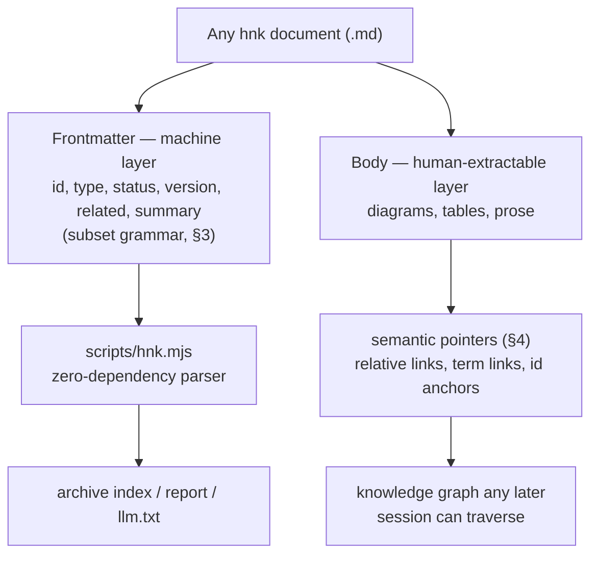
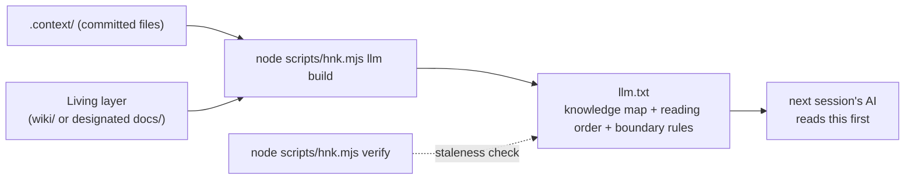

# Open Knowledge Format

This document specifies how every document in an `hnk`-operated project is
made **machine-first and human-extractable**. It is the direct application of
the AI-native storage process defined in
[`core/philosophy.md` §7](../core/philosophy.md#7-the-ai-native-storage-process);
it derives from the core and does not restate it.

Naming note: the format's name is written in full — "Open Knowledge Format" —
because `hnk` is the only registered alias in this repository (see
[05-dictionary-and-naming.md](05-dictionary-and-naming.md)). The slug `okf`
appears only in this file's name, never in prose.

## 1. Derivation from the core

Each mechanism in this document exists to serve one step of the three-step
storage process (core §7) and, through it, first-degree or nth-degree
understanding (core §2):

| Core §7 step | Mechanism specified here | Understanding served |
| --- | --- | --- |
| 1. Data is created AI-native, following the rules | frontmatter in the machine-readable subset grammar (§3) | first degree: the AI writes metadata the toolchain can verify immediately |
| 2. Prepared so a human-friendly form can be extracted | one-line `summary`, `related` graph, semantic pointers (§4) | nth degree: indexes and extractions are possible without re-reading bodies |
| 3. The AI delivers the human-friendly form through the rules | `llm.txt` generation (§5); on-demand digests via `node scripts/hnk.mjs report` (defined in [08-conversation-archive.md](08-conversation-archive.md)) | nth degree: any later human or AI gets an oriented entry point |

Every document therefore has one anatomy:



## 2. Frontmatter specification

### 2.1 Common fields (every document)

All documents in this repository and in every target project's `.context/`
and Living layer carry this block (for Living-layer documents designated from
pre-existing files, see the adoption rule in §5.1). This field set is a
**frozen interface at milestone M2** (see §3.5).

| Field | Value | Rule |
| --- | --- | --- |
| `id` | unique string | Unique across the project; kebab-case (`skill-03-okf`, `artifact-0001-notification-spec`). Timestamped id schemes for sessions and media are owned by [08-conversation-archive.md](08-conversation-archive.md) and [09-visual-assets.md](09-visual-assets.md). |
| `type` | one value from §2.2 | Determines which specification owns the document's additional fields. |
| `status` | `draft` \| `active` \| `frozen` \| `deprecated` | Common value set. A type's owning specification may replace it (session cards do — see [08-conversation-archive.md](08-conversation-archive.md)). Freeze and deprecation semantics are owned by [06-lifecycle-and-versioning.md](06-lifecycle-and-versioning.md). |
| *(omissions)* | — | A type's owning specification may **omit** `version` and `related` where versioning a single record is meaningless: session cards ([08-conversation-archive.md](08-conversation-archive.md)) and the regenerated indexes (`archive-index`, `media-index`). Recorded here per audit item D3; no other omissions are sanctioned. |
| `version` | integer ≥ 1 | Increment and Version History rules are owned by [06-lifecycle-and-versioning.md](06-lifecycle-and-versioning.md). |
| `related` | inline list of ids | Document **ids**, not paths — the machine layer is path-independent; the body uses clickable relative links instead (§4). Convention: list the core document ids plus the ids of every document this one directly cites. |
| `summary` | one line, double-quoted | Consumed verbatim by index builders and `llm build`. One line is a grammar rule (§3), not a style preference. |

Two shared optional fields, `domain` and `topic`, locate a document in the
context tree defined in
[02-context-architecture.md](02-context-architecture.md); whether they are
required is decided per type by the owning specification.

### 2.2 The `type` enum

| `type` | Instantiated in | Additional fields owned by |
| --- | --- | --- |
| `core` | this repository only | [`core/philosophy.md`](../core/philosophy.md), [`core/audit.md`](../core/audit.md) |
| `skill` | this repository only | the skill document itself |
| `artifact` | target: topic specification (`ai-spec.md`) | [02-context-architecture.md](02-context-architecture.md); diagram duties in [04-diagram-first.md](04-diagram-first.md) |
| `invariant` | target: `invariants.md` (global or domain) | [02-context-architecture.md](02-context-architecture.md) |
| `dictionary` | target: `dictionary.md` (global or domain) | [05-dictionary-and-naming.md](05-dictionary-and-naming.md) |
| `wiki` | target: Living layer pages | [02-context-architecture.md](02-context-architecture.md); sync rules in [06-lifecycle-and-versioning.md](06-lifecycle-and-versioning.md) |
| `session` | target: session cards in `_archive/` | [08-conversation-archive.md](08-conversation-archive.md). Naming note: earlier drafts of this system called the type `conversation`; it was renamed `session` when the session actor model was adopted — recorded here per audit item D3. |
| `interview` | target: topic `interview.md` | [07-pre-interview.md](07-pre-interview.md) |
| `profile` | target: `_global/project-profile.md` | [07-pre-interview.md](07-pre-interview.md) |
| `archive-index` | target: `_archive/index.md` | [08-conversation-archive.md](08-conversation-archive.md) |
| `media-index` | target: `_media/index.md` | [09-visual-assets.md](09-visual-assets.md) |

### 2.3 Per-type fields live with their owners

This document deliberately does **not** enumerate per-type fields (session
card fields, media index entry fields, interview fields). Those field lists
are frozen at milestone M2 inside their owning documents, listed in the table
above. Any per-type field must still obey the grammar in §3 — that is the
contract this document holds over every type.

## 3. The machine-readable subset grammar

**This document owns this grammar.** It applies to every frontmatter block in
the system, regardless of `type`.

### 3.1 Rules

Anything not listed below is outside the subset and forbidden.

1. The frontmatter block is the first content of the file: a `---` line, the
   entries, a closing `---` line.
2. Each entry is exactly one line of `key: value`, at depth 1. Keys are
   lowercase ASCII letters, digits, and underscores; no duplicate keys.
3. Scalar values are one-line strings, numbers, `true`/`false`, or the
   reserved unquoted literal `null` ("not yet" sentinel — never quoted, never
   a user string value), quoted per
   §3.2.
4. Lists are inline flow style only — `[a, b, c]` on one line. Items are
   plain scalars; no nesting. The empty list `[]` is legal.
5. Maps are inline flow style only — `{key1: value1, key2: value2}` on one
   line, one level deep. Values are plain scalars; no nesting. The empty map
   `{}` is legal.
6. Forbidden explicitly: block lists (`- item`), multiline scalars (`|`,
   `>`), nested block maps, anchors/aliases/tags (`&`, `*`, `!!`), comments,
   and multi-document markers.
7. `summary` is required on every document and must be one line.

### 3.2 Quoting

- Double-quote any value that contains a colon followed by a space, begins
  with a character YAML would reinterpret (`[ { > | & * ! % @ " ' #`), or has
  leading/trailing spaces. Escape `"` as `\"` and `\` as `\\` inside.
- `summary` is **always** double-quoted, so serialization is deterministic
  and the round trip is byte-stable.

### 3.3 Valid and invalid example

Valid — every line is depth-1, lists and maps are inline, `summary` is one
quoted line:

```yaml
---
id: artifact-0001-notification-spec
type: artifact
status: active
version: 2
domain: notification
topic: 0001-notification-pipeline
related: [invariant-notification, dictionary-notification]
meta: {author: user-handle, agent: tool@model}
summary: "Specification v2: queue-based dispatch replaces synchronous send."
---
```

(`meta` appears here only to demonstrate inline-map grammar; its field
semantics are owned by [08-conversation-archive.md](08-conversation-archive.md).)

Invalid — each marked line violates the subset and fails verification:

```yaml
---
id: artifact-0001-notification-spec
type: artifact
related:                      # block list: forbidden by rule 6
  - invariant-notification
summary: |                    # multiline scalar: forbidden by rule 6
  Specification v2:
  queue-based dispatch
meta:
  author: user-handle         # nested block map: forbidden by rule 6
---
```

### 3.4 Rationale

- For a zero-dependency toolchain, the genuinely hard problem is not network
  code — it is YAML. The full YAML specification cannot be parsed and
  re-serialized losslessly without a library. The subset can, in a few dozen
  lines of `scripts/hnk.mjs`, with a round-trip test in the self-test suite.
- The subset makes **key-line-targeted edits** safe: when the upload path
  updates `raw_remote` and `status` on a card, it replaces only those key
  lines — never a full re-serialization that could disturb other fields.
- Restricting the grammar costs nothing: per core §7, frontmatter is written
  by the AI under rules, never hand-maintained by humans.
- `node scripts/hnk.mjs verify` detects subset violations — the safety net
  for the rule-based core, where the AI itself writes files and may drift
  (audit item N2 in [`core/audit.md`](../core/audit.md)).

### 3.5 Freeze

The grammar in §3.1–3.2 and the common field set in §2.1 are **frozen
interfaces at milestone M2** (M0–M6 are this repository's build stages,
recorded in [CHANGELOG.md](../CHANGELOG.md)). After the freeze, any change
requires a
`version` increment of this document with a recorded reason (per
[06-lifecycle-and-versioning.md](06-lifecycle-and-versioning.md)) and must
pass the audit of [`core/audit.md`](../core/audit.md).

## 4. Semantic pointers

A reference that a machine cannot resolve is a reference that an nth-degree
consumer must reconstruct — that reconstruction cost is knowledge debt
interest (core §3). Therefore: **in bodies, every reference to a term, rule,
document, session, or asset is a markdown relative link to a real file or
anchor.** Vague prose references are a defect.

### 4.1 Pointer kinds

| Kind | Form | Example |
| --- | --- | --- |
| file | relative path to a committed file | `[ai-spec.md](../0001-notification-pipeline/ai-spec.md)` |
| anchor | `file#heading-anchor` | `[core §7](../core/philosophy.md#7-the-ai-native-storage-process)` |
| dictionary term | term linked to its dictionary row anchor | `[device](../../_global/dictionary.md#device)` |
| invariant | invariant id anchor | `[INV-SEC-001](../_shared_ai/invariants.md#inv-sec-001)` |
| media id | anchor into `_media/index.md` | `[media-20260729-142001-wireframe](../../_media/index.md#media-20260729-142001-wireframe)` |
| card id | anchor into `_archive/index.md`, or the card file | `[session-20260729-153042-pipeline-pivot](../../_archive/index.md#session-20260729-153042-pipeline-pivot)` |

### 4.2 Prefer id-anchored links for assets

For assets and sessions, link the **id anchor in the index, not the raw
path**. Binary files and raw transcripts are git-ignored
([02-context-architecture.md](02-context-architecture.md)): a raw path dies
in any clone that lacks the file, while the index entry — with its required
`alt` text and its `remote` field — survives and stays honest about what
exists where (core §9). The link keeps working before and after upload.

### 4.3 Example (stack-agnostic)

- **Bad:** "Run this step only after the device is authenticated."
- **Good** (shown as source — these paths exist only inside an installed
  target project):

```markdown
Run this step only after [device](../../_global/dictionary.md#device)
[authentication](../../_global/dictionary.md#authentication) completes,
respecting [INV-SEC-001](../_shared_ai/invariants.md#inv-sec-001).
```

The bad form forces every later reader to guess which device, which
authentication, and which rule. The good form is a knowledge graph edge: the
AI resolves it mechanically, the human clicks it. Dead pointers are a
verification failure (audit item N2).

## 5. llm.txt

`llm.txt` is a project's single entry point for any external AI — the first
file the next session reads.

### 5.1 Target projects: generated



- **Command:** `node scripts/hnk.mjs llm build`
- **Input scope:** committed files under `.context/` plus the Living layer
  (location fixed by the Level 1 interview — see
  [02-context-architecture.md](02-context-architecture.md)). Ignored paths —
  raw transcripts, media binaries — are **never** read: `llm.txt` is
  committed, so including raw content would bypass the `visibility` control
  defined in [08-conversation-archive.md](08-conversation-archive.md).
- **Adopted Living documents:** when audit-existing designates a pre-existing
  `docs/` as the Living layer, its documents may lack frontmatter. Adding
  frontmatter is proposed during installation (propose-then-confirm — never a
  silent rewrite of user files). Until it is added, `llm build` falls back to
  filename plus first heading for such documents and emits an advisory
  warning — never a failure.
- **Built from:** the frontmatter of every document in scope (`id`, `type`,
  `status`, `summary`, `related`). This is why `summary` is a one-line
  machine-subset field.

### 5.2 Content contract

| Section | Built from | Serves |
| --- | --- | --- |
| knowledge map | id, type, status, one-line summary of every document in scope | nth-degree orientation without opening any file |
| reading order | the document graph: orchestrator first, then invariants and dictionary, then active topics | onboarding a fresh session with zero extra prompting |
| boundary rules | project profile and ignore rules: committed vs ignored content, Living layer location, instance-vs-rule boundaries | prevents a consumer from parsing instances as rules or expecting ignored files to exist |

### 5.3 Regeneration and staleness

Regeneration is a standing orchestrator rule, owned by
[08-conversation-archive.md](08-conversation-archive.md): at every milestone
or session end, the AI runs `node scripts/hnk.mjs archive index` and then
`node scripts/hnk.mjs llm build`. `node scripts/hnk.mjs verify` warns when
`llm.txt` is older than the newest change under `.context/` (audit item N4 in
[`core/audit.md`](../core/audit.md)) — a stale entry point misleads exactly
the consumer it exists to orient.

### 5.4 This repository: hand-maintained (the asymmetry)

This repository's own [`llm.txt`](../llm.txt) is **hand-maintained**, not
generated. The asymmetry is deliberate: `hnk` is a skill repository with no
`.context/` instance of its own, so there is nothing for `llm build` to scan
— and running the toolchain against specification documents would blur the
instance-vs-rule boundary that §5.2 exists to protect. The file is small and
stable; target projects generate theirs because their knowledge changes every
session.

## 6. What verification enforces from this document

| Check | Failure meaning | Audit item |
| --- | --- | --- |
| subset grammar (§3) | frontmatter the zero-dependency parser cannot round-trip | N2 |
| duplicate `id` | the machine layer's path-independent references become ambiguous | N2 |
| dead semantic pointers (§4) | a knowledge graph edge an nth-degree consumer cannot follow | N2 |
| `llm.txt` staleness (§5.3) | the entry point misrepresents the current state | N4 |

All four checks run inside `node scripts/hnk.mjs verify`; the audit items are
defined in [`core/audit.md`](../core/audit.md).
