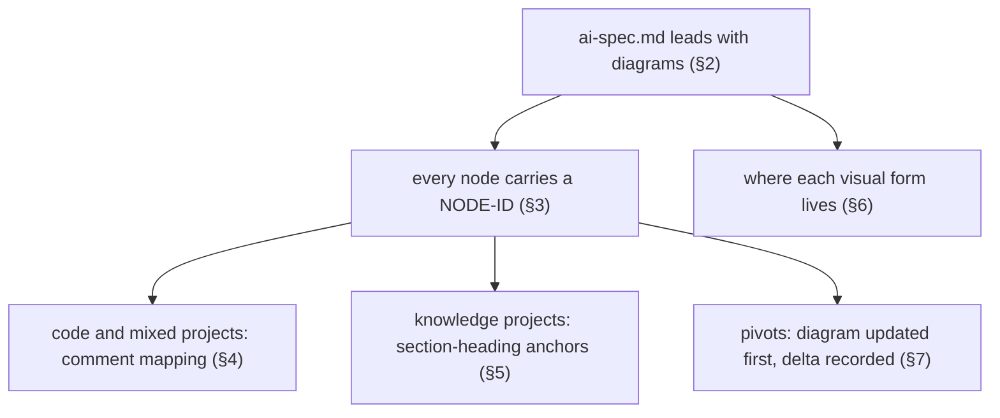
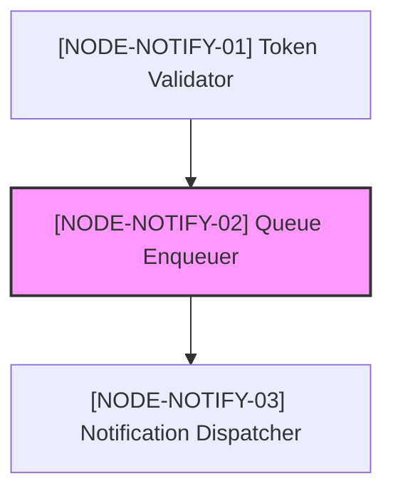
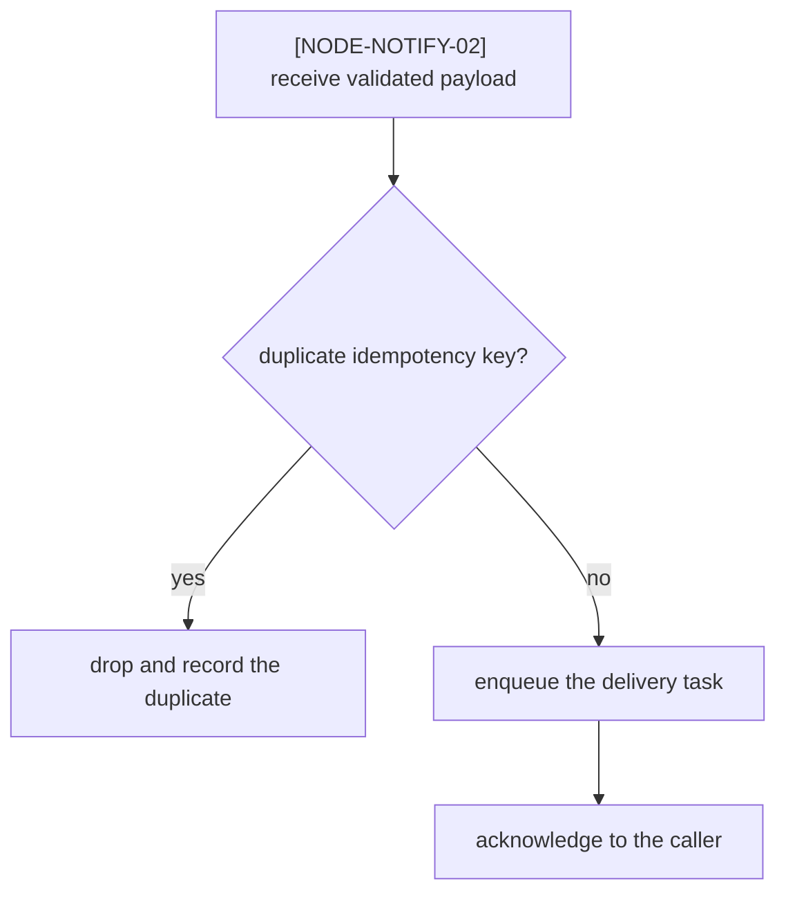
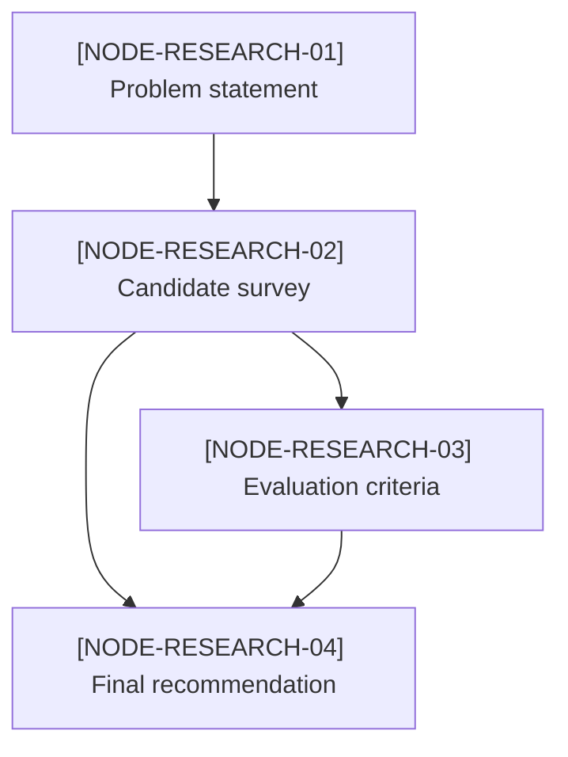
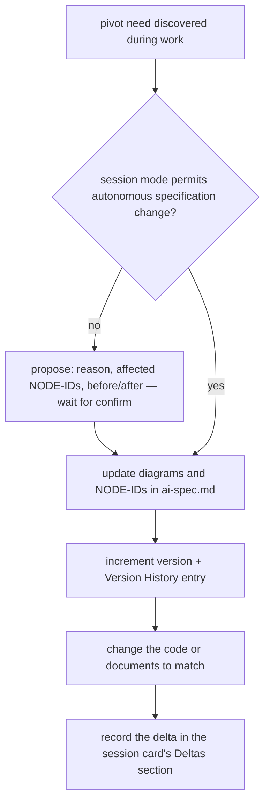

# Skill 04 — Diagram First

This document derives from [`core/philosophy.md`](../core/philosophy.md) and does
not restate it. The derivation chain (visual understanding as a first-degree
device) is laid out in [`01-principles.md`](01-principles.md); the audit items
this document answers to are **F3** (specs lead with diagrams) and **D1**
(every rule states which stage it serves) in
[`core/audit.md`](../core/audit.md).



| Rule | Derives from | Stage served |
| --- | --- | --- |
| Diagrams before prose (§2) | [`core/philosophy.md`](../core/philosophy.md) §2, first degree | First-degree verification |
| NODE-ID on every node (§3) | §2, nth degree | Nth-degree traceability |
| Code / section mapping (§4, §5) | §2, both stages | Both: verify now, trace later |
| Change control (§7) | §2 + §9 honesty of the record | Both |

## 1. Why diagrams come first

A diagram is not an illustration of the specification — it **is** the primary
verification surface. Humans catch macro logic errors (a missing branch, a
cycle, an unreachable step) in a node graph in seconds, where the same error
hides for pages inside prose. Leading with diagrams is therefore a
**first-degree device**: it is how the human verifies the AI's design at the
moment it is produced ([`core/philosophy.md`](../core/philosophy.md) §2).

Two consequences:

- **Human review protocol.** When reviewing an `ai-spec.md`, read the diagrams
  before the prose. Macro errors are cheaper to catch there.
- **Authority.** When diagram and prose disagree, the disagreement is a defect
  that blocks freezing the version ([`06-lifecycle-and-versioning.md`](06-lifecycle-and-versioning.md)).
  Neither silently wins; the conflict is resolved and recorded.

## 2. The leading visual block of `ai-spec.md`

Every `ai-spec.md` (topic layout defined in
[`02-context-architecture.md`](02-context-architecture.md), frontmatter defined
in [`03-okf.md`](03-okf.md)) must place the following **before any prose
section**, in this order:

| Order | Block | Mermaid form | Depicts |
| --- | --- | --- | --- |
| 1 | Macro node graph | `graph TD` | How the topic's features, actors, or documents interact — the whole topic on one screen |
| 2 | Detailed flowcharts | `flowchart TD` | The step-by-step logic of each nontrivial process, with decision branches explicit |

One macro graph per topic; one flowchart per nontrivial process. Prose
elaborates afterward, section by section, anchored to the NODE-IDs the
diagrams introduced.

### Sample — macro node graph



The `style` highlight marks the node currently under discussion or change —
use it in proposals, remove it at freeze time.

### Sample — detailed flowchart



Each flowchart is anchored to exactly one macro node: its first node (or its
section heading, see §5) carries that macro node's NODE-ID. Internal steps do
not need NODE-IDs unless they are individually mapped to code or referenced
from prose — in that case they receive their own NODE-ID from the same domain
sequence.

## 3. The NODE-ID scheme

Every diagram node carries a unique identifier:

```text
NODE-[DOMAIN]-[NUMBER]
```

| Segment | Rule |
| --- | --- |
| `NODE` | Literal prefix. Makes identifiers greppable across specifications, code, and session cards. |
| `[DOMAIN]` | Uppercase short code for the domain. Because Full Naming forbids **unregistered** abbreviations, this code must be registered in the project dictionary before first use ([`05-dictionary-and-naming.md`](05-dictionary-and-naming.md)) — in the sample above, `NOTIFY` is registered as the code for `notification-delivery`. |
| `[NUMBER]` | Zero-padded two-digit sequence within the domain (`01`, `02`, …; grow to three digits only when a domain exceeds 99 nodes). |

Identifier rules:

- **Project-wide uniqueness.** The domain segment is the namespace; a NODE-ID
  is unique across the whole project. Verification (`hnk.mjs verify`) checks
  for collisions, operationalizing audit item
  [N2](../core/audit.md#n--nth-degree-devices-transfer-time-understanding).
- **Never renumber, never reuse.** A pivot may add nodes or retire them, but an
  existing node keeps its NODE-ID for life. Retired NODE-IDs stay reserved so
  that Version History entries and session-card deltas
  ([`06-lifecycle-and-versioning.md`](06-lifecycle-and-versioning.md),
  [`08-conversation-archive.md`](08-conversation-archive.md)) never point at a
  recycled meaning.
- **The identifier appears twice per node**: as the Mermaid node identifier
  *and* inside the visible label —
  `NODE-NOTIFY-02["[NODE-NOTIFY-02] Queue Enqueuer"]`. The label copy survives
  rendering (viewers show it to humans) and plain-text search (AI and scripts
  grep for it).

The terms `NODE-ID`, `@spec-node`, and `@spec-doc` are seeded into the target
project dictionary at installation ([`05-dictionary-and-naming.md`](05-dictionary-and-naming.md)).

## 4. Code mapping — the code module

This section applies only when the Level 1 installation interview answered the
project type as `code` or `mixed` ([`07-pre-interview.md`](07-pre-interview.md)).
Pure `knowledge` projects use §5 instead.

Every code unit that implements a diagram node declares it in a comment block
at the top of the unit, using three markers:

| Marker | Content |
| --- | --- |
| `@spec-node` | The NODE-ID this unit implements. One line per NODE-ID if the unit implements several. |
| `@spec-doc` | Relative path from the project root to the owning `ai-spec.md`. |
| `@description` | One line: what this unit does and why, in Full Naming vocabulary. |

The comment leader follows the language family:

| Comment leader | Language family |
| --- | --- |
| `//` | C, C++, C#, Java, JavaScript, TypeScript, Go, Rust |
| `#` | Python, Ruby, Shell, YAML |
| `--` | SQL, Lua, Haskell |
| `<!-- … -->` | HTML, XML, Markdown |

Any comment form native to the language is acceptable (line comments, block
comments, documentation comments such as the JSDoc block below) **as long as
each of the three markers sits on its own line and is greppable** — leading
whitespace and decoration characters (`*`) before the marker are fine.

### Sample — JavaScript / TypeScript family

```javascript
/**
 * @spec-node NODE-NOTIFY-02
 * @spec-doc .context/notification-delivery/0001-outbound-queue/ai-spec.md
 * @description Enqueues the outbound message so that slow providers cannot time out the calling request.
 */
export async function enqueueNotificationTask(payload) {
  const idempotencyKey = payload.idempotencyKey;
  // implementation …
}
```

### Sample — `#` family

```python
# @spec-node NODE-NOTIFY-03
# @spec-doc .context/notification-delivery/0001-outbound-queue/ai-spec.md
# @description Delivers queued messages and records the provider response.
def dispatch_notification(task): ...
```

Mapping rules:

- One NODE-ID may map to several files; each mapped file names **all** the
  NODE-IDs it implements.
- A macro node with no implementing code (external system, human step) states
  that in the prose section anchored to its NODE-ID, so an auditor never
  mistakes "unmapped" for "unimplemented".
- Enforcement is by guidance, not by tool dependency: the target audit
  procedure and verification grep the mapping in both directions (every
  diagram NODE-ID accounted for; every `@spec-node` resolving to a live
  diagram node) — the operational form of audit item
  [N2](../core/audit.md#n--nth-degree-devices-transfer-time-understanding) —
  following the enforcement-as-guides principle of
  [`05-dictionary-and-naming.md`](05-dictionary-and-naming.md).

## 5. Non-code projects — what diagrams depict

Diagram-first is not a code rule; it is an understanding rule. In `knowledge`
projects (planning, research, writing, operations) the same two-block lead
applies — only the subject changes:

| Diagram | Mermaid form | Nodes are |
| --- | --- | --- |
| Decision flow | `flowchart TD` | Decisions and their criteria — how the project reaches a conclusion |
| Document dependency graph | `graph TD` | Documents and sections — which text depends on which source |
| Process flow | `flowchart TD` | Steps of a human or organizational process |
| Argument structure | `graph TD` | Claims, evidence, and objections — what supports what |

### Sample — document dependency graph



**Anchor convention.** Where code projects anchor a NODE-ID with `@spec-node`,
knowledge projects anchor it with a **section heading that carries the
NODE-ID**:

```markdown
## [NODE-RESEARCH-04] Final recommendation
```

Semantic pointers ([`03-okf.md`](03-okf.md)) then link to the heading anchor:

```markdown
See [NODE-RESEARCH-04](ai-spec.md#node-research-04-final-recommendation).
```

The heading is the single anchor for that node — in the same document or
across documents of the topic. Verification checks headings against diagram
nodes exactly as it checks `@spec-node` comments in code. `mixed` projects use
both conventions, each where it applies.

## 6. Where each visual form lives

| Form | Location | Committed |
| --- | --- | --- |
| Inline Mermaid (**preferred**) | Inside `ai-spec.md`, leading block per §2 | Yes |
| Standalone `.svg`, `.mmd` | The topic's `visuals/` directory ([`02-context-architecture.md`](02-context-architecture.md)) | Yes |
| Binaries (`.png`, `.webp`, screenshots, video, …) | `_media` with a required index entry and `alt` text — defined in [`09-visual-assets.md`](09-visual-assets.md); not respecified here | Index yes, files no |

Inline Mermaid is preferred because it is text: the AI parses it, git diffs
it, and viewers render it — one source serving both readers, exactly the
AI-native storage process of [`core/philosophy.md`](../core/philosophy.md) §7.

## 7. Diagram change control



On any pivot:

1. **The diagram moves first.** Diagrams and NODE-IDs in `ai-spec.md` are
   updated *before* any code or document is changed, in every autonomy mode.
   Whether the update needs prior confirmation is decided by the session mode
   agreed in the Level 2 interview ([`07-pre-interview.md`](07-pre-interview.md));
   audit item **F2** forbids skipping that agreement.
2. **The version freezes.** The specification's version number is incremented
   and a Version History entry is written, per
   [`06-lifecycle-and-versioning.md`](06-lifecycle-and-versioning.md).
3. **The delta is recorded** in the session card's **Deltas** section — the
   reason, the affected NODE-IDs, and the before/after of the diagram edges.
   The card format that owns this section is defined in
   [`08-conversation-archive.md`](08-conversation-archive.md).
4. **No orphan implementations.** Code or documents implementing a diagram
   change that was never recorded is a defect the audit flags
   ([`core/audit.md`](../core/audit.md), items F2 and H3): the record would
   claim less than what happened.

The before/after fragments in a delta are written in the same Mermaid edge
syntax as the diagram (`NODE-NOTIFY-01 --> NODE-NOTIFY-02`), so an nth-degree
consumer can replay the topology change without opening any other file.
