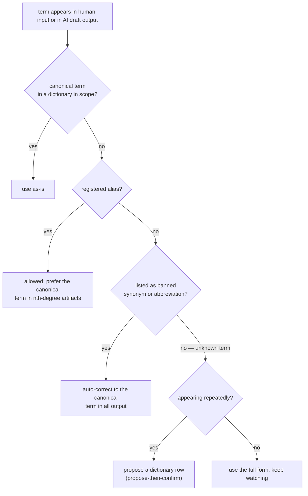
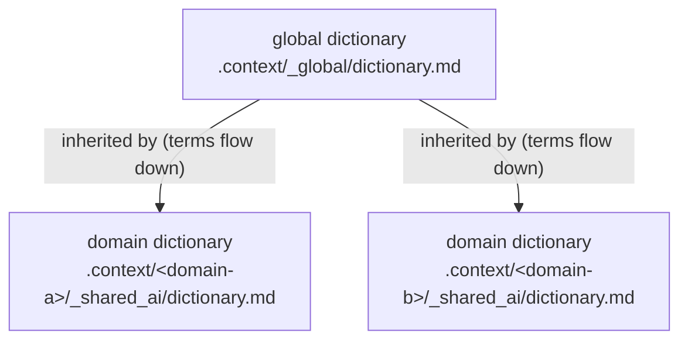

# 05 — Dictionary and Naming

Scope: shared vocabulary as a **first-degree device**. This document specifies
the refined Full Naming principle, the dictionary file format, how dictionary
scopes inherit, how the AI behaves around terms, and why automated enforcement
lives in `guides/` rather than in core.

## 1. Derivation

This document derives from [`core/philosophy.md`](../core/philosophy.md) and
adds mechanism only; the reasoning chain *"understanding requires the absence
of ambiguity → Full Naming"* is derived in [`01-principles.md`](01-principles.md).

| Core source | What derives from it here |
| --- | --- |
| [First principle, first degree](../core/philosophy.md#2-first-principle--the-two-stage-condition-of-accumulation) | While work happens, the human and the AI must mean the same thing by the same word. The dictionary is the shared-vocabulary contract that makes this checkable. |
| [AI-native storage process](../core/philosophy.md#7-the-ai-native-storage-process) | The AI writes and maintains the dictionary under rules; the human confirms rows at decision points and never hand-maintains the table. |
| [Judgment criterion](../core/philosophy.md#10-the-judgment-criterion), audit item [F4](../core/audit.md#f--first-degree-devices-production-time-mutual-understanding) | Every naming rule and every dictionary row must help first-degree or nth-degree understanding — a dictionary is not a glossary of everything. |

Which stage each mechanism serves (audit item
[D1](../core/audit.md#d--derivation-every-rule-earns-its-existence)): Full
Naming and auto-correction serve **first-degree** mutual understanding; the
dictionary file and its term anchors also serve **nth-degree** understanding,
because every later human and AI resolves the same word through the same table.

## 2. The Full Naming principle, refined

> **Abbreviations are banned unless registered in the dictionary as an
> official alias. The sin is unregistered ambiguity, not brevity itself.**

The unrefined form ("never abbreviate anything") fails the judgment criterion
in practice: some short names are unambiguous, heavily used, and sometimes
externally imposed (a public API named `auth`, a vendor product name). The
refined form keeps the ban as the default and makes legality a matter of
**registration**: a term is either the canonical full name, a registered
alias, or it does not appear in output.

`hnk` is the living example: it is the registered official short name of
**human-native-knowledge-skills**, used in `scripts/hnk.mjs`, in command
namespaces, and in prose — legal precisely because it is registered
(see the registration row in [§3.4](#34-the-hnk-registration-row)).

Full Naming applies to every artifact both parties read: conversation,
planning documents, specifications, session cards, commit messages, and code
identifiers.

### 2.1 Term resolution (the one flowchart every rule below follows)



## 3. The dictionary format

### 3.1 Files and scope inheritance



| Scope | File | Contains |
| --- | --- | --- |
| Global | `.context/_global/dictionary.md` | Workspace-wide terms; the seed rows of [§3.3](#33-default-seed-rows-proposals-not-law); the `hnk` row |
| Domain (optional layer) | `.context/<domain>/_shared_ai/dictionary.md` | Domain-specific business terms, **added** on top of the global scope |

Placement inside the target project's `.context/` tree is specified in
[`02-context-architecture.md`](02-context-architecture.md).

**Conflict rule.** A domain row that redefines, re-aliases, or un-bans a
global term is a conflict. Conflicts resolve **toward global** unless the
domain row explicitly overrides, with the override written into its
definition-and-rules cell (for example: *"Overrides global: in this domain,
`ticket` means a support case, not an event admission."*). A silent
contradiction between scopes is an audit failure under
[D3](../core/audit.md#d--derivation-every-rule-earns-its-existence).

### 3.2 Columns

| Column | Required | Content |
| --- | --- | --- |
| **Term** (canonical full name) | yes | The one legal name. Also carries the anchor ([§3.5](#35-term-anchors)). |
| **Registered aliases** | yes — **empty by default** | Short names that are legal. Each alias must have its justification recorded in the definition-and-rules cell. |
| **Banned synonyms / abbreviations** | yes — may be empty | Forms that must never appear in output. This column feeds enforcement ([§5](#5-enforcement-is-guidance-not-core)). |
| **Definition and rules** | yes | One to three sentences: what the term means, usage rules, alias justifications, override notes. |
| **Local-language name** | optional | Activated when the Level 1 installation interview's documentation-language answer includes a language other than English (defined in [`07-pre-interview.md`](07-pre-interview.md)). |

An alias earns registration only when it is (a) externally imposed or a
public-facing term the team cannot avoid, or (b) unambiguous within the
project and heavily used against a long canonical name — and in both cases the
reason is written into the definition-and-rules cell. Aliases are the
exception; the empty-by-default column is the norm.

The dictionary file itself carries machine-readable frontmatter with
`type: dictionary`, following the format defined in [`03-okf.md`](03-okf.md).

### 3.3 Default seed rows (proposals, not law)

These rows, generalized from the original playbook, are the **default seed**
of every new global dictionary. They are **proposals that the Level 1
installation interview confirms, edits, or rejects** — not law. The classic
example: some teams legitimately use `auth` as a public API term; for them the
interview moves `auth` from the banned column to registered aliases, with the
justification recorded.

| Term (canonical full name) | Registered aliases | Banned synonyms / abbreviations | Definition and rules |
| --- | --- | --- | --- |
| device | — | `dev`, `dvc`, `deviceInfo` | A physical device connected to the system. |
| context | — | `ctx`, `cntxt` | Application state, and the material a session provides to the AI. |
| authentication | — | `auth`, `authn` | The procedure that verifies an identity. If the team's public API uses `auth`, register it as an alias instead — the interview decides. |
| isLoading | — | `isPending`, `waiting`, `loadingState` | Boolean flag: an asynchronous operation is in progress. Seeded only for code and mixed project types. |
| NODE-ID | — | — | The unique identifier of a specification diagram node ([04-diagram-first.md](04-diagram-first.md)). Seeded for all project types. |
| spec-node | — | — | The `@spec-node` code-comment marker mapping code to a NODE-ID. Seeded only for code and mixed project types. |
| spec-doc | — | — | The `@spec-doc` code-comment marker pointing at the owning specification document. Seeded only for code and mixed project types. |

When the local-language column is activated, it is prepended, for example:

| Local name (한국어) | Term (canonical full name) | Registered aliases | Banned synonyms / abbreviations | Definition and rules |
| --- | --- | --- | --- | --- |
| 인증 | authentication | — | `auth`, `authn` | The procedure that verifies an identity. |

### 3.4 The `hnk` registration row

**This table is also the registry for this repository itself.** The
repository carries no installed `.context/` instance (it is the skill, not a
target), so the registration that makes the alias `hnk` legal lives here, in
the naming specification — every claim in this repository that "`hnk` is
registered" resolves to this section. Installation additionally seeds the
same row into the target's global dictionary, so the alias used by
`scripts/hnk.mjs` and its command namespace is registered — legal — in every
project the skill is installed into:

| Term (canonical full name) | Registered aliases | Banned synonyms / abbreviations | Definition and rules |
| --- | --- | --- | --- |
| human-native-knowledge-skills | `hnk` | — | The skill system operating this project's knowledge base. Alias registered because it is unambiguous, heavily used, and appears in file names (`scripts/hnk.mjs`) and command namespaces. |

### 3.5 Term anchors

Semantic pointers reference terms by dictionary anchor — from a topic
document in single-domain mode, `[device](../_global/dictionary.md#device)`
(in domain mode the path gains one level: `../../_global/dictionary.md#device`,
as in the examples of [`03-okf.md`](03-okf.md)). Because
table rows do not generate heading anchors, the term cell begins with an
explicit inline anchor whose id is the canonical term verbatim:

```markdown
| <a id="device"></a>device | — | `dev`, `dvc`, `deviceInfo` | A physical device connected to the system. |
```

The AI writes these anchors when it writes rows (the human never hand-edits
the table — [core §7](../core/philosophy.md#7-the-ai-native-storage-process)).
The pointer grammar itself is defined in [`03-okf.md`](03-okf.md); dead term
pointers fail audit item [N2](../core/audit.md#n--nth-degree-devices-transfer-time-understanding).

### 3.6 What earns a row

A row exists only if it helps understanding
([core §10](../core/philosophy.md#10-the-judgment-criterion)): the term
carries a usage rule, has caused or plausibly risks ambiguity, or has aliases
or banned forms. A dictionary that defines every noun in the project is
padding, and padding is itself a form of knowledge debt.

## 4. AI behavior

These are standing rules, instantiated into the target project's
`orchestrator.md` at installation
(see [`02-context-architecture.md`](02-context-architecture.md)):

1. **Load the scope.** At session start, read the global dictionary and the
   dictionary of the domain being worked on. They are small by design (§3.6).
2. **Auto-correct, silently.** When the human types a form listed in the
   banned column (`dev`, `ctx`, `auth`), the AI uses the canonical term
   (`device`, `context`, `authentication`) in **all output and written
   artifacts**. Human input is never rejected and never lectured about;
   correction is silent normalization of the output side. Unknown terms are
   not auto-corrected — they follow rule 3 and the flowchart of
   [§2.1](#21-term-resolution-the-one-flowchart-every-rule-below-follows).
3. **Propose rows for repeated new terms.** When an unregistered term keeps
   appearing (guideline: three or more times within a session, or across two
   sessions on the same topic), the AI proposes a complete dictionary row —
   canonical name, empty aliases, candidate banned forms, one-line definition
   — and waits for confirmation before appending it
   (**propose-then-confirm**, per
   [core §8](../core/philosophy.md#8-storageconsumption-separation)).
4. **Register instead of fight.** If the human keeps choosing an
   abbreviation after correction, the resolution is not repeated correction —
   it is a proposal to register the abbreviation as an official alias, with
   the justification recorded. The dictionary adapts to real usage; it does
   not wage war on it.

Row additions and edits are decisions: they go through propose-then-confirm
and are recorded in the session card of the session that made them (session
cards are defined in [`08-conversation-archive.md`](08-conversation-archive.md)).
The dictionary is a living document in the global layer — it is never frozen;
its history is its git history (see
[`06-lifecycle-and-versioning.md`](06-lifecycle-and-versioning.md)).

## 5. Enforcement is guidance, not core

The **principle** is universal and constitutional: audit item
[F4](../core/audit.md#f--first-degree-devices-production-time-mutual-understanding)
checks it in every project, and the AI behavior of [§4](#4-ai-behavior) is the
zero-dependency floor that works in any environment. The **mechanism** is
per-stack tooling, and tooling churns — so mechanisms live as reference
guides, chosen through the Level 1 installation interview and activated by its
project-type answer (code and mixed projects; defined in
[`07-pre-interview.md`](07-pre-interview.md)):

| Guide | Stack | Mechanism |
| --- | --- | --- |
| [`guides/enforcement/eslint.md`](../guides/enforcement/eslint.md) | TypeScript / JavaScript | Lint rules **generated from the banned column** (`no-restricted-syntax`, `id-denylist`) — violations fail lint at the code level. |
| [`guides/enforcement/generic-grep.md`](../guides/enforcement/generic-grep.md) | Any stack, any file type | A continuous-integration grep over the banned column — **the works-anywhere floor**. Also usable on documents in knowledge-type projects. |

Rules for this layer:

- **Link guides; never inline them.** Their content is maintained in one
  place so it can track tool changes without touching this specification.
- **Mechanism failure must not break the floor.** If lint or grep is absent
  or broken, the AI behavior rules of [§4](#4-ai-behavior) and audit item F4
  still hold — enforcement tooling is an amplifier, not the rule itself.
- **Knowledge-type projects** get no mandatory tooling: §4 plus F4 are their
  enforcement, with `generic-grep` available as an optional document scan.

## 6. Related documents

| Document | Relationship |
| --- | --- |
| [`01-principles.md`](01-principles.md) | Derives Full Naming from the core first principle; this document mechanizes it. |
| [`02-context-architecture.md`](02-context-architecture.md) | Where dictionary files live in the target `.context/` tree. |
| [`03-okf.md`](03-okf.md) | Frontmatter of dictionary files; semantic pointer grammar for term anchors. |
| [`04-diagram-first.md`](04-diagram-first.md) | Diagram conventions used by this document's flowcharts. |
| [`06-lifecycle-and-versioning.md`](06-lifecycle-and-versioning.md) | Living-document status of dictionaries; git-native history. |
| [`07-pre-interview.md`](07-pre-interview.md) | Level 1 interview: confirms seed rows, activates the local-language column, selects enforcement. |
| [`08-conversation-archive.md`](08-conversation-archive.md) | Session cards that record dictionary-row decisions. |
