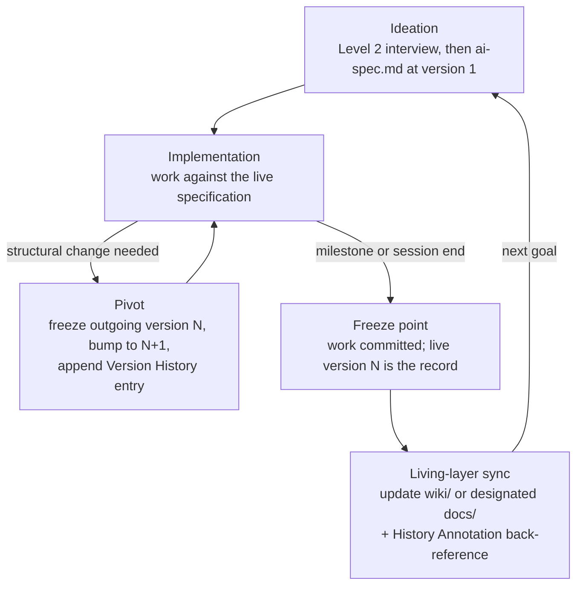
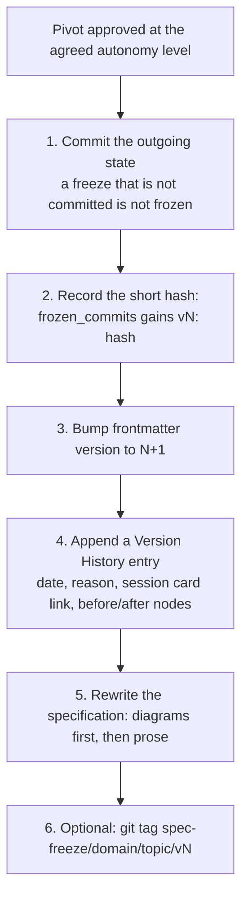

# 06 — Lifecycle and Versioning

This document specifies how a topic's specification evolves without losing
history. It derives from the first principle of
[`core/philosophy.md`](../core/philosophy.md) §2: verifying accumulated work
requires distinguishing *the decision as it was made* from *the state as it is
now*. The decision-at-the-time is served by frozen versions and Version
History (nth-degree devices); the current state is served by exactly one live
specification per topic and by the Living layer (first-degree and nth-degree
at once). The derivation of this split from the core is laid out in
[01-principles.md](01-principles.md); the topic and Living-layer structures it
operates on are defined in
[02-context-architecture.md](02-context-architecture.md).

## 1. The lifecycle



| Stage | What happens | Recorded where |
| --- | --- | --- |
| Ideation | Goal agreed in the Level 2 interview; `ai-spec.md` drafted at `version: 1`, diagrams first | topic folder ([02-context-architecture.md](02-context-architecture.md)); interview defined in [07-pre-interview.md](07-pre-interview.md) |
| Implementation | Work proceeds against the live specification at the agreed autonomy level | session card Deltas, defined in [08-conversation-archive.md](08-conversation-archive.md) |
| Pivot | The agreed structure changes: outgoing version frozen, version bumped, Version History appended | `ai-spec.md` frontmatter + Version History section (§2) |
| Freeze point | Milestone or session ends; everything is committed | git history |
| Living-layer sync | Living layer updated to current architecture; History Annotation appended | `wiki/` or designated `docs/` (§5) |

**Pivot boundary.** A pivot is any change that alters the structure of the
specification's node graph (nodes added, removed, or re-wired — see
[04-diagram-first.md](04-diagram-first.md)) or invalidates a decision recorded
in the specification. Wording and detail edits that preserve the agreed intent
are not pivots: they ride on ordinary git history and are summarized in the
session card's Deltas section. Whether a pivot may be applied directly or must
be proposed first is governed by the session's recorded autonomy level
([07-pre-interview.md](07-pre-interview.md)).

## 2. Git-native freeze

**One live `ai-spec.md` per topic.** There are no version folders and no
frozen copies by default. Git history already stores every past state of the
file; this document's job is to make those past states *addressable and
understandable* — a hash without a reason is not knowledge.

### 2.1 Freeze fields

The live specification's frontmatter carries two lifecycle-owned fields
(all other frontmatter fields, and the machine-readable grammar they must
obey, are defined in [03-okf.md](03-okf.md)):

```yaml
version: 2
frozen_commits: {v1: a1b2c3d}
```

- `version` — integer, starts at 1. The version of the *live* content.
- `frozen_commits` — inline flow map. One entry per **past** version:
  `vN: <short-hash>` where the hash is the commit that contains the final
  state of version N (`git rev-parse --short HEAD` at freeze time). A topic
  still on version 1 has `frozen_commits: {}` — version 1 is simply the live
  file until the first pivot freezes it.

### 2.2 Pivot procedure



Step 6 tags are optional but recommended for long-lived projects:
`spec-freeze/<domain>/<topic>/vN`, or `spec-freeze/<topic>/vN` when the
project has no domain layer. Tags make frozen versions addressable by name
instead of hash; they add no information the frontmatter lacks.

### 2.3 Version History section

Appending a Version History entry at every pivot is **mandatory**. It lives
as the last section of the live `ai-spec.md` and answers, for every past
version, the nth-degree question: *why did this change?* Format:

```markdown
## Version History

### v1 → v2 — 2026-07-29
- **reason:** External API timeouts forced a move from synchronous dispatch
  to queue-based asynchronous dispatch.
- **decided-by:** [session-20260729-143012-queue-pivot](../../_archive/session-20260729-143012-queue-pivot.md)
- **before:** `NODE-SMS-01[Validator] --> NODE-SMS-02[Sync Dispatcher]`
- **after:** `NODE-SMS-01[Validator] --> NODE-SMS-02[Queue Enqueuer] --> NODE-SMS-03[Notification Dispatcher]`
- **frozen-as:** v1 at commit `a1b2c3d` (tag `spec-freeze/sms-system/0001-notification/v1`)
```

Every entry must contain: date, reason, a relative link to the session card
that decided the pivot (card format and id scheme defined in
[08-conversation-archive.md](08-conversation-archive.md)), a before/after
summary at the node level (NODE-IDs per
[04-diagram-first.md](04-diagram-first.md)), and the frozen commit hash of
the outgoing version.

### 2.4 Retrieving a frozen version

Any consumer — human or AI — retrieves a frozen version from history:

```bash
git show a1b2c3d:.context/sms-system/0001-notification/ai-spec.md
# or, if tagged:
git show spec-freeze/sms-system/0001-notification/v1:.context/sms-system/0001-notification/ai-spec.md
```

Retrieval at a commit reproduces the *entire* repository state of that
moment, so relative semantic pointers inside the frozen content resolve as
they did then — something no physical copy can guarantee.

## 3. Why folder-copy freezing was replaced

The original playbook froze versions as hard-copied folders (`v1/`, `v2/`
inside each topic). That scheme was replaced by the git-native freeze above —
the change and its rationale are recorded in the change table of
[01-principles.md](01-principles.md). The operational failures were:

| Failure of folder copies | What went wrong | Git-native answer |
| --- | --- | --- |
| Duplication with git history | Every freeze re-stored bytes git history already stored | History stores the bytes; frontmatter stores the address |
| Link rot in frozen copies | Relative semantic pointers inside a `vN/` copy broke as neighboring files moved on | Retrieval at a commit resolves pointers as of that commit (§2.4) |
| Path breakage on every pivot | Every inbound reference targeted `.../vN/artifact/ai-spec.md` and had to be re-pointed at each pivot | One stable live path per topic, forever |
| Live-version ambiguity | Nothing structural marked which folder was current | Exactly one live file; its `version` field says what it is |

The folder scheme survives only as the no-git fallback in Appendix A.

## 4. The change ledger is absorbed into session cards

The playbook's `change-ledger.json` recorded per-change deltas (reason,
NODE-IDs, before/after, affected files). In `hnk`, that semantic payload is
carried by the **Deltas section of the session card** — reason, affected
NODE-IDs, and before/after summary (affected files live in the card's
separate Affected-files section) — as specified in
[08-conversation-archive.md](08-conversation-archive.md). A separate ledger
file would duplicate the card and split the single source of truth for "what
changed and why". The ledger file therefore no longer exists in git-managed
projects; it survives **only** in the no-git fallback (Appendix A.2), where
there is no git history for the card to lean on.

## 5. Living-layer sync with History Annotation

The Living layer (structural specification in
[02-context-architecture.md](02-context-architecture.md); location chosen in
the Level 1 interview — an existing `docs/` or a created `wiki/`) shows only
the **current** architecture. `.context/` remembers; the Living layer states.
This section owns the sync rule connecting the two.

**Trigger.** At every milestone or session end — a standing rule in the
target project's `orchestrator.md`, alongside the archive step defined in
[08-conversation-archive.md](08-conversation-archive.md).

**Procedure.**

1. Update every Living document affected by the session so it describes the
   current architecture — the live version N of the relevant specifications.
   No history in the body: superseded content is removed, not struck through.
2. Append one **History Annotation** entry at the bottom of each updated
   Living document, back-referencing `.context/`: topic + version + session
   card, as relative links.
3. Run verification (§6).

**History Annotation format** (append-only; newest entry last; one entry per
sync):

```markdown
## History Annotation

- 2026-07-29 — [0001-notification](../.context/sms-system/0001-notification/ai-spec.md) v2
  — decided in [session-20260729-143012-queue-pivot](../.context/_archive/session-20260729-143012-queue-pivot.md)
```

The annotation is the Living layer's only memory: a reader of the current
architecture can walk back to the specification version and the session that
produced it, without the Living document itself accumulating history.

## 6. Verification hooks

Verification (`hnk.mjs verify` — its command shape is frozen together with
the archive interfaces of
[08-conversation-archive.md](08-conversation-archive.md); the implementation
lands with the script) asserts the rules this document owns:

| Check | Rule verified |
| --- | --- |
| `version` is an integer ≥ 1 | §2.1 |
| `frozen_commits` has exactly keys `v1..v(N-1)` when `version: N` | §2.1 — every past version is addressable |
| Version History section exists with one entry per past version whenever `version > 1` | §2.3 — every freeze has a reason |
| Recorded hashes resolve in local history (when git is available) — **audit-level**: checked by the target audit procedure, not by `hnk.mjs verify` in v1 | §2.4 |
| Living layer exists at the location recorded in `.context/_global/project-profile.md` | §5 |

These checks operationalize items N2 and N3 of
[`core/audit.md`](../core/audit.md) for the lifecycle domain.

## Appendix A — No-git fallback (fallback-only)

**This appendix applies only when the target project is not a git
repository** (recorded in `project-profile.md` by the Level 1 interview).
If git is available, the git-native freeze of §2 is mandatory and this
appendix must not be used — running both would recreate the duplication
failure of §3.

### A.1 Version folders

On pivot, before editing, hard-copy the live specification into a version
folder inside the topic; the live files stay flat at the topic root:

```text
.context/sms-system/0001-notification/
├── interview.md
├── sources.md
├── ai-spec.md               # live — always the current version
├── change-ledger.json       # fallback delta log (A.2)
└── versions/
    ├── v1/ai-spec.md        # hard copy, frozen at the pivot to v2
    └── v2/ai-spec.md        # hard copy, frozen at the pivot to v3
```

The frontmatter field `frozen_commits` is replaced by
`frozen_copies: {v1: versions/v1/ai-spec.md}`. The Version History section
of §2.3 remains mandatory and identical (its `frozen-as` line cites the copy
path instead of a hash). Relative links inside frozen copies are **not**
maintained — this is the known link-rot cost of §3, accepted only because
there is no history to retrieve from.

### A.2 change-ledger.json

Without git history, session cards have no byte-level record to lean on, so
the ledger survives here as an append-only machine log at the topic root.
Format (the `mode` value is the session's recorded autonomy level from
[07-pre-interview.md](07-pre-interview.md): `confirm-each-change` |
`confirm-spec-changes-only` | `autonomous-with-report`):

```json
[
  {
    "timestamp": "2026-07-21T10:30:00Z",
    "mode": "autonomous-with-report",
    "status": "APPLIED_AND_REPORTED",
    "nodeId": "NODE-SMS-02",
    "reason": "Switched from synchronous dispatch to queue-based asynchronous dispatch to prevent external API timeouts",
    "specDiff": {
      "before": "NODE-SMS-01[Validator] --> NODE-SMS-02[Sync Dispatcher]",
      "after": "NODE-SMS-01[Validator] --> NODE-SMS-02[Queue Enqueuer] --> NODE-SMS-03[Notification Dispatcher]"
    },
    "affectedFiles": [
      "src/services/queue-service.ts",
      "src/workers/notification-worker.ts"
    ]
  }
]
```

`status` is `CONFIRMED_AND_APPLIED` under the two confirm modes and
`APPLIED_AND_REPORTED` under `autonomous-with-report`. Session cards are
still written in no-git mode ([08-conversation-archive.md](08-conversation-archive.md));
the ledger duplicates their Deltas payload in machine form deliberately,
because here the ledger — not git — is the only byte-faithful record.

### A.3 Migrating to git later

When git is introduced into a fallback project: commit the current state,
adopt §2 from that commit forward, keep `versions/` folders and the ledger
as a historical record (do not delete, do not append), and note the
migration as a Version History entry in each affected specification.
