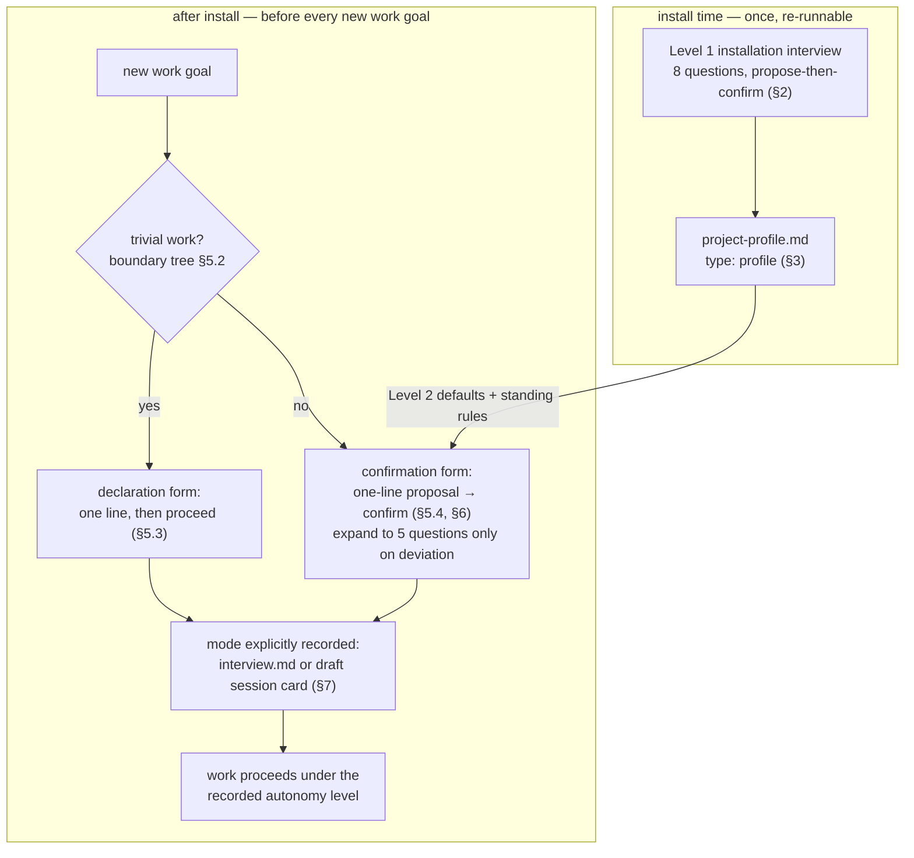
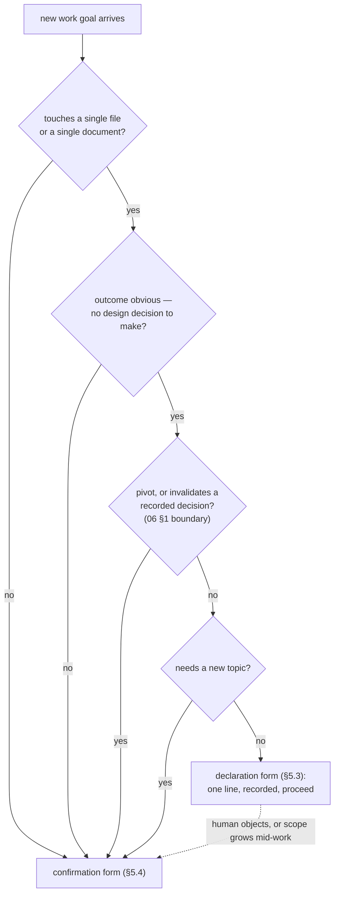
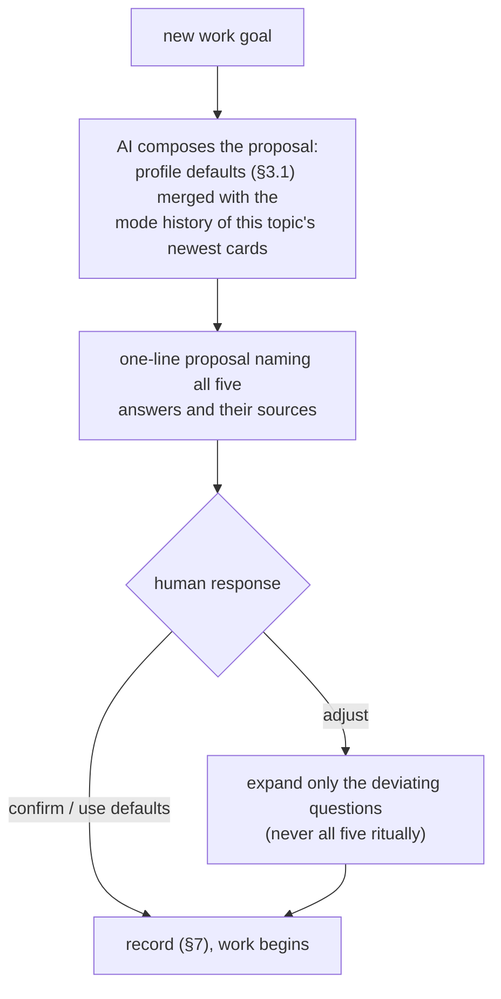

# 07 — Pre-Interview

Scope: the way of working itself is agreed and recorded **before** work
happens — the first-degree device derived in
[`01-principles.md` §3 I3](01-principles.md#i3--two-point-pre-interview-install-time--per-work-goal)
from [`core/philosophy.md` §2](../core/philosophy.md#2-first-principle--the-two-stage-condition-of-accumulation).
This document specifies the mechanism only; it answers to audit items
[F1 and F2](../core/audit.md#f--first-degree-devices-production-time-mutual-understanding)
in [`core/audit.md`](../core/audit.md). The interview system replaces the
source playbook's hardcoded Interactive/Auto execution modes — that change and
its reason are recorded in the change table of
[`01-principles.md` §6](01-principles.md#6-what-changed-from-the-source-playbook-and-why).

## 1. The two interview points

Both points are **mandatory**. Level 1 runs at installation as a required,
re-runnable step of the install state machine
([`orchestrator.md`](../orchestrator.md) step 3). Level 2 runs before **every**
new work goal after installation — not as a one-shot suggestion, but as a
standing rule instantiated into the target project's
`.context/_global/orchestrator.md` (rules in [§8](#8-standing-orchestrator-rules)).



| Level | When | Mandated by | Output | Re-run |
| --- | --- | --- | --- | --- |
| Level 1 — installation interview | skill installation | required step of [`orchestrator.md`](../orchestrator.md) | `.context/_global/project-profile.md` (§3) | any time; re-runs propose diffs against the existing profile |
| Level 2 — work interview | before every new work goal | standing rule in the target's orchestrator (§8) | `interview.md` or session-card `mode` (§7) | on goal shift, by proposed update (§8 R6) |

Both levels are **propose-then-confirm**: the AI does all the analysis first
(inspecting the target, its history, and the profile) and presents a complete
proposed answer set; the human confirms or edits. The human-time budget in the
common path is **under a minute** — for Level 1 through bulk confirmation of a
filled-in proposal, for Level 2 through the one-line convergence of
[§6](#6-convergence--the-one-line-proposal) — per the worker/confirmer split of
[`core/philosophy.md` §7](../core/philosophy.md#7-the-ai-native-storage-process).

## 2. Level 1 — the installation interview

### 2.1 Frozen interface — the Level 1 question bank

The eight questions, their closed value sets, and their profile fields are a
**frozen interface at milestone M2**. Open-valued answers (marked *open*) may
take any one-line value; closed enums may not grow without a version increment
of this document.

| # | Question | Answer values | Drives / gates | Profile field(s) (§3.1) |
| --- | --- | --- | --- | --- |
| L1-1 | Project type | `code` \| `knowledge` \| `mixed` | activates the code module: spec-node mapping ([`04-diagram-first.md` §4](04-diagram-first.md#4-code-mapping--the-code-module)), enforcement tooling ([`05-dictionary-and-naming.md` §5](05-dictionary-and-naming.md#5-enforcement-is-guidance-not-core)); rule gating table in [`02-context-architecture.md` §9](02-context-architecture.md#9-project-types) | `project_type` |
| L1-2 | AI environments in use | *open* — inline list of environment names, detected then confirmed | what integration [10-environment-integration.md](10-environment-integration.md) generates at install and regenerates on harness change | `environments` |
| L1-3 | Stack and repository shape | *open* one-line stack summary **plus three recorded gates**: git available `true`\|`false`; domain layer `true`\|`false` ([`02-context-architecture.md` §3.1](02-context-architecture.md#31-single-domain-mode)); UI surface present `true`\|`false` (gates `design-system.md`, [`02-context-architecture.md` §9](02-context-architecture.md#9-project-types)) | enforcement guide selection (`guides/enforcement/`); no-git fallback ([`06-lifecycle-and-versioning.md` Appendix A](06-lifecycle-and-versioning.md#appendix-a--no-git-fallback-fallback-only)) | `stack`, `git`, `domain_layer`, `design_system` |
| L1-4 | Viewer | *open* — bring-your-own viewer name, or `none` | reference guide selection (`guides/viewers/`); never a dependency | `viewer` |
| L1-5 | Living layer location | designate an existing `docs/` (or equivalent) \| create `wiki/` — **there is no "none" option**; the Living layer's role is mandatory per [`02-context-architecture.md` §6](02-context-architecture.md#6-the-living-layer) | Living-layer designation or creation at install; sync target of [`06-lifecycle-and-versioning.md` §5](06-lifecycle-and-versioning.md#5-living-layer-sync-with-history-annotation) | `living_layer` (the resulting path) |
| L1-6 | Storage backend | `none` \| `r2` | the upload paths of [08-conversation-archive.md](08-conversation-archive.md) and [09-visual-assets.md](09-visual-assets.md); guide: `guides/storage/cloudflare-r2.md`. **When the answer is `none`, the AI must state the disclosure of §2.2 before confirmation.** | `storage` |
| L1-7 | Documentation languages and audience | *open* — inline list of language tags + one-line audience description | a language other than English activates the dictionary's local-language column ([`05-dictionary-and-naming.md` §3.2](05-dictionary-and-naming.md#32-columns)) | `languages`, `audience` |
| L1-8 | Dictionary seeding | confirm / edit / reject each proposed row | seeds the global dictionary: the default rows of [`05-dictionary-and-naming.md` §3.3](05-dictionary-and-naming.md#33-default-seed-rows-proposals-not-law), the `hnk` registration row of [§3.4](05-dictionary-and-naming.md#34-the-hnk-registration-row), plus candidate terms the AI found by scanning the target | none — the rows land in `dictionary.md` (single source of truth); the profile records only `dictionary_seeded: true` |

### 2.2 Conduct rules

- **Analyze before asking.** The AI inspects the target first — detects
  environments and stack, finds an existing `docs/`, scans for recurring terms
  (L1-8) — and proposes every answer pre-filled. Questions the analysis
  answers with confidence are presented for bulk confirmation; only genuinely
  ambiguous ones are asked individually.
- **The `none`-storage disclosure (frozen wording requirement).** When L1-6 is
  answered `none`, the AI must state, before the answer is confirmed:
  *"Raw transcripts and binaries will exist only on this machine; if it is
  lost, only the session cards remain."* This is the honesty rule of
  [`core/philosophy.md` §9](../core/philosophy.md#9-honesty-of-the-record)
  applied in advance: the human accepts the loss surface knowingly.
- **Re-running is safe.** Level 1 may be re-run whenever the situation changes
  (new AI environment, storage added, language change, harness change per
  [10-environment-integration.md](10-environment-integration.md)). A re-run
  proposes diffs against the existing profile and appends or updates only
  confirmed changes — user data files are never overwritten
  ([`02-context-architecture.md` §10](02-context-architecture.md#10-installation-and-existing-assets)).

## 3. The project profile

The profile is the durable record of Level 1:
`.context/_global/project-profile.md`, frontmatter `type: profile` (type enum
in [`03-okf.md` §2.2](03-okf.md#22-the-type-enum)). It is a living document of
the global layer — never frozen; its history is its git history, like the
dictionary ([`06-lifecycle-and-versioning.md`](06-lifecycle-and-versioning.md)).

### 3.1 Frozen interface — profile frontmatter fields

In addition to the common fields of [`03-okf.md` §2.1](03-okf.md#21-common-fields-every-document),
a `type: profile` document carries these fields, all in the machine-readable
subset grammar of [`03-okf.md` §3](03-okf.md#3-the-machine-readable-subset-grammar):

| Field | Value | Records |
| --- | --- | --- |
| `project_type` | `code` \| `knowledge` \| `mixed` | L1-1 |
| `environments` | inline list | L1-2 |
| `stack` | one line, quoted per grammar | L1-3 |
| `git` | `true` \| `false` | L1-3 gate |
| `domain_layer` | `true` \| `false` | L1-3 gate |
| `design_system` | `true` \| `false` | L1-3 gate |
| `viewer` | one-line name or `none` | L1-4 |
| `living_layer` | relative path from project root (`wiki/`, `docs/`, …) | L1-5 — verification checks the Living layer exists here ([`02-context-architecture.md` §7](02-context-architecture.md#7-storageconsumption-separation-and-the-integrity-net)) |
| `storage` | `none` \| `r2` | L1-6 |
| `languages` | inline list of language tags | L1-7 |
| `audience` | one line, quoted | L1-7 |
| `dictionary_seeded` | `true` \| `false` | L1-8 completed |
| `hnk_version` | installed skill release, e.g. `"1.0.0"` | installed version (with `hnk_commit`, the upgrade baseline) |
| `hnk_commit` | short commit hash of the installed skill repository | same |
| `defaults` | inline map `{mode: <Q2 value>, depth: <Q3 value>}` | the Level 2 defaults this project starts every proposal from (§6) |

Example (instance ids in `related` are fixed by the templates at
instantiation; shown empty here):

```yaml
---
id: project-profile
type: profile
status: active
version: 1
related: []
project_type: mixed
environments: [claude-code]
stack: "TypeScript monorepo, pnpm workspaces"
git: true
domain_layer: false
design_system: false
viewer: obsidian
living_layer: docs/
storage: none
languages: [en, ko]
audience: "product team of four; Korean-first readers"
dictionary_seeded: true
hnk_version: "1.0.0"
hnk_commit: a1b2c3d
defaults: {mode: confirm-spec-changes-only, depth: full-topic}
summary: "Level 1 record: mixed project, docs/ as Living layer, no storage backend, Korean local-language column active."
---
```

### 3.2 Frozen interface — profile body sections

| Section | Content | Rule |
| --- | --- | --- |
| `## Level 1 answers` | one table row per question L1-1..L1-8: question, confirmed answer, reason/notes (including the acknowledged `none`-storage disclosure when applicable) | the human-extractable record with *reasons*; on any divergence from frontmatter, **frontmatter is the machine authority** and the divergence is a defect |
| `## Level 2 defaults` | the default mode and depth with a one-line reason each, plus any project-specific deviations from the defaults table of [§4.3](#43-frozen-interface--defaults-by-deliverable-type) | read by the AI when composing the one-line proposal of [§6](#6-convergence--the-one-line-proposal) |
| `## Environment integration` | the integration record table — one row per AI environment | **owned by [10-environment-integration.md](10-environment-integration.md) §4.3**; listed here so the frozen profile body is complete |

### 3.3 Standing profile rules

Instantiated into the target orchestrator (full rule set in [§8](#8-standing-orchestrator-rules)):
read the profile at session start; **never re-ask a question the profile
already answers**; if a needed answer is missing, ask once and append it.
Re-asking answered questions is friction with no understanding gained — it
fails the judgment criterion of
[`core/philosophy.md` §10](../core/philosophy.md#10-the-judgment-criterion).

## 4. Level 2 — the work interview

### 4.1 Frozen interface — the Level 2 question set

At most **five questions**, skippable as a whole with the shortcut answer
**"use defaults"** ([§5.4](#54-the-confirmation-form)). Questions, value
enums, and field names are frozen at milestone M2.

| Q | Question | Frozen values | Recorded as |
| --- | --- | --- | --- |
| Q1 | Goal and deliverable type | free-text goal + `specification` \| `implementation` \| `research` \| `hotfix` | `goal`, `deliverable` |
| Q2 | Autonomy level | `confirm-each-change` \| `confirm-spec-changes-only` \| `autonomous-with-report` | `mode` |
| Q3 | Documentation depth | `full-topic` \| `lightweight` | `depth` — decides where the record lives (§7) |
| Q4 | Visual requirements | `node-graph-and-flowchart` \| `flowchart-only` \| `none` | `visuals` |
| Q5 | Archive granularity | `card-per-milestone` \| `card-per-goal` | `archive` |

The `deliverable` enum is deliberately coarse: an unusual goal takes the
nearest behavior profile, and the free-text `goal` line carries the nuance.
Naming note: the machine token `full-topic` mirrors the owning file name
[`03-okf.md`](03-okf.md); like a file name, an enum token is machine layer,
not prose — in prose write "full Open Knowledge Format topic"
(cf. the naming note of [`03-okf.md`](03-okf.md) and Full Naming in
[`05-dictionary-and-naming.md` §2](05-dictionary-and-naming.md#2-the-full-naming-principle-refined)).

### 4.2 The autonomy scale

The three levels of Q2 are the system's only execution modes. The source
playbook's Auto mode survives as the *behavior* of the third level — its
document-first discipline and report protocol — rather than as an unrecorded
default ([`01-principles.md` §6](01-principles.md#6-what-changed-from-the-source-playbook-and-why)).

| `mode` | AI acts without asking | AI must confirm first | Reporting duty |
| --- | --- | --- | --- |
| `confirm-each-change` | nothing — every change is proposed | every change | per change, at proposal time |
| `confirm-spec-changes-only` | implementation-level changes within the agreed specification | any pivot — the boundary of [`06-lifecycle-and-versioning.md` §1](06-lifecycle-and-versioning.md#1-the-lifecycle) — or anything that invalidates a recorded decision | deltas in the session card |
| `autonomous-with-report` | changes including specification updates, **document-first**: diagram and specification updated before implementation ([`04-diagram-first.md` §7](04-diagram-first.md#7-diagram-change-control)) | goal changes and interview updates only (§8 R6) | consolidated report at each milestone or session end, plus the session card |

In every mode, changing the **mode itself** or the goal silently is forbidden
(audit item F2) — mode changes go through a proposed interview update.

### 4.3 Frozen interface — defaults by deliverable type

These are the system-wide starting defaults; a project's
`profile.defaults` (§3.1) overrides `mode` and `depth`, and the one-line
proposal of [§6](#6-convergence--the-one-line-proposal) presents the final merged values for confirmation.

| `deliverable` | `mode` | `depth` | `visuals` | `archive` |
| --- | --- | --- | --- | --- |
| `specification` | `confirm-spec-changes-only` | `full-topic` | `node-graph-and-flowchart` | `card-per-milestone` |
| `implementation` | `confirm-spec-changes-only` | `full-topic` | `node-graph-and-flowchart` | `card-per-milestone` |
| `research` | `autonomous-with-report` | `full-topic` | `node-graph-and-flowchart` | `card-per-goal` |
| `hotfix` | `confirm-each-change` | `lightweight` | `none` | `card-per-goal` |

The hotfix row encodes a deliberate trade: documentation depth is lowered, so
the compensating first-degree device is raised confirmation frequency — the
understanding budget moves from the record to the conversation, it is never
dropped.

**Consistency rule (frozen).** `depth: full-topic` requires
`visuals: node-graph-and-flowchart` — a full topic owns an `ai-spec.md`,
whose leading visual block is mandatory per
[`04-diagram-first.md` §2](04-diagram-first.md#2-the-leading-visual-block-of-ai-specmd).
`flowchart-only` and `none` are legal only with `depth: lightweight`, where
any needed diagram lives in the session card body or the edited document.

## 5. The two fulfillment forms

### 5.1 What is mandatory

**What is mandatory is that the mode is explicitly recorded at work start —
not the interview ceremony** (audit item F1: work never begins under an
implicit mode). Level 2 is fulfilled in one of two forms; the boundary is frozen.

### 5.2 Frozen interface — the boundary decision tree



The declaration form is permitted only when **all four** tests pass. Two
override rules: **doubt resolves to the confirmation form**, and a human
objection to a declaration converts it to the confirmation form immediately.
If scope grows mid-work (a second file, a design decision appears), the AI
stops and escalates to the confirmation form before continuing.

### 5.3 The declaration form (trivial work)

The AI declares the mode in one line and proceeds; the declaration is
recorded in the session card (draft-card rule, §7). The trivial tuple is
fixed — only `mode` is chosen by the AI:

| Element | Value |
| --- | --- |
| declared | `mode` (any Q2 value; the human may veto) |
| fixed | `depth: lightweight`, `visuals: none`, `archive: card-per-goal` |
| required content of the line | the form name, the mode value, and the boundary claim (which tests of §5.2 passed) |

Normative example:
`Level 2 declaration — mode: autonomous-with-report; trivial work (single file, obvious fix, no pivot, no new topic). Proceeding; recorded in the draft session card.`

### 5.4 The confirmation form

Everything that is not trivial: the AI proposes, the human confirms before
work starts. **"use defaults"** is a shortcut *answer* of this form — not a
separate form — accepting the full proposal while still producing the record.

## 6. Convergence — the one-line proposal

The interview must converge, not accumulate friction: the steady state of the
confirmation form is **one line, one confirmation**. The five-question
expansion appears only when someone deviates from the defaults.



The proposal must name all five answers and where each came from (profile
default, restored from a card, or proposed deviation). Normative example:
`Level 2 proposal — goal: harden retry handling; deliverable: implementation; mode: confirm-spec-changes-only; depth: full-topic; visuals: node-graph-and-flowchart; archive: card-per-milestone (profile defaults; same mode as the last session on this topic). Confirm, or name what to change.`
The AI expands questions proactively only on deviation signals: a new
deliverable type for the topic, a shifted goal, or friction recorded in a
previous card's follow-ups.

## 7. Where the record lives

### 7.1 Frozen interface — storage by depth

| `depth` | The mode record lives in | Written when |
| --- | --- | --- |
| `full-topic` | `interview.md` (`type: interview`) in the topic folder ([`02-context-architecture.md` §4.1](02-context-architecture.md#41-file-roles)) | at confirmation, before work starts |
| `lightweight` | the `mode` field of the session card frontmatter — the card is created as a draft at session start under the draft-card rule of [08-conversation-archive.md](08-conversation-archive.md) | at session start |

Card fields themselves (`mode`, the `interview` pointer, and all others) are
owned and frozen by [08-conversation-archive.md](08-conversation-archive.md);
this document only fixes *that* the mode lands there in the lightweight path.

### 7.2 Frozen interface — interview.md frontmatter fields

In addition to the common fields of [`03-okf.md` §2.1](03-okf.md#21-common-fields-every-document)
(the common `status` enum applies unchanged):

| Field | Value |
| --- | --- |
| `id` | `interview-<topic-folder-name>`, e.g. `interview-0001-notification-pipeline` |
| `domain` | optional; present in domain-layer projects |
| `topic` | the topic folder name |
| `goal` | one line, quoted |
| `deliverable` | Q1 enum value |
| `mode` | Q2 enum value |
| `depth` | Q3 enum value (`full-topic` by construction — recorded anyway so the answer set is complete without inference) |
| `visuals` | Q4 enum value |
| `archive` | Q5 enum value |
| `confirmed` | date of the latest confirmation, `YYYY-MM-DD` |

Body rule: whenever `version > 1`, the file carries an append-only
`## Update History` section — one entry per confirmed change, with date,
changed answers as before → after, and a relative link to the session card
that decided it (mirroring the Version History discipline of
[`06-lifecycle-and-versioning.md` §2.3](06-lifecycle-and-versioning.md#23-version-history-section)).
A topic hosts successive goals over its life: each new goal updates
`interview.md` through the confirmation form, incrementing `version`.

### 7.3 Multi-session goals

When a goal spans sessions, later sessions restore the mode from the newest
card of the **same topic** — the minimal automatic restore of the
consumption model ([`01-principles.md` §4](01-principles.md#4-the-on-demand-consumption-model-derived);
procedure owned by [08-conversation-archive.md](08-conversation-archive.md)).
Automatic restore is **topic-keyed only**: a lightweight goal without a topic
has no machine-matchable identity, so its continuation re-establishes the
mode through the ordinary confirmation or declaration form (the AI may cite
recent card summaries in its proposal, but that is on-demand retrieval, not
automatic restore).
Restoration replaces re-asking, not recording: the continuing session states
the restored mode in its one-line proposal or declaration, and its own draft
card records it again — every session's card carries the mode it ran under
(audit item F1).

## 8. Standing orchestrator rules

Instantiated verbatim (adapted only for paths) into the target project's
`.context/_global/orchestrator.md` at installation. The rule set is frozen;
wording may be instantiated per project.

| # | Standing rule | Level | Audit |
| --- | --- | --- | --- |
| R1 | At session start, read `project-profile.md` (alongside the dictionary load of [`05-dictionary-and-naming.md` §4](05-dictionary-and-naming.md#4-ai-behavior)) | 1 | — |
| R2 | Never re-ask a question the profile already answers | 1 | D1 |
| R3 | If a needed Level 1 answer is missing, ask once and append it to the profile | 1 | F1 |
| R4 | Before every new work goal, record the mode explicitly through the declaration or confirmation form (§5) — never begin under an implicit mode | 2 | F1 |
| R5 | Before working on a topic, read its `interview.md` (or restore the mode from the topic's newest card, §7.3) and obey the recorded autonomy level | 2 | F1, F2 |
| R6 | When the goal shifts, propose an interview update (version increment + Update History) — never silently change the mode or the goal | 2 | F2 |
| R7 | Level 1 may be re-run at any time; re-runs propose diffs and never overwrite user data ([`02-context-architecture.md` §10](02-context-architecture.md#10-installation-and-existing-assets)) | 1 | — |

Machine-side safety net: `node scripts/hnk.mjs verify` checks that the
profile exists with valid subset frontmatter ([`03-okf.md` §3](03-okf.md#3-the-machine-readable-subset-grammar))
and that the Living layer matches `living_layer`; whether every piece of work
*started* with a recorded mode is checked by the audit (items F1/F2), because
only the record trail — cards and interviews — can show it.

## 9. Freeze

The interfaces marked "Frozen interface" above — the Level 1 question bank
(§2.1), the profile frontmatter fields and body sections (§3.1–3.2), the
Level 2 question set and value enums (§4.1), the defaults table and
consistency rule (§4.3), the boundary decision tree and the declaration
form's fixed tuple (§5.2–5.3), the storage-by-depth mapping (§7.1), the
interview frontmatter fields (§7.2), and the standing rule set (§8) — are
**frozen at milestone M2**. After the freeze, any change requires a `version`
increment of this document with a recorded reason
([`06-lifecycle-and-versioning.md`](06-lifecycle-and-versioning.md)) and must
pass the audit of [`core/audit.md`](../core/audit.md).
