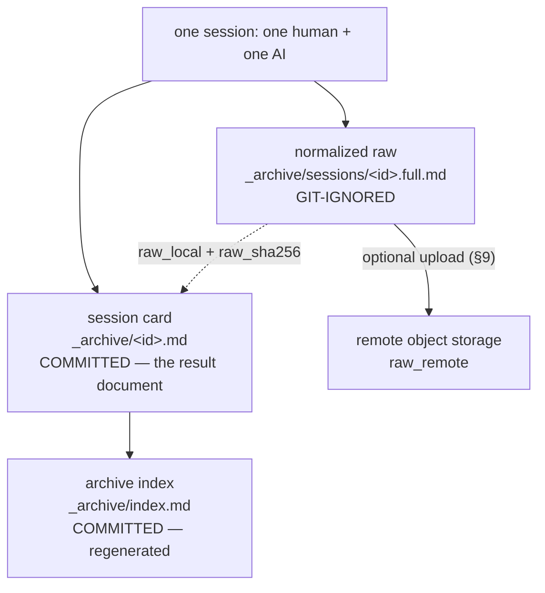
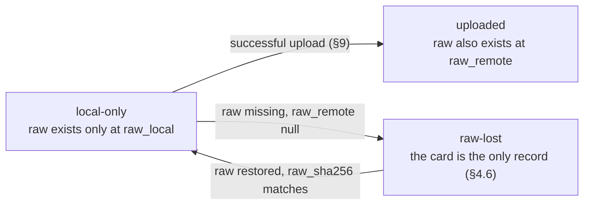
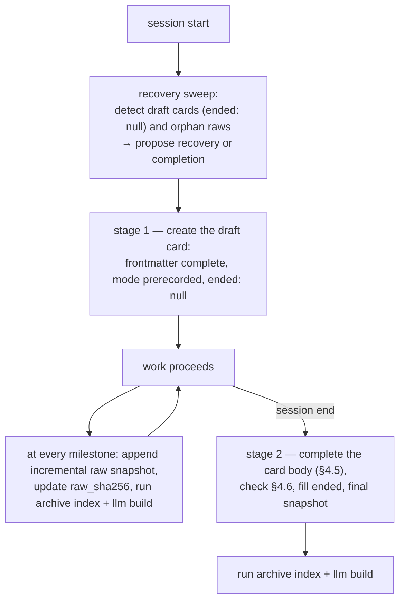
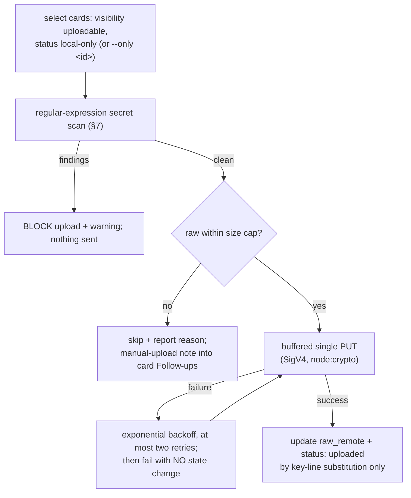

# 08 — Conversation Archive

This document specifies the session archive: how every session of
[`core/philosophy.md` §6](../core/philosophy.md#6-the-actor-model--the-session)
leaves a result document, and how that record is later consumed — the card as
unit of verification and transfer, derived in [01-principles.md](01-principles.md).
Locations and commit status of every path below are owned by
[02-context-architecture.md](02-context-architecture.md); frontmatter grammar by [03-okf.md](03-okf.md).

This document freezes the system's **largest interface set at milestone M2**:
every frozen element sits under a "Frozen interface" heading and is listed in
[§13](#13-freeze-summary). Post-freeze changes require a `version` increment
with a recorded reason per [06-lifecycle-and-versioning.md](06-lifecycle-and-versioning.md).

## 1. Derivation

Nth-degree devices, all: the dual track realizes the result-document metaphor
of [core §5](../core/philosophy.md#5-core-metaphor--the-restoration-of-document-collaboration);
self-sufficiency, truthful fidelity, and redaction realize
[core §9](../core/philosophy.md#9-honesty-of-the-record) (audit items
[H1, H3, H4](../core/audit.md#h--honesty-of-the-record)); the consumption
model executes the delivery step of [core §7](../core/philosophy.md#7-the-ai-native-storage-process)
(audit item [N3](../core/audit.md#n--nth-degree-devices-transfer-time-understanding)).
One first-degree device: two-stage card writing records the mode at work
start (audit item [F1](../core/audit.md#f--first-degree-devices-production-time-mutual-understanding)).

## 2. The three artifacts — Frozen interface



| Artifact | Path (under `.context/`) | Committed | Written by |
| --- | --- | --- | --- |
| Normalized raw | `_archive/sessions/<id>.full.md` | no — git-ignored | capture path (§8) or rule-based core (§5) |
| Session card | `_archive/<id>.md` | yes | the AI, in two stages (§5) |
| Archive index | `_archive/index.md` | yes | regenerated by `node scripts/hnk.mjs archive index` |

The raw is a log found when needed; the card is the record everyone reads;
the index is the retrieval surface. The ignore rule is
[02-context-architecture.md §8](02-context-architecture.md#8-the-gitignore-contract).

## 3. The identifier scheme — Frozen interface

```text
session-YYYYMMDD-HHMMSS-slug
```

| Segment | Rule |
| --- | --- |
| `session` | Literal prefix. |
| `YYYYMMDD-HHMMSS` | The session's `started` timestamp, **UTC**, to the second. Identical to the date-time in the card's `started` field. |
| `slug` | Kebab-case: `[a-z0-9]+(-[a-z0-9]+)*`; short (guideline: at most five words), derived from the session title. |

1. **Collision resistance beats readability.** A raw is a log located when
   needed, not something a human browses — second-precision timestamps make
   collisions structurally impossible for the one-human-one-AI session
   model, so there are **no counters and no rename procedures**.
2. **The id never changes.** It names the card file, the raw file
   (`<id>.full.md`), the index row anchor, and every semantic pointer
   ([03-okf.md §4](03-okf.md#4-semantic-pointers)).
3. **Duplicate detection is a safety net only:** `verify` reports duplicate
   ids (clock skew, manual copying) as failures to fix by hand.
4. **Media identifiers are symmetric:** `media-YYYYMMDD-HHMMSS-slug`,
   applied by [09-visual-assets.md](09-visual-assets.md).

## 4. The session card

### 4.1 Card frontmatter — Frozen interface

All fields obey the machine-readable subset grammar of
[03-okf.md §3](03-okf.md#3-the-machine-readable-subset-grammar). The literal
`null` is the reserved "not yet" sentinel for the fields marked below.

| Field | Required | Value |
| --- | --- | --- |
| `id` | yes | the identifier of §3 |
| `type` | yes | `session` |
| `started` | yes | ISO-8601 UTC instant (`2026-07-29T15:30:42Z`) |
| `ended` | yes | ISO-8601 UTC instant; **`null` while the card is a draft** (§5) |
| `meta` | yes | inline map `{author: <human handle>, agent: <tool@model>}` |
| `domain` | no | domain name per [02-context-architecture.md](02-context-architecture.md) |
| `topic` | no | topic folder name (`0001-notification`) |
| `interview` | no | `id` of the governing interview document (scheme owned by [07-pre-interview.md](07-pre-interview.md)); omitted in lightweight mode, where this card's `mode` field is the record |
| `mode` | yes | the session's recorded autonomy level; value set owned by [07-pre-interview.md](07-pre-interview.md) |
| `visibility` | yes | `private` \| `uploadable` — default `private` (§4.3) |
| `status` | yes | `local-only` \| `uploaded` \| `raw-lost` (§4.4) |
| `raw_fidelity` | yes | `captured` \| `reconstructed` (§4.2) |
| `raw_local` | yes | project-root-relative path: `.context/_archive/sessions/<id>.full.md` |
| `raw_remote` | yes | remote locator after upload; `null` until then |
| `raw_sha256` | yes | lowercase hex SHA-256 of the raw file at the last snapshot; `null` until the first snapshot |
| `summary` | yes | one line, double-quoted, per [03-okf.md §2.1](03-okf.md#2-frontmatter-specification) |

Notes:

- `status` **replaces** the common status enum for this type, as sanctioned
  by [03-okf.md §2.1](03-okf.md#2-frontmatter-specification). Draft state is
  not a status value: **a card is a draft exactly when `ended` is `null`.**
- Cards **omit** the common fields `version` and `related` — a single session
  record is never versioned — per the sanctioned-omission clause of
  [03-okf.md §2.1](03-okf.md#2-frontmatter-specification).
- `raw_sha256` means **only** the byte-level link between this card and the
  raw file snapshot it references — tamper and loss verification. Fidelity
  assurance belongs to `raw_fidelity` alone.
- Team/public visibility splits are a **future field migration**, not values
  of `visibility`.

### 4.2 Raw fidelity semantics — Frozen interface

| `raw_fidelity` | Produced by | Meaning |
| --- | --- | --- |
| `captured` | `archive capture --transcript` (§8) | Verbatim transcript, normalized from a tool's own session log; per-message timestamps preserved where the source has them |
| `reconstructed` | rule-based core (§5) | Post-hoc reconstruction written by the AI from its own context — subject to context compression, no per-message timestamps |

A `reconstructed` raw must **never** be labeled or described as `captured` —
in the field, in prose, in reports, anywhere (audit item
[H1](../core/audit.md#h--honesty-of-the-record)). Timestamps and other
capture-only information are optional in the normalized format (§6): absent
in reconstructed raws, never fabricated.

### 4.3 Visibility behavior — Frozen interface

`visibility` controls **only** whether the raw may leave the machine; the
card, being the result document, is always committed.

| `visibility` | Card committed | Raw eligible for upload (§9) |
| --- | --- | --- |
| `private` (default) | yes | no — upload skips it, always |
| `uploadable` | yes | yes — per-card opt-in |

### 4.4 Status values and transitions



Transitions are applied by the upload path or proposed by `verify` (§12);
`uploaded` is never set without a confirmed successful upload.

### 4.5 Card body — Frozen interface

The card body carries exactly these five sections, in this order:

| Section | Content |
| --- | --- |
| `## Goal` | What this session set out to do, and under which mode |
| `## Key decisions` | Each decision with its reason — including dictionary rows added ([05-dictionary-and-naming.md §4](05-dictionary-and-naming.md)) and interview outcomes |
| `## Deltas` | One entry per specification change: reason, affected NODE-IDs, before/after in Mermaid edge syntax — this section absorbs the change ledger, per [06-lifecycle-and-versioning.md §4](06-lifecycle-and-versioning.md#4-the-change-ledger-is-absorbed-into-session-cards) |
| `## Affected files` | Every file created, changed, or deleted, as a list of paths |
| `## Follow-ups` | Open items handed to the next session (including manual-upload notes from §9) |

A Deltas entry lists **reason**, **nodes** (affected NODE-IDs), **before**,
and **after** — the last two in Mermaid edge syntax, the entry shape of
[06-lifecycle-and-versioning.md §2.3](06-lifecycle-and-versioning.md#23-version-history-section)
(example there) — so a consumer can replay the topology change per
[04-diagram-first.md §7](04-diagram-first.md#7-diagram-change-control).

### 4.6 The self-sufficiency acceptance criterion

The criterion itself is constitutional —
[core §9](../core/philosophy.md#9-honesty-of-the-record) — and audit item
[H3](../core/audit.md#h--honesty-of-the-record) checks it. What this document
adds is the operational contract: the check runs **before `ended` is filled**
(a card cannot leave draft state while incomplete), the concrete units checked
are the §4.5 sections (decisions with reasons, before/after deltas, affected
files), and in the default flow the nth-degree consumer genuinely *cannot*
access the raw (git-ignored, possibly never uploaded) — so failing this
criterion means the archive fails entirely. Symmetric with the `alt` rule of
[09-visual-assets.md](09-visual-assets.md).

## 5. The session lifecycle: two-stage writing, snapshots, recovery



**Two-stage writing.** At session start the card is created as a draft:
frontmatter in full, `mode` prerecorded so the agreed autonomy level exists
on disk while work is underway (audit item
[F1](../core/audit.md#f--first-degree-devices-production-time-mutual-understanding)),
`ended: null`. At session end the body is completed and `ended` filled. A
later session on the same topic restores `mode` from its newest completed
card (§10).

**Rule-based core (the zero-dependency floor).** This standing rule is
instantiated into the target project's `orchestrator.md` and works in any
environment, because the AI itself writes the files:

> At every milestone and at session end: update the incremental raw snapshot
> under `_archive/sessions/`, write or complete the session card, then run
> `node scripts/hnk.mjs archive index` and `node scripts/hnk.mjs llm build`.

Raws written by this path are `reconstructed` (§4.2). Environment-specific
automation, generated at install time under the contract of
[10-environment-integration.md](10-environment-integration.md), feeds the
capture path of §8 instead — but this rule is the floor that holds even when
all automation fails.

**Recovery sweep.** At every session start, the standing rule checks for
draft cards (`ended: null`) and orphan raws (a `sessions/<id>.full.md` with
no matching card) and proposes recovery: completing the abandoned card, or
generating one from the orphan raw. Combined with incremental snapshots, an
abnormal termination loses only the tail after the last milestone.

## 6. The normalized raw format — Frozen interface

The raw is a **payload, not an Open Knowledge Format document**: no
frontmatter, never read by `llm build` ([03-okf.md §5](03-okf.md#5-llmtxt)),
id in its filename. One common markdown shape normalizes any tool's session:

```markdown
# session-20260729-153042-queue-pivot — normalized raw

- agent: claude-code@claude-fable-5
- fidelity: captured
- format: hnk-raw v1

## human — 2026-07-29T15:30:42Z

Move notification dispatch to a queue; synchronous send keeps timing out.

## agent — 2026-07-29T15:31:05Z

Proposal: enqueue on receipt, dispatch from a worker. Two spec nodes change.

- tool-call: edit `ai-spec.md` — replaced sync dispatch nodes (summary only)
```

| Element | Rule |
| --- | --- |
| Header list | `agent`, `fidelity`, `format: hnk-raw v1` — always present |
| Speaker turns | `## <speaker> — <timestamp>`; speaker is `human` \| `agent` \| `note` |
| Timestamps | ISO-8601 UTC; **optional** — capture-only information, absent in reconstructed raws (§4.2) |
| `note` turns | archiver annotations: snapshot boundaries, redaction notices |
| Tool calls | one-line `tool-call:` **summaries** — never verbatim transcription of tool payloads (file contents, command output) |
| Redaction | mandatory, at write time (§7) |

## 7. Mandatory redaction

**No secret values are ever transcribed** — a standing rule covering raws
*and* cards (audit item [H4](../core/audit.md#h--honesty-of-the-record)):

| Rule | Detail |
| --- | --- |
| Mask at write time | Credential patterns — API keys, bearer tokens, passwords, `.env` values, private key blocks — are replaced with `[REDACTED:<kind>]` as the text is written, by capture normalization and by the AI under the rule-based core alike |
| Never quote secrets in summaries | A tool-call summary names the file or variable, never its secret value |
| Scan before sending | `archive capture` and `archive upload` run a regular-expression secret scan; `upload` findings **block the upload** with a warning (§9) |

## 8. Command shapes — Frozen interface

All commands are subcommands of the single-entry script `node scripts/hnk.mjs` ([02-context-architecture.md](02-context-architecture.md)).

| Command | Effect |
| --- | --- |
| `node scripts/hnk.mjs archive new --title <title> [--domain <d>] [--topic <t>] [--mode <m>]` | generate the id (§3, slug from the title), create the draft card (§5). The optional `interview` field is written at card completion under the rule-based floor — the command does not set it |
| `node scripts/hnk.mjs archive index` | regenerate `_archive/index.md` from card frontmatter (§11) |
| `node scripts/hnk.mjs archive verify` | archive-scope checks (§12); also runs inside global `verify` |
| `node scripts/hnk.mjs archive capture --transcript <path> [--format <f>]` | normalize a tool transcript into a `captured` raw (§4.2), applying redaction (§7) |
| `node scripts/hnk.mjs archive upload [--provider r2] [--only <id>] [--dry-run]` | upload eligible raws (§9) |
| `node scripts/hnk.mjs report [--from <date>] [--to <date>] [--topic <t>] [--domain <d>]` | card digest to standard output (§10) |
| `node scripts/hnk.mjs verify` | global verification: archive-scope checks (§12) + visuals checks ([09-visual-assets.md](09-visual-assets.md)) + structure, grammar, pointer, staleness checks ([02](02-context-architecture.md), [03](03-okf.md), [06](06-lifecycle-and-versioning.md)) |
| `node scripts/hnk.mjs llm build` | regenerate the target's `llm.txt` ([03-okf.md §5](03-okf.md#5-llmtxt)) |

`--format` values, **frozen for v1**:

| Value | Input | When `--format` is omitted |
| --- | --- | --- |
| `claude-code-jsonl` | a Claude Code session JSONL file | inferred from `.jsonl` |
| `markdown` | an already-normalized markdown transcript — passthrough | inferred from `.md` |
| `plaintext` | a plain-text transcript — passthrough, wrapped in the §6 header | fallback for any other extension |

Tools not in this table use the rule-based path of §5 (yielding
`reconstructed` raws); adding a format is a versioned change to this table.

**Repeat runs.** Re-running `archive capture` for the same session id
**replaces** the raw snapshot and updates the card's `raw_sha256` by key-line
substitution. Firing capture at both trigger points of
[10-environment-integration.md](10-environment-integration.md) §3 (before
context compression, then at session end) is therefore safe: the later run
supersedes the earlier one.

## 9. Upload — Frozen behavior

Upload persists raws off-machine so `raw-lost` never has to happen. It is
optional, per-card opt-in (§4.3), configured only through environment
variables:

| Environment variable | Required | Meaning |
| --- | --- | --- |
| `R2_ACCOUNT_ID` | yes | Cloudflare R2 account |
| `R2_ACCESS_KEY_ID` | yes | access key |
| `R2_SECRET_ACCESS_KEY` | yes | secret key |
| `R2_BUCKET` | yes | target bucket |
| `R2_PUBLIC_BASE_URL` | no | public base for recorded `raw_remote` values |



1. **Eligibility:** only `visibility: uploadable` cards; `private` is never
   sent, and no override flag exists.
2. **Secret scan gate:** findings block the upload with a warning naming the
   card and pattern kind — never the matched value.
3. **Buffered single PUT only**, size cap **100 MiB** (the file is held in
   memory for signing). Oversize raws are skipped: reason reported, plus a
   manual-upload note in the card's Follow-ups — the note lands in the card,
   not the index, because the index is fully regenerated with no
   hand-maintained fields (§11); recorded here per audit item D3. Multipart
   and streaming upload are an **explicit v2 item**.
4. **Retry** with exponential backoff, at most two retries per object; on
   final failure **no partial state** — the card is touched only after a
   confirmed success.
5. **On success**, `raw_remote` and `status` are updated by **key-line
   substitution only** ([03-okf.md §3.4](03-okf.md#34-rationale)).
   Object key: `sessions/<id>.full.md`; `raw_remote`:
   `<R2_PUBLIC_BASE_URL>/sessions/<id>.full.md` if set, else `r2://<bucket>/sessions/<id>.full.md`.
6. `--dry-run` performs selection, scan, and signing without sending, and
   changes nothing.

Provider setup and cap rationale: [`guides/storage/cloudflare-r2.md`](../guides/storage/cloudflare-r2.md).

## 10. The consumption model

Derivation and diagram:
[01-principles.md §4](01-principles.md#4-the-on-demand-consumption-model-derived).
This document owns the operational rules:

| Layer | Trigger | Procedure |
| --- | --- | --- |
| Minimal automatic restore | a session starts on an existing topic | read the topic's newest completed card; restore `mode` and the latest Key decisions. **Nothing else is restored automatically.** Restore is **topic-keyed only**: a lightweight goal without a topic re-establishes its mode through the ordinary interview forms ([07-pre-interview.md §7.3](07-pre-interview.md#73-multi-session-goals)) |
| On-demand query | the human asks ("what happened with X?", "summarize last week") | search `_archive/index.md` → open matching cards → descend to a raw **only if** the cards cannot answer (a standing orchestrator rule) |
| Report | the human wants a digest — the manager-check use case | `node scripts/hnk.mjs report [--from --to] [--topic] [--domain]` prints a markdown digest of matching cards (goal, key decisions, delta summaries) to standard output — the delivery step of [core §7](../core/philosophy.md#7-the-ai-native-storage-process) made executable |

Audit item [N3](../core/audit.md#n--nth-degree-devices-transfer-time-understanding)
checks that this path reconstructs past decisions from cards alone (possible
exactly because of §4.6).

## 11. The archive index — Frozen interface

`_archive/index.md` carries frontmatter `id: archive-index,
type: archive-index` per [03-okf.md](03-okf.md) and is **fully regenerated**
from card frontmatter by `node scripts/hnk.mjs archive index` — no
hand-maintained fields. One row per card, newest first. Required columns:

| Column | Source |
| --- | --- |
| `id` | card `id`; the cell begins with an inline anchor `<a id="<id>"></a>` (the anchor semantic pointers target — [03-okf.md §4.2](03-okf.md#42-prefer-id-anchored-links-for-assets)) and links to the card file |
| `date` | date part of `started` |
| `summary` | card `summary`, verbatim |
| `domain/topic` | `<domain>/<topic>`, or `—` when unset |
| `mode` | card `mode` |
| `status` | card `status` |
| `raw_fidelity` | card `raw_fidelity` |
| `visibility` | card `visibility` |

Example `id` cell: `<a id="session-20260729-153042-queue-pivot"></a>[session-20260729-153042-queue-pivot](session-20260729-153042-queue-pivot.md)`.

## 12. Verification hooks

Checks this document contributes to `archive verify` and the global `verify`:

| Check | Meaning of failure or warning | Audit item |
| --- | --- | --- |
| duplicate session ids | safety-net violation of §3 — fix by hand | N2 |
| `raw_sha256` mismatch against the file at `raw_local` | the raw changed after the card's last snapshot — tamper or drift | H1 |
| raw missing + `raw_remote: null` + status not `raw-lost` | propose the `raw-lost` transition (§4.4) | H1 |
| draft cards (`ended: null`) from past sessions; orphan raws | recovery sweep input (§5) | N1 |
| card body missing a §4.5 section | the result document is incomplete | H3 |
| **local-only accumulation warning** | more than 20 `local-only` raws, or the oldest older than 30 days (advisory defaults): a machine loss would orphan them — nudge toward upload or backup | N1 |
| index out of date relative to card frontmatter | regenerate via `archive index` | N4 |
| **uncarded work** (advisory): commits newer than the newest card that touch no file under `_archive/` | work happened outside any carded session — the archive has a blind spot; propose a retro-card, honestly labeled `reconstructed` (orchestrator R3) | N1 |

## 13. Freeze summary

| Frozen element | Section |
| --- | --- |
| Three artifacts: raw (ignored) / card (committed) / index (committed, regenerated) | §2 |
| `session-YYYYMMDD-HHMMSS-slug` identifier scheme; no counters, no renames; media scheme symmetric | §3 |
| Card frontmatter field list; value enums and behavior of `visibility` (raw upload only), `status`, `raw_fidelity` (with `raw_sha256` restricted to byte-level linkage); `null` sentinel; draft = `ended: null` | §4.1–4.4 |
| Card body sections (Goal / Key decisions / Deltas / Affected files / Follow-ups) and the self-sufficiency acceptance criterion | §4.5–4.6 |
| Normalized raw format `hnk-raw v1`: header, speaker turns, optional timestamps, tool-call summaries | §6 |
| Mandatory redaction: mask at write time, scan on capture and upload | §7 |
| Command shapes: `archive new` / `index` / `verify` / `capture` (v1 formats: `claude-code-jsonl`, `markdown`, `plaintext`) / `upload`; `report` | §8 |
| Upload behavior: environment variables, secret-scan gate, 100 MiB single-PUT cap, two-retry backoff, no partial state, key-line substitution; multipart is v2 | §9 |
| Index frontmatter, required columns, and row anchors | §11 |

## Version History

- **version 2** — 2026-07-30. Added the uncarded-work verification check
  (§12) and its recovery-sweep counterpart (orchestrator R3). **Why:**
  community feedback proposed an automated extraction architecture
  (post-commit hooks feeding git history to an unattended sub-agent that
  generates rule files). The correct observation inside it: commits are an
  archive-independent signal, and work committed outside any carded session
  previously escaped the archive with no signal anywhere — a blind spot in
  the system's own core promise (audit item N1). **How:** the signal was
  adopted mechanically — `verify` compares commit history against the newest
  card and warns, and the session-start sweep proposes a retro-card. The
  unattended generation itself was declined: an LLM writing rule files
  without propose-then-confirm is an unverified second producer — the exact
  debt generator this system exists to prevent (audit F2; core §9) — and a
  sample script in another language would break the Node-builtins-only rule.
- **version 1** — initial archive specification (M2 freeze).
