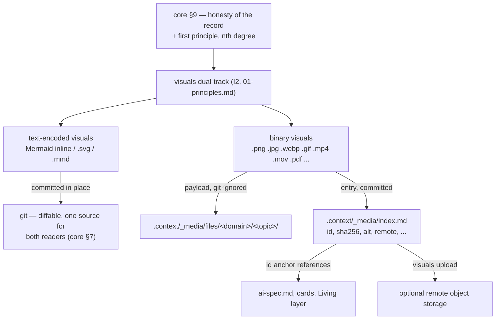
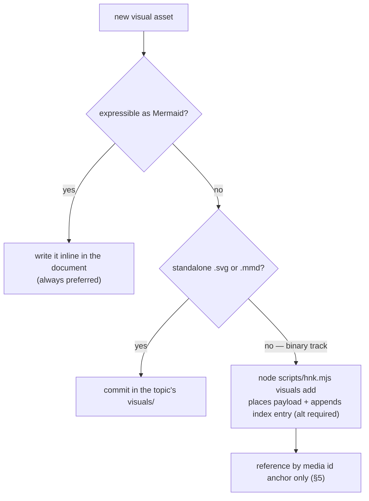
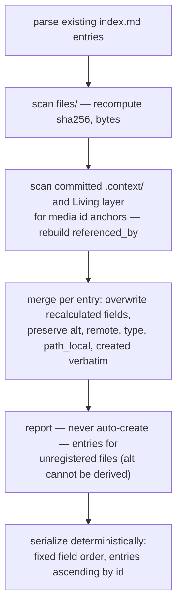
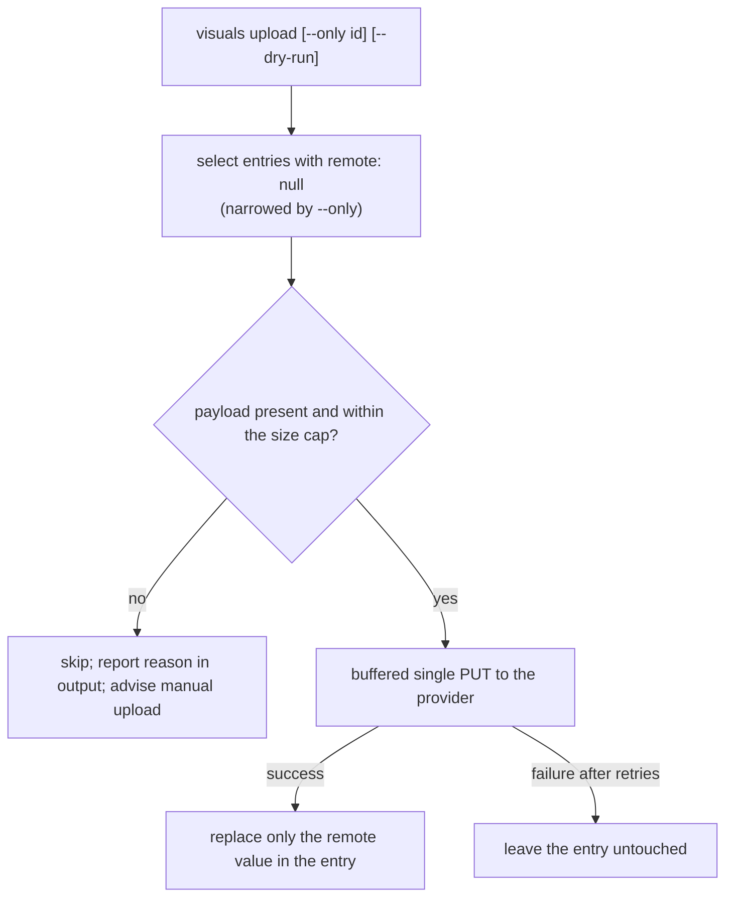

# Skill 09 — Visual Assets

This document specifies the **visuals dual-track**: which visual forms are
committed as text, how every binary asset is stored, indexed, referenced, and
optionally uploaded. It derives from [`core/philosophy.md`](../core/philosophy.md)
and does not restate it; the derivation chain (improvement I2) is laid out in
[`01-principles.md`](01-principles.md). The governing honesty rule is
[core §9](../core/philosophy.md#9-honesty-of-the-record), operationalized as
audit item [H2](../core/audit.md#h--honesty-of-the-record): **a clone without
the binaries must remain understandable.** Locations and commit status of
`_media/` are owned by [`02-context-architecture.md`](02-context-architecture.md);
which diagram forms lead a specification is owned by
[`04-diagram-first.md`](04-diagram-first.md); this document owns everything
about registration, the index, and the media toolchain.

Interfaces marked **Frozen interface** below freeze at milestone M2, under the
same change discipline as [`03-okf.md` §3.5](03-okf.md#35-freeze).

## 1. Derivation and the dual track



| Rule | Serves | Why |
| --- | --- | --- |
| Text-encoded visuals commit in place (§2) | both degrees | one source that the AI parses, git diffs, and viewers render ([04 §6](04-diagram-first.md#6-where-each-visual-form-lives)) |
| Binaries centralize, git-ignored, index committed (§2) | nth degree | one ignore rule, one index, one upload path — atomicity as retrievability ([01-principles.md](01-principles.md)) |
| Mandatory `alt` on every entry (§4) | nth degree | audit item [H2](../core/audit.md#h--honesty-of-the-record): the record must not depend on a file that may be gone |
| Reference by media id, never by raw path (§5) | nth degree | the index entry survives every clone; a raw path dies ([03 §4.2](03-okf.md#42-prefer-id-anchored-links-for-assets)) |

## 2. The format-based rule

**Frozen interface.** The track is decided by format alone — no judgment
calls, no case-by-case decisions:

| Form | Location | Committed |
| --- | --- | --- |
| Inline Mermaid (**always preferred**) | inside `ai-spec.md` and other documents | yes |
| Standalone `.svg`, `.mmd` | the topic's `visuals/` directory ([02 §4](02-context-architecture.md#4-the-flat-topic-folder)) | yes |
| **Any** other visual file — binary or not (`.png`, `.jpg`, `.webp`, `.gif`, `.mp4`, `.mov`, `.pdf`, and every format not listed above) | `.context/_media/files/<domain>/<topic>/` (git-ignored per the contract of [02 §8](02-context-architecture.md#8-the-gitignore-contract)) | payload no; index entry yes |

Three consequences, all frozen:

1. **Never commit a binary under `.context/`.** The extension list above is
   illustrative; the discriminator is exhaustive: only the three text forms in
   the first two rows are committable. Everything else takes the binary track.
2. **Register before reference.** A binary must have its index entry in
   `.context/_media/index.md` *before* it is referenced anywhere — a reference
   to an unregistered binary is a defect (§7).
3. **Placement mirrors the context tree.** The canonical payload path is
   `files/<domain>/<topic>/<filename>`; in single-domain mode
   ([02 §3.1](02-context-architecture.md#31-single-domain-mode)) the
   `<domain>` segment is omitted. `path_local` in the entry is authoritative.



## 3. The media identifier

**Frozen interface.**

```text
media-YYYYMMDD-HHMMSS-slug
```

| Segment | Rule |
| --- | --- |
| `media` | literal prefix — distinguishes media ids from the `session-` ids of [08-conversation-archive.md](08-conversation-archive.md) |
| `YYYYMMDD-HHMMSS` | timestamp of the registration moment, second precision. The scheme, its collision rationale, and its timezone convention are shared with — and owned by — the session id scheme of [08-conversation-archive.md](08-conversation-archive.md); this document freezes the media instantiation |
| `slug` | short kebab-case description: lowercase ASCII letters, digits, hyphens — derived from the filename or supplied at registration |

Because ids contain only lowercase letters, digits, and hyphens, the
GitHub-style anchor of an entry heading equals the id verbatim — no explicit
anchor tag is needed (unlike dictionary rows,
[05 §3.5](05-dictionary-and-naming.md#35-term-anchors)). Duplicate ids are a
verification failure (§7), kept as a safety net only.

## 4. The media index

`.context/_media/index.md` is the single committed record of every binary in
the project. Its frontmatter follows [`03-okf.md`](03-okf.md) with
`id: media-index`, `type: media-index` (type enum row in
[03 §2.2](03-okf.md#22-the-type-enum)). One index per project — there are no
per-domain media indexes.

### 4.1 Entry format

**Frozen interface — field list and serialized form.** After the frontmatter
and an `# Media Index` title, the file holds one `##` heading per entry — the
heading text is the media id, which is the anchor — followed by one field
table with exactly these rows, in this order:

| Field | Value | Rule |
| --- | --- | --- |
| `type` | `image` \| `video` \| `document` \| `other` | set at registration from the file format; hand-correctable |
| `path_local` | path relative to `.context/_media/` | where the payload sits on machines that have it (`files/...`); renders as a working relative link in local clones |
| `sha256` | 64 lowercase hex characters | digest of the payload bytes — the byte-level identity of what the entry describes |
| `bytes` | integer | payload size |
| `created` | ISO 8601 timestamp of the registration moment | same instant the id's timestamp encodes |
| `referenced_by` | inline list of project-root-relative `path#anchor` items | every document location that cites this id; `[]` when unreferenced |
| `remote` | `null` until upload, then the remote object URL | written by `visuals upload` on success, or by hand for manually uploaded payloads |
| `alt` | **required, never empty** | the text-native substitute for the binary (§4.2) |

Example entry (the same asset the pointer example of
[03 §4.1](03-okf.md#41-pointer-kinds) cites):

```markdown
## media-20260729-142001-wireframe

| Field | Value |
| --- | --- |
| type | image |
| path_local | files/notification-delivery/0001-outbound-queue/wireframe.png |
| sha256 | 9f2c4a1e7b8d3f6052e9a4c1d8b7f3a6e5d2c9b8a7f6e5d4c3b2a1f0e9d8c7b6 |
| bytes | 184227 |
| created | 2026-07-29T14:20:01Z |
| referenced_by | [.context/notification-delivery/0001-outbound-queue/ai-spec.md#node-notify-02-queue-enqueuer] |
| remote | null |
| alt | Hand-drawn wireframe of the queue administration screen: left panel lists pending deliveries with retry counts; right panel shows the selected delivery's provider response history. |
```

### 4.2 The `alt` field

`alt` is not a caption; it is the **understanding-carrier** of the entry. A
reader in a clone without `files/` must learn from `alt` what the asset shows
and why it matters to the documents that reference it — that is audit item
[H2](../core/audit.md#h--honesty-of-the-record) verbatim. One to three
sentences on a single line. An entry without `alt` cannot be created (§6) and
fails verification (§7).

### 4.3 Field ownership and merge regeneration

**Frozen interface.**

| Ownership class | Fields | Writer |
| --- | --- | --- |
| Script-recalculated | `sha256`, `bytes`, `referenced_by` | derivable at any time by scanning `files/` and the committed documents; `visuals index` overwrites them |
| Hand-maintained | `alt`, `remote` | humans and the AI at decision points; `visuals upload` is the only other legitimate writer of `remote` |
| Set-once at registration | id, `type`, `path_local`, `created` | written by `visuals add`; preserved thereafter (`type` and `path_local` are hand-correctable) |

**Index regeneration is a merge, never a destructive rewrite.**
`visuals index` recalculates only the script-recalculated fields and preserves
every other field verbatim — losing an `alt` or a `remote` on regeneration
would destroy exactly the fields no script can rebuild (audit item
[N4](../core/audit.md#n--nth-degree-devices-transfer-time-understanding);
user-data protection per [02 §10](02-context-architecture.md#10-installation-and-existing-assets)).



Entries whose payload has vanished are kept, not deleted — the entry is the
surviving record (§7 warns about them). Removing an entry is a decision:
propose-then-confirm, and only when `referenced_by` is empty.

## 5. The reference rule

**Frozen interface.** Documents reference a binary **by its media id anchor
into `_media/index.md`, never by raw path** — the pointer kind and rationale
are defined in [03 §4.2](03-okf.md#42-prefer-id-anchored-links-for-assets):
a raw path dies in every clone that lacks the payload, while the index entry
— with its required `alt` and its `remote` field — survives and stays honest
about what exists where.

```markdown
The queue screen follows
[media-20260729-142001-wireframe](../../_media/index.md#media-20260729-142001-wireframe).
```

The link works identically before upload, after upload, and in a clone with
no `files/` at all. Raw-path references to `files/` in committed documents are
a verification defect (§7); `path_local` inside the entry is the single
sanctioned place a payload path appears.

## 6. Commands

**Frozen interface — command shapes.** All media operations live in the
single-entry script (`scripts/hnk.mjs`, decision recorded in
[02 §2.2](02-context-architecture.md#22-layout-tree)) under the `visuals`
namespace — the namespace uses the registered alias `hnk`
([05 §3.4](05-dictionary-and-naming.md#34-the-hnk-registration-row)):

| Command | Shape | Effect |
| --- | --- | --- |
| add | `node scripts/hnk.mjs visuals add <file> [--domain <domain>] [--topic <topic>] [--alt <text>]` | places the file under `files/` per §2, computes `sha256` and `bytes`, appends the entry. **`alt` is required**: prompted for interactively when the flag is missing; a hard error in non-interactive runs |
| index | `node scripts/hnk.mjs visuals index` | merge-regeneration per §4.3 |
| verify | `node scripts/hnk.mjs visuals verify` | runs the checks of §7; also included in the project-wide `node scripts/hnk.mjs verify` |
| upload | `node scripts/hnk.mjs visuals upload [--provider r2] [--only <id>] [--dry-run]` | uploads payloads of entries with `remote: null` (§8) |

`visuals add` rules beyond the shape: it never overwrites — a filename
collision in the target directory is an error; and when the computed `sha256`
already exists in the index, it warns and points at the existing entry instead
of registering a duplicate payload.

## 7. Verification

**Frozen interface — check list.** `visuals verify` asserts, over `.context/`
and the index:

| # | Check | Severity | Meaning / audit item |
| --- | --- | --- | --- |
| 1 | binary content anywhere under `.context/` outside `_media/files/` (raw transcripts under `_archive/sessions/` excluded — owned by [08-conversation-archive.md](08-conversation-archive.md)) | failure | the format-based rule of §2 and the gitignore contract of [02 §8](02-context-architecture.md#8-the-gitignore-contract) were bypassed |
| 2 | file present in `_media/files/` with no index entry | failure | unregistered payload — invisible to every nth-degree consumer ([N2](../core/audit.md#n--nth-degree-devices-transfer-time-understanding)) |
| 3 | entry whose `path_local` is gone **and** `remote` is `null` | warning: content unreachable | the record survives only as metadata plus `alt` — honest, but flagged ([core §9](../core/philosophy.md#9-honesty-of-the-record)) |
| 4 | entry with missing or empty `alt` | failure | audit item [H2](../core/audit.md#h--honesty-of-the-record) |
| 5 | `referenced_by` stale — stored list differs from a fresh scan, including references to ids with no entry | warning: run `visuals index` | derived fields must be fresh ([N4](../core/audit.md#n--nth-degree-devices-transfer-time-understanding)); raw-path references to `files/` in committed documents are reported here as failures (§5) |
| 6 | duplicate media id | failure | safety net for the timestamp scheme (§3) |

## 8. Upload

Upload is optional off-machine persistence for payloads, sharing **one
implementation** inside `scripts/hnk.mjs` with the archive upload of
[08-conversation-archive.md](08-conversation-archive.md): the same provider
mechanism, the same environment variables (`R2_ACCOUNT_ID` and companions —
enumerated in 08, detailed in [`guides/storage/cloudflare-r2.md`](../guides/storage/cloudflare-r2.md)),
the same buffered single PUT, the same size cap (oversize payloads are
skipped with the reason in the command output — the frozen entry rows of §4.1
have no note field, so the follow-up is advised to the human, mirroring 08's
Follow-ups approach), and the same retry rules (bounded exponential backoff;
no partial entry updates on failure). Those operational limits are owned by
08 and not respecified here.

**Object key and recorded `remote` value** (frozen, symmetric with 08 §9
point 5): object key `media/<id>/<original filename>`; `remote` records
`<R2_PUBLIC_BASE_URL>/media/<id>/<filename>` when the base is set, else
`r2://<bucket>/media/<id>/<filename>`.



**Media entries have no `visibility` field.** Selection is structural:
`upload` targets every entry with `remote: null`; per-entry exclusion is
`--only <id>` — or simply not running upload. The privacy gate sits **at the
entry to `_media`, not at upload time**: a binary whose content must not
leave the machine should never be registered at all — the record layer for
sensitive material is the session card and `alt` text (secret-handling rules
in [08-conversation-archive.md](08-conversation-archive.md); audit item
[H4](../core/audit.md#h--honesty-of-the-record)). Contrast with the per-card
`visibility` opt-in of 08 — see §9.

## 9. The deliberate asymmetry with the session archive

The archive ([08-conversation-archive.md](08-conversation-archive.md)) writes
**one card file per session**; this document writes **one shared index with
one entry per binary**. The asymmetry is deliberate, not drift:

| Dimension | Session archive (08) | Visual assets (09) |
| --- | --- | --- |
| Record unit | one committed card file per session | one committed index, one entry per binary |
| Record body | substantive prose: Goal, Key decisions, Deltas, Affected files — must stand alone (audit [H3](../core/audit.md#h--honesty-of-the-record)) | pure metadata plus one-line `alt` (audit [H2](../core/audit.md#h--honesty-of-the-record)) |
| Upload gate | per-card `visibility`, `private` by default | no field — registration itself is the gate; `remote: null` selects |
| Identifier | `session-YYYYMMDD-HHMMSS-slug` | `media-YYYYMMDD-HHMMSS-slug` — same scheme (§3) |

A card is a result document ([core §5](../core/philosophy.md#5-core-metaphor--the-restoration-of-document-collaboration))
and needs a file's worth of room; a media entry describes a file whose
understanding lives in `alt` and in the documents that reference it. A
card-sized file per binary would be padding, and padding is itself knowledge
debt ([05 §3.6](05-dictionary-and-naming.md#36-what-earns-a-row)).

## 10. Out of scope for v1

| Item | Status |
| --- | --- |
| `visuals fetch` — re-download `remote` payloads into local `files/` to repopulate a clone | **v2.** Until then, restoring payloads is manual; check 3 of §7 keeps the gap visible |
| Multipart / streaming upload | **v2**, jointly with the archive upload of [08-conversation-archive.md](08-conversation-archive.md) |
| Image transformation, thumbnailing, format conversion | not planned — `hnk` records assets; it does not process them |
