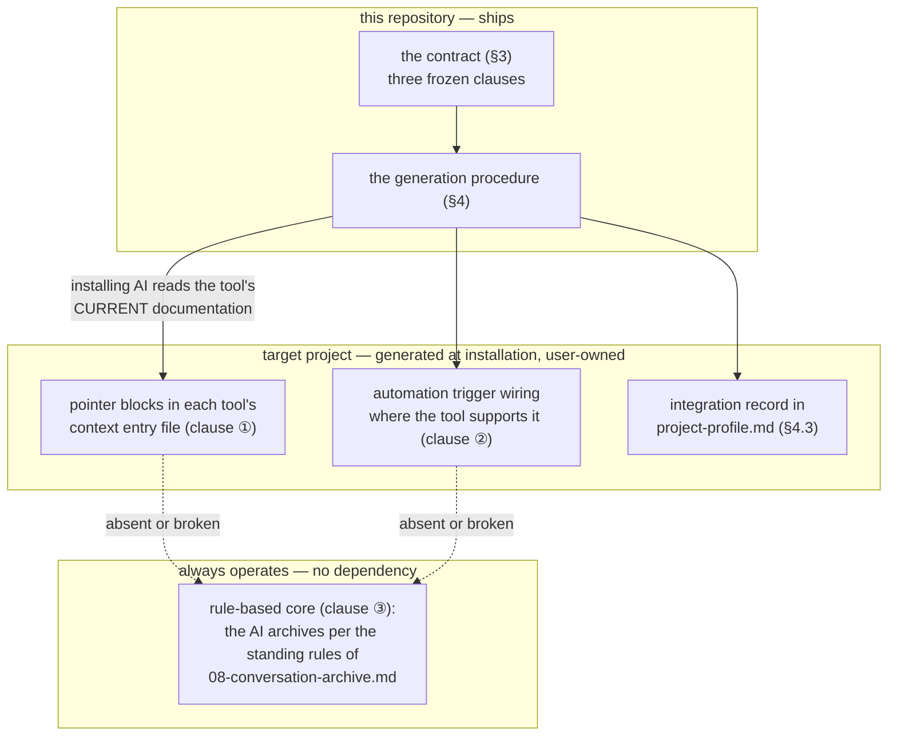
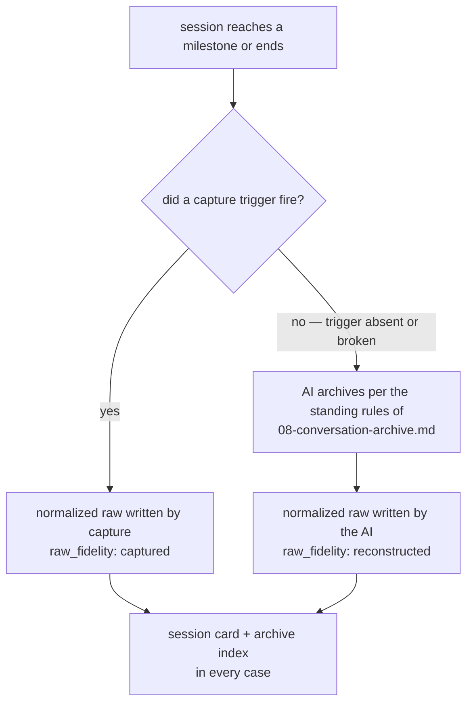
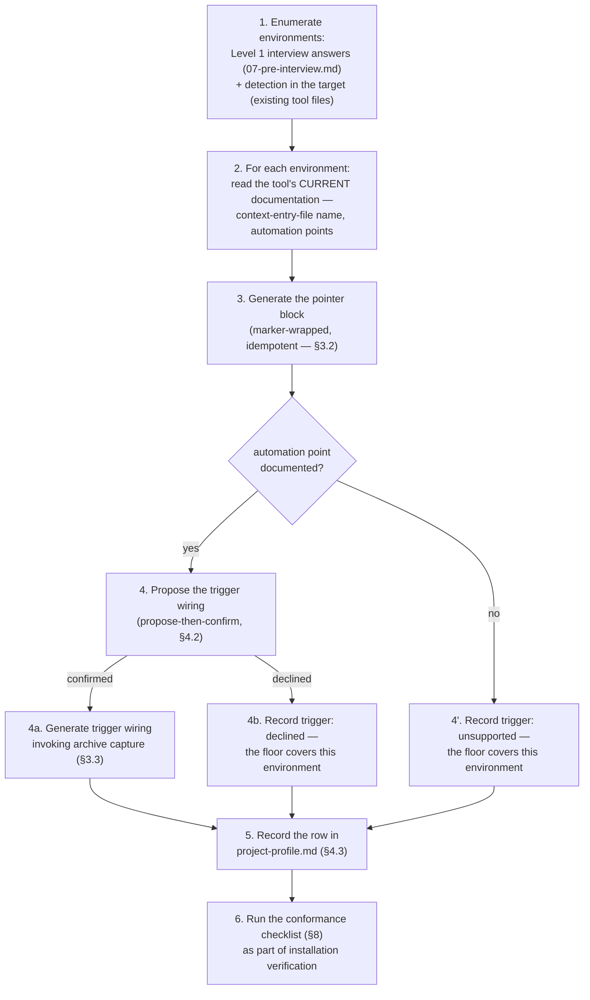
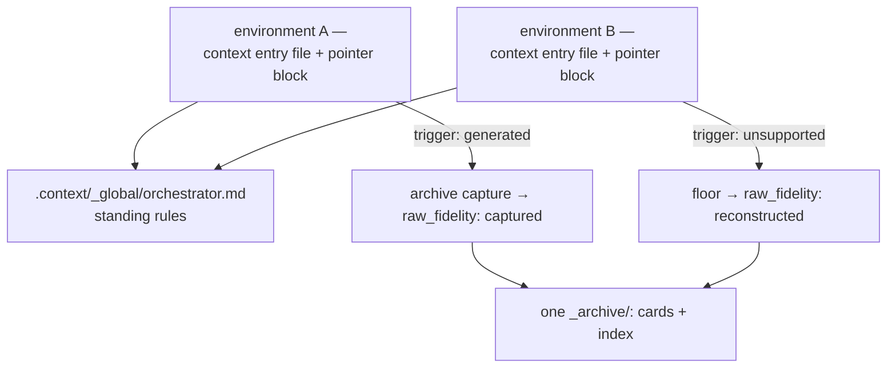

# 10 — Environment Integration

This document specifies how an `hnk`-operated project connects to the AI tool
environments it is worked in — and why this repository ships **no
tool-specific configuration whatsoever**. It derives from
[`core/philosophy.md`](../core/philosophy.md) and does not restate it; the
alias `hnk` is legal because it is registered
([05-dictionary-and-naming.md §3.4](05-dictionary-and-naming.md#34-the-hnk-registration-row)).

What ships is a **contract** (three clauses, frozen in §3) plus a
**generation procedure** (§4). The installing AI generates the concrete
integration at installation time, from the tool's *current* documentation.
The generated artifacts are user-owned; when the tool's harness changes, the
fix is regeneration (§5) — never a patch to this repository.

## 1. Derivation

A shipped hooks file or rules file is a promise about a tool harness this
repository does not control. When the harness changes, the file silently
stops working while continuing to claim that it works — the record then
claims more than it is, violating
[core §9](../core/philosophy.md#9-honesty-of-the-record), and every session
that trusted the broken automation issues fresh knowledge-debt principal
([core §3](../core/philosophy.md#3-problem-definition--knowledge-debt)).
The contract-plus-generation design removes that failure class: nothing
tool-shaped is maintained here, and the layer that can rot is explicitly
user-owned and regenerable.

Per audit item [D1](../core/audit.md#d--derivation-every-rule-earns-its-existence),
each mechanism states the stage it serves:

| Mechanism | Serves | Derivation | Audit item |
| --- | --- | --- | --- |
| Clause ① pointer (§3.2) | first degree | every session loads the standing rules, so work begins with a recorded mode and agreed autonomy | [F1](../core/audit.md#f--first-degree-devices-production-time-mutual-understanding) |
| Clause ② trigger (§3.3) | nth degree | captured raw transcripts preserve the full trail at the highest fidelity, cheaply | [N1](../core/audit.md#n--nth-degree-devices-transfer-time-understanding) |
| Clause ③ floor (§3.4) | both | accumulation must not depend on any tool: per [core §7](../core/philosophy.md#7-the-ai-native-storage-process) the rules bind the AI itself, not the harness | [H1](../core/audit.md#h--honesty-of-the-record), [N1](../core/audit.md#n--nth-degree-devices-transfer-time-understanding) |
| No shipped tool configuration (§2) | nth degree | rotting configuration is a record that lies about automation ([core §9](../core/philosophy.md#9-honesty-of-the-record)) | [P2](../core/audit.md#p--process-repository-self-audit-only) |

## 2. The anti-dependency design



| Layer | Lives in | Maintained by | Can rot? |
| --- | --- | --- | --- |
| Contract + generation procedure | this repository (this document) | `hnk` releases | no — it names no tool |
| Generated integration artifacts | the target project | the user, by regeneration (§5) | yes — regeneration is the designed response |
| Rule-based core (floor) | target `orchestrator.md` standing rules | `hnk` templates | no — it needs only an AI that reads rules |

The one concrete integration in this repository is a demonstration **output**
inside `examples/`, never a maintained artifact (§7).

## 3. The contract

Terms used by the contract:

| Term | Meaning |
| --- | --- |
| environment | one AI tool harness a human works the project in (a coding agent, a chat tool, an editor assistant) |
| context entry file | the file the environment automatically reads into every session — whatever the current harness uses: a project instructions file, a rules file |
| pointer block | a marker-wrapped block inside a context entry file that routes every session to the orchestrator |
| trigger | environment automation that invokes the archive capture command |
| floor | the rule-based core that operates when pointer or trigger is absent or broken |
| integration artifact | anything generation produces in the target: pointer blocks, trigger wiring, the integration record rows |

### 3.1 The three clauses — Frozen interface

Every environment integration, for every tool, present and future, consists
of exactly these three clauses. ① and ② are generated per environment;
③ is shared and always present.

| Clause | Name | Obligation |
| --- | --- | --- |
| ① | POINTER | The environment's context entry file contains a pointer block to `.context/_global/orchestrator.md`, so every session loads the standing rules. |
| ② | TRIGGER | Best-effort automation invokes `node scripts/hnk.mjs archive capture --transcript <path>` at session end — and, where the tool supports it, before context compression. |
| ③ | FLOOR | When ① or ② is absent or broken, the rule-based core still operates: the AI itself archives per the standing rules of [08-conversation-archive.md](08-conversation-archive.md), and raw transcripts from this path are labeled `raw_fidelity: reconstructed` (audit item [H1](../core/audit.md#h--honesty-of-the-record)). |

### 3.2 Clause ① — the pointer block — Frozen interface

The pointer block reuses the marker mechanism of the gitignore contract
([02-context-architecture.md §8](02-context-architecture.md#8-the-gitignore-contract)):
the marker tokens are **`hnk:begin`** and **`hnk:end`**, wrapped in the host
file's native comment syntax (`<!-- hnk:begin -->` in a markdown context
entry file, `# hnk:begin` in a plain-text one). Frozen rules:

1. **One block per context entry file.** If the markers already exist,
   generation replaces the content between them; it never appends a second
   block (idempotence, exactly as in the gitignore contract).
2. **Marker tokens are fixed** — `hnk:begin` / `hnk:end`, host-comment
   wrapped. Tooling and audits locate the block by these tokens.
3. **Required elements** — the block's wording is generated per tool and per
   project and is *not* frozen; the elements it must contain are:

| # | Required element |
| --- | --- |
| 1 | a resolvable relative path to `.context/_global/orchestrator.md` |
| 2 | the instruction to read that file at session start, before any work |
| 3 | self-identification: the block states it is managed by human-native-knowledge-skills (`hnk`) |
| 4 | the regeneration note: do not edit between markers; regenerate on harness change |

Example of a generated block in a markdown context entry file (illustrative
wording — only the four elements and the markers are contractual):

```markdown
<!-- hnk:begin (managed by human-native-knowledge-skills — do not edit between markers; regenerate on harness change) -->
This project is operated by human-native-knowledge-skills (`hnk`).
At session start, before any work, read `.context/_global/orchestrator.md`
and follow its standing rules (interviews, archiving, verification).
<!-- hnk:end -->
```

### 3.3 Clause ② — the trigger — Frozen interface

The trigger invokes the capture command:

```bash
node scripts/hnk.mjs archive capture --transcript <path> [--format <format>]
```

The command's full grammar, the enumerated `--format` values, and the
normalized raw output it produces are owned and frozen by
[08-conversation-archive.md](08-conversation-archive.md). This document
freezes the trigger's **invocation points** and **failure semantics**:

| Invocation point | Obligation |
| --- | --- |
| session end | generate the trigger wherever the tool's current documentation exposes any session-end automation |
| before context compression | generate additionally wherever the tool exposes a pre-compression point — safe because a repeat run of capture replaces the earlier snapshot ([08-conversation-archive.md §8](08-conversation-archive.md#8-command-shapes--frozen-interface), "Repeat runs") |

Failure semantics — **best-effort** means:

- A failing or missing trigger must never block the tool, the session, or
  the human's work. No retry loop may stall a session end.
- A trigger miss is not data loss: the floor (§3.4) still produces the
  session record; the session-recovery sweep of
  [08-conversation-archive.md](08-conversation-archive.md) flags orphan raw
  transcripts and draft cards at the next session start.
- The transcript path and format passed to `capture` are determined per tool
  from its current documentation at generation time — they are part of the
  generated artifact, not of this contract.

### 3.4 Clause ③ — the floor — Frozen interface



Frozen rules:

1. The rule-based core — the AI writing the session record itself, following
   the target `orchestrator.md` standing rules defined in
   [08-conversation-archive.md](08-conversation-archive.md) — must operate
   in **every** environment, including one with no automation support at all.
   The floor is the zero-dependency guarantee; clauses ① and ② are
   amplifiers, not prerequisites.
2. Raw transcripts produced through the floor are labeled
   `raw_fidelity: reconstructed` — never `captured`. A reconstruction is a
   post-hoc account subject to context compression and missing timestamps;
   presenting it as a verbatim capture violates
   [core §9](../core/philosophy.md#9-honesty-of-the-record) and fails audit
   item [H1](../core/audit.md#h--honesty-of-the-record). The field and its
   values are owned by [08-conversation-archive.md](08-conversation-archive.md).
3. The floor is **shared**: one orchestrator, one archive, one index —
   regardless of how many environments hold clause ① and ② artifacts (§6).

## 4. Generation at installation

Generation is step 6 of the installation state machine
([`orchestrator.md`](../orchestrator.md)). The installing AI — not a shipped
file — produces the integration.

### 4.1 Procedure



| Step | Rule |
| --- | --- |
| Enumerate | The environment list is the union of what the Level 1 interview named ([07-pre-interview.md](07-pre-interview.md)) and what is detectable in the target (existing context entry files, tool directories). Detection never overrides the human's answers — it adds candidates the human confirms. |
| Read current documentation | Always the tool's documentation *as of installation time*. Never generate from memory of an older harness, and never copy the `examples/` integration (§7) — staleness is exactly the failure this design removes. |
| Generate | Pointer block per §3.2; trigger wiring per §3.3 in whatever form the tool currently accepts (a hooks entry, an extension setting, a wrapper command). |
| Record | One integration record row per environment (§4.3). |
| Verify | Checklist of §8, run by the installation's verification step. |

### 4.2 Non-destructive rules

Generation follows the same principles as installation itself
([02-context-architecture.md §10](02-context-architecture.md#10-installation-and-existing-assets)):

- **Pointer blocks append inside markers.** Existing instructions in the
  tool's context entry file are never rewritten, reordered, or deleted; the
  block is added (or replaced between existing markers) and nothing else is
  touched.
- **Conflicts are surfaced, never resolved silently.** If existing
  instructions in the entry file contradict the orchestrator's standing
  rules (for example, an instruction forbidding file writes that the archive
  rules require), the installing AI surfaces the conflict to the human and
  proposes a resolution — propose-then-confirm, per
  [core §8](../core/philosophy.md#8-storageconsumption-separation).
- **Existing automation is user data.** Pre-existing hooks or automation
  entries are treated like user data files: trigger wiring is added
  alongside them, never over them.

### 4.3 The integration record — Frozen interface

Generation records what it produced in
`.context/_global/project-profile.md`. The profile document itself (its
`type: profile` frontmatter and interview-owned contents) is owned by
[07-pre-interview.md](07-pre-interview.md); this document owns the
**environment integration table** in its body — one row per environment,
with these frozen columns:

| Column | Content |
| --- | --- |
| environment | the tool's full name (Full Naming — no unregistered abbreviations, per [05-dictionary-and-naming.md](05-dictionary-and-naming.md)) |
| entry file | path of the context entry file holding the pointer block |
| trigger | one of the frozen values: `generated` \| `unsupported` \| `declined` |
| artifacts | paths of every generated integration artifact for this environment |
| generated on | date of the last generation or regeneration |
| documentation consulted | identifier of the tool documentation version or page the generation read |

Frozen `trigger` value semantics:

| Value | Meaning |
| --- | --- |
| `generated` | trigger wiring exists and invokes the capture command of §3.3 |
| `unsupported` | the tool's current documentation exposes no usable automation point — the floor covers this environment |
| `declined` | the human chose not to wire automation for this environment — the floor covers it |

## 5. Regeneration, not maintenance

| Rule | Consequence |
| --- | --- |
| Generated artifacts are user-owned | They live only in the target project. This repository never gains a tool-specific file, and a harness change is never an `hnk` defect. |
| Harness change or breakage → regenerate | Re-run §4.1 for the affected environment against the tool's *new* current documentation. Marker replacement (§3.2 rule 1) makes regeneration idempotent for pointer blocks; trigger wiring is replaced per the new documentation. |
| Never hand-patch this repository | The fix for a rotten integration is regeneration in the target — patching tool-specific workarounds into `hnk` would recreate the shipped-adapter dependency this design exists to remove. |
| Update the record | Regeneration updates the environment's row in the integration table (§4.3): `generated on` and `documentation consulted` at minimum. |
| The floor covers the gap | Between breakage and regeneration nothing is lost except capture fidelity: sessions continue under clause ③, honestly labeled `reconstructed`. |

## 6. Multi-tool projects

A project may be worked in several environments at once. The contract scales
by repetition of ① and ②, never of ③:



| Clause | In a multi-tool project |
| --- | --- |
| ① | one pointer block per environment's context entry file — every entry file routes to the same orchestrator |
| ② | per environment, where its harness supports automation; environments differ in `trigger` status and that is normal |
| ③ | **shared** — one rule-based core, one archive, one index; a session's producing environment is visible in its card's `meta` agent field ([08-conversation-archive.md](08-conversation-archive.md)) |

## 7. Example, not dependency

- `examples/minimal-target/` contains the output of one real installation
  run, including the generated integration for one concrete environment
  (Claude Code). It demonstrates **what generation produces** — it is an
  install output, an instance, never a maintained artifact. Audit item
  [P2](../core/audit.md#p--process-repository-self-audit-only) marks it as
  instance demonstration, not specification; the boundary-rule mechanism is
  the one defined in [03-okf.md §5.2](03-okf.md#52-content-contract).
- **Never copy the example into a target.** The example is as stale as its
  generation date, by design; a real installation generates fresh from the
  tool's current documentation (§4.1).
- `guides/` contains harness-independent documents only (viewers,
  enforcement, storage). No document under `guides/` may embed a
  tool-harness configuration file; if a guide needs one, that is a signal
  the content belongs to generation (§4), not to a shipped document.

## 8. Contract-conformance checklist — Frozen interface

Run by the installation's verification step (state-machine step 7 of
[`orchestrator.md`](../orchestrator.md)) and by the target audit of
[`core/audit.md`](../core/audit.md). EC-1 through EC-3 are mechanically
checkable (markers, paths, and record rows); EC-4 through EC-6 are
audit-level checks.

| Item | Check | Clause | Audit item |
| --- | --- | --- | --- |
| EC-1 | every row of the integration table (§4.3) has a pointer block with intact `hnk:begin`/`hnk:end` markers in its recorded entry file, and the orchestrator path inside it resolves | ① | [F1](../core/audit.md#f--first-degree-devices-production-time-mutual-understanding) |
| EC-2 | every pointer block contains the four required elements of §3.2 | ① | [F1](../core/audit.md#f--first-degree-devices-production-time-mutual-understanding) |
| EC-3 | every `trigger` value matches reality: `generated` rows have live wiring invoking the capture command of §3.3; `unsupported`/`declined` rows have none left behind | ② | [N1](../core/audit.md#n--nth-degree-devices-transfer-time-understanding) |
| EC-4 | every raw transcript produced without a capture trigger is labeled `raw_fidelity: reconstructed`; no reconstructed raw is labeled `captured` | ③ | [H1](../core/audit.md#h--honesty-of-the-record) |
| EC-5 | sessions from environments without a working trigger still left indexed session cards — the floor operated | ③ | [N1](../core/audit.md#n--nth-degree-devices-transfer-time-understanding) |
| EC-6 | no tool-specific configuration file ships in this repository; generated integration artifacts exist only in targets and, as demonstration output, in `examples/` | design | [P2](../core/audit.md#p--process-repository-self-audit-only) |

## Version History

- **version 1** — initial environment integration contract, written against
  [`core/philosophy.md`](../core/philosophy.md) version 1; contract clauses,
  pointer-block markers and required elements, trigger invocation points and
  failure semantics, integration record columns and `trigger` values, and
  the EC checklist frozen at milestone M2.
