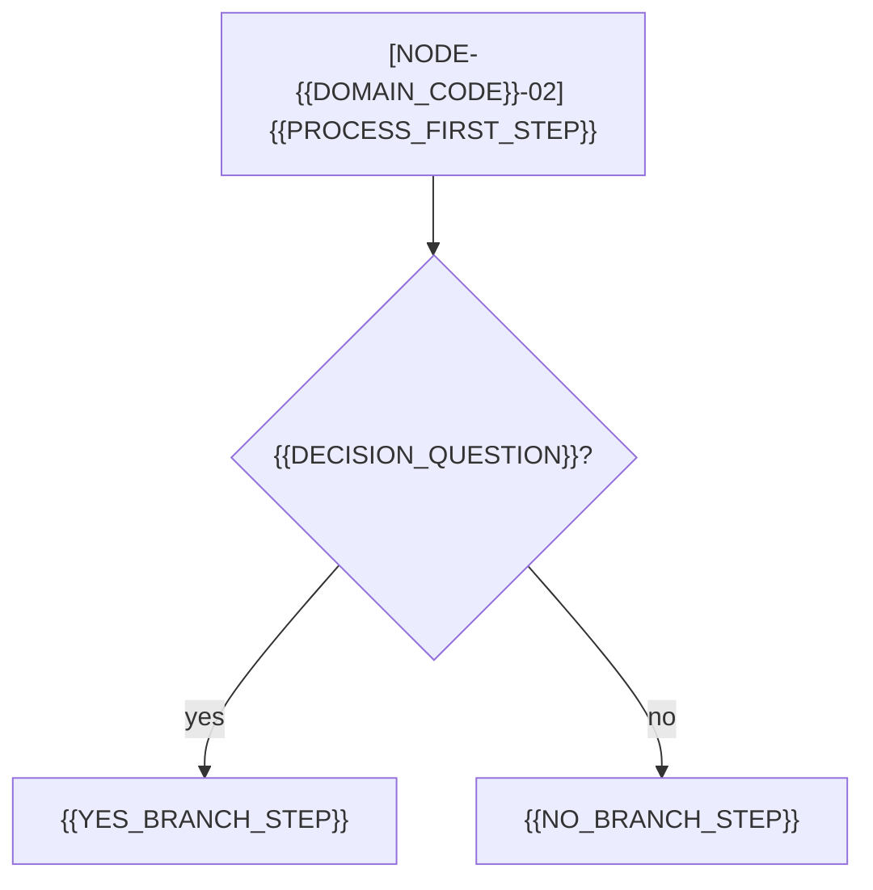

<!-- ai-instruction: TIMING GATE — instantiate at TOPIC CREATION (after a full-topic
     Level 2 interview concludes), never at installation: no topic exists at install
     time and the placeholders below are unresolvable then. -->
<!-- ai-instruction: instantiate at the topic root as ai-spec.md — the topic's single live
     specification (exactly one per topic; versions live inside it, never beside it).
     Resolve every placeholder, replace the sample diagram nodes with the topic's real
     macro structure, and delete every ai-instruction comment. -->
<!-- ai-instruction: single-domain mode — delete the `domain:` line. Path depth for links
     to the global layer: ../_global/... in single-domain mode, ../../_global/... in
     domain mode. -->
<!-- ai-instruction: {{DOMAIN_CODE}} is the uppercase short code namespacing this topic's
     NODE-IDs (e.g. NOTIFY). Register it in the dictionary BEFORE first use — an
     unregistered abbreviation is illegal. NODE-IDs are unique project-wide and are never
     renumbered or reused; two-digit sequence, zero-padded. -->
<!-- ai-instruction: `related` — list the ids of the invariants and dictionary documents
     this specification cites (e.g. invariant-global, dictionary-global, and the domain
     ids in domain mode). {{HNK_SPEC_BASE}} = browsable base URL of the installed hnk
     release, pinned to the hnk_commit recorded in project-profile.md. -->
---
id: artifact-{{TOPIC_FOLDER_NAME}}
type: artifact
status: active
version: 1
frozen_commits: {}
domain: {{DOMAIN_NAME}}
topic: {{TOPIC_FOLDER_NAME}}
related: []
summary: "{{SPEC_SUMMARY_ONE_LINE}}"
---

# {{TOPIC_TITLE}} — Specification

<!-- ai-instruction: diagrams lead, prose follows — frozen order: (1) one macro node
     graph, (2) one flowchart per nontrivial process, then prose sections anchored to the
     NODE-IDs the diagrams introduced. When reviewing, the human reads the diagrams
     first; when diagram and prose disagree, the disagreement is a defect that blocks
     freezing. In knowledge projects the same two blocks depict decision flows and
     document dependencies instead of code nodes. -->

## Macro node graph

```mermaid
graph TD
    NODE-{{DOMAIN_CODE}}-01["[NODE-{{DOMAIN_CODE}}-01] {{NODE_01_TITLE}}"] --> NODE-{{DOMAIN_CODE}}-02["[NODE-{{DOMAIN_CODE}}-02] {{NODE_02_TITLE}}"]
```

## Flowcharts

<!-- ai-instruction: one flowchart per nontrivial process; each is anchored to exactly
     one macro node — its first node carries that macro node's NODE-ID. Internal steps
     need their own NODE-ID only when individually mapped to code or cited from prose. -->



## [NODE-{{DOMAIN_CODE}}-01] {{NODE_01_TITLE}}

<!-- ai-instruction: one prose section per macro node; the heading carries the NODE-ID —
     it is the node's single anchor for semantic pointers. In code and mixed projects,
     implementing code units additionally declare @spec-node / @spec-doc / @description
     comment markers pointing back here. A node with no implementing code (external
     system, human step) states that here, so "unmapped" is never mistaken for
     "unimplemented". Link terms to their dictionary anchors and rules to their
     INV-<CODE>-<NUMBER> anchors as you write. -->

{{NODE_01_PROSE}}

## [NODE-{{DOMAIN_CODE}}-02] {{NODE_02_TITLE}}

{{NODE_02_PROSE}}

## Version History

<!-- ai-instruction: keep this section last. At version 1 the single line below is the
     whole section; from the first pivot on, follow the frozen procedure: commit the
     outgoing state, record its short hash in frozen_commits (vN: hash), bump `version`,
     and append one entry per pivot. -->

No pivots yet — version 1 is the live content. Each future pivot appends an
entry in
[the frozen shape]({{HNK_SPEC_BASE}}/skill/06-lifecycle-and-versioning.md#23-version-history-section):
`### vN → vN+1 — <date>` with **reason**, **decided-by** (session card link),
**before**/**after** (NODE-ID edge syntax), and **frozen-as** (the outgoing
version's commit hash).
